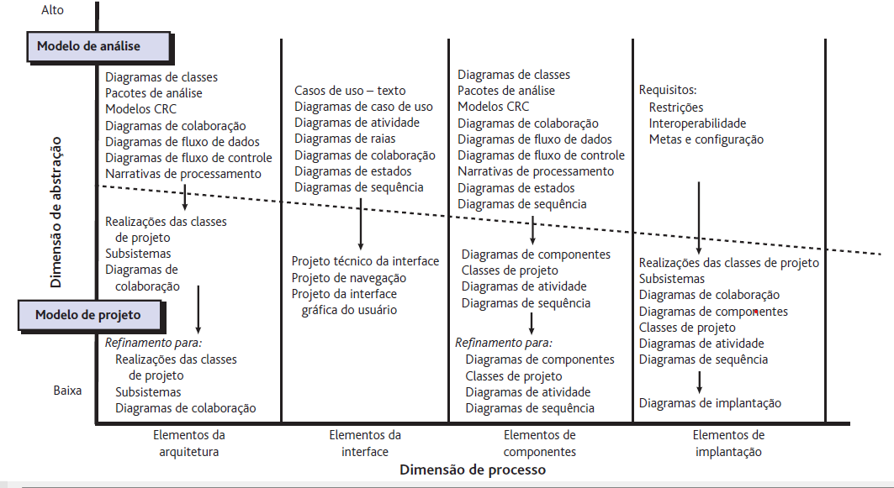
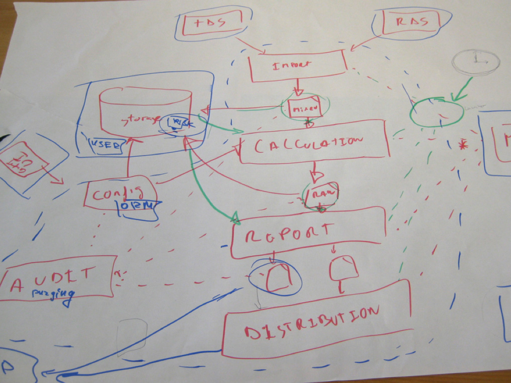
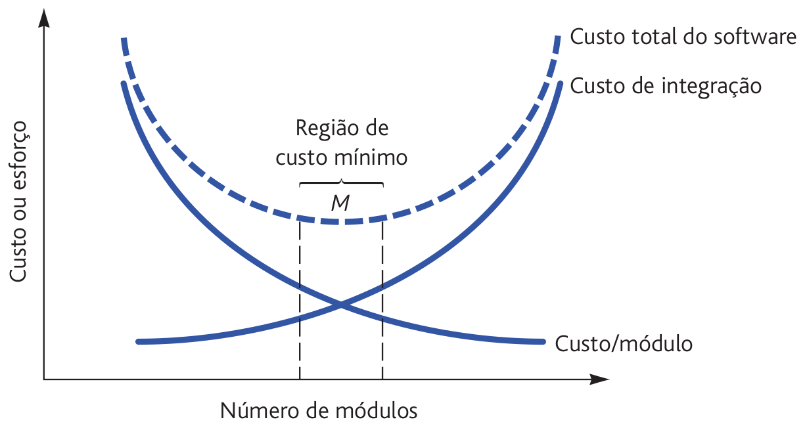
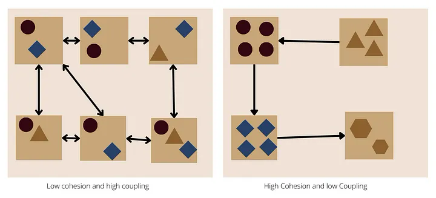
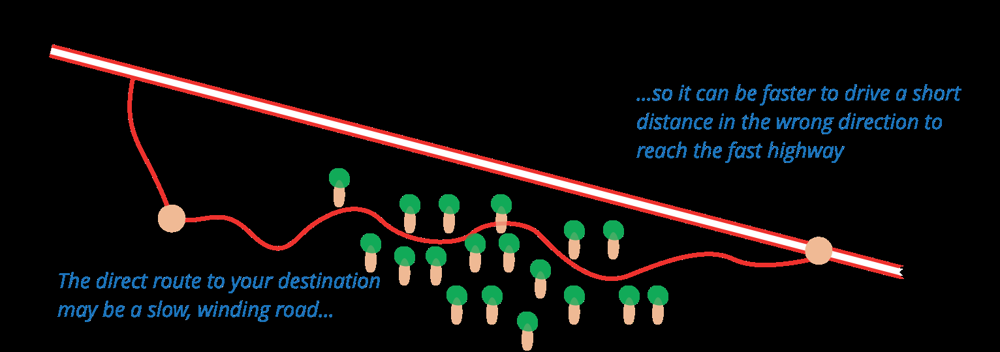

# 02
_Total de páginas: 141_

## Página 1 — Engenharia de Software II

Engenharia de Software II
Andr´e L. D. Rossi
Universidade Estadual Paulista “J´ulio de Mesquita Filho” (UNESP)
Faculdade de Ciˆencias (FC) / Departamento de Computa¸c˜ao (DCo)
Bauru, SP - Brasil

## Página 2 — Conceitos de Projeto

Conceitos de Projeto

## Página 3 — O que e projeto

O que ´e projeto?
ˆ Projeto ´e o que todo engenheiro quer fazer
1

## Página 4 — O que e projeto

O que ´e projeto?
ˆ Projeto ´e o que todo engenheiro quer fazer
ˆ Modelo de projeto: “Como fazer?”
1

## Página 5 — O que e projeto

O que ´e projeto?
ˆ Projeto ´e o que todo engenheiro quer fazer
ˆ Modelo de projeto: “Como fazer?”
ˆ Cria uma representa¸c˜ao ou modelo de software
1

## Página 6 — O que e projeto

O que ´e projeto?
ˆ Projeto ´e o que todo engenheiro quer fazer
ˆ Modelo de projeto: “Como fazer?”
ˆ Cria uma representa¸c˜ao ou modelo de software
ˆ Fornece detalhes:
ˆ Arquitetura de sotware
ˆ Estruturas de dados
ˆ Interfaces
ˆ Componentes
1

## Página 7 — O que e Projeto

O que ´e Projeto?
Segundo Mitchell Kapor (1990) no seu Manifesto do Projeto (Design) de
Software:
2

## Página 8 — O que e Projeto

O que ´e Projeto?
Segundo Mitchell Kapor (1990) no seu Manifesto do Projeto (Design) de
Software:
“It’s where you stand with a foot in two worlds—the world of
technology and the world of people and human purposes—and
you try to bring the two together.”
2

## Página 9 — Por que elaborar um projeto

Por que elaborar um projeto?
ˆ Permite “modelar” o sistema (produto) antes de ser codificado
(constru´ıdo)
3

## Página 10 — Por que elaborar um projeto

Por que elaborar um projeto?
ˆ Permite “modelar” o sistema (produto) antes de ser codificado
(constru´ıdo)
ˆ Etapa em que a qualidade ´e estabelecida
3

## Página 11 — Por que elaborar um projeto

Por que elaborar um projeto?
Atributos de qualidade – FURPS:
ˆ Funcionalidade (Functionality): caracter´ısticas e capacidades do
software
4

## Página 12 — Por que elaborar um projeto

Por que elaborar um projeto?
Atributos de qualidade – FURPS:
ˆ Funcionalidade (Functionality): caracter´ısticas e capacidades do
software
ˆ Usabilidade (Usability) : fatores humanos, est´etica, consistˆencia e
documenta¸c˜ao
4

## Página 13 — Por que elaborar um projeto

Por que elaborar um projeto?
Atributos de qualidade – FURPS:
ˆ Funcionalidade (Functionality): caracter´ısticas e capacidades do
software
ˆ Usabilidade (Usability) : fatores humanos, est´etica, consistˆencia e
documenta¸c˜ao
ˆ Confiabilidade (Reliability) : frequˆencia (MTTF) e gravidade das
falhas
4

## Página 14 — Por que elaborar um projeto

Por que elaborar um projeto?
Atributos de qualidade – FURPS:
ˆ Funcionalidade (Functionality): caracter´ısticas e capacidades do
software
ˆ Usabilidade (Usability) : fatores humanos, est´etica, consistˆencia e
documenta¸c˜ao
ˆ Confiabilidade (Reliability) : frequˆencia (MTTF) e gravidade das
falhas
ˆ Desempenho (Performance) : eficiˆencia e efic´acia
4

## Página 15 — Por que elaborar um projeto

Por que elaborar um projeto?
Atributos de qualidade – FURPS:
ˆ Funcionalidade (Functionality): caracter´ısticas e capacidades do
software
ˆ Usabilidade (Usability) : fatores humanos, est´etica, consistˆencia e
documenta¸c˜ao
ˆ Confiabilidade (Reliability) : frequˆencia (MTTF) e gravidade das
falhas
ˆ Desempenho (Performance) : eficiˆencia e efic´acia
ˆ Facilidade de Suporte (Suportability) : facilidade de manuten¸c˜ao
(estender, adptar, reparar, ...)
4

## Página 16 — Por que elaborar um projeto

Por que elaborar um projeto?
Pr´aticas de projeto:
5

## Página 17 — Por que elaborar um projeto

Por que elaborar um projeto?
Pr´aticas de projeto:
ˆ Diversifica¸c˜ao: identificar pos´ıveis alternativas de projeto
5

## Página 18 — Por que elaborar um projeto

Por que elaborar um projeto?
Pr´aticas de projeto:
ˆ Diversifica¸c˜ao: identificar pos´ıveis alternativas de projeto
ˆ Convergˆencia: rejeitar alternativas que n˜ao atendam os requisitos
5

## Página 19 — O Modelo de Projeto

O Modelo de Projeto
ˆ A modelagem de projetos de software equivale aos planos de um
arquiteto para uma casa
6

## Página 20 — O Modelo de Projeto

O Modelo de Projeto
ˆ A modelagem de projetos de software equivale aos planos de um
arquiteto para uma casa
ˆ Come¸ca pela representa¸c˜ao do todo a ser constru´ıdo (p. ex., uma
representa¸c˜ao tridimensional da casa)
6

## Página 21 — O Modelo de Projeto

O Modelo de Projeto
ˆ A modelagem de projetos de software equivale aos planos de um
arquiteto para uma casa
ˆ Come¸ca pela representa¸c˜ao do todo a ser constru´ıdo (p. ex., uma
representa¸c˜ao tridimensional da casa)
ˆ Gradualmente, concentra-se nos detalhes, oferecendo um roteiro
para a sua constru¸c˜ao (p. ex., a estrutura do encanamento)
6

## Página 22 — O Modelo de Projeto

O Modelo de Projeto
Figura 1: Encanamento e tomadas da minha casa!
7

## Página 23 — O Modelo de Projeto

O Modelo de Projeto
Figura 2: Encanamento e tomadas da minha casa!
8

## Página 24 — O Modelo de Projeto

O Modelo de Projeto
Figura 3: Encanamento e tomadas da minha casa!
9

## Página 25 — O Modelo de Projeto

O Modelo de Projeto
Exemplo: quais os principais m´odulos de um compilador?
10

## Página 26 — O Modelo de Projeto

O Modelo de Projeto
Exemplo: quais os principais m´odulos de um compilador?
Figura 4: Principais m´odulos de um compilador.
10

## Página 27 — O Modelo de Projeto

O Modelo de Projeto
ˆ Os elementos do modelo de projeto usam v´arios dos diagramas da
UML utilizados no modelo de an´alise
11

## Página 28 — O Modelo de Projeto

O Modelo de Projeto
ˆ Os elementos do modelo de projeto usam v´arios dos diagramas da
UML utilizados no modelo de an´alise
ˆ A diferen¸ca ´e o grau de refinamento, fornecendo detalhes para a
implementa¸c˜ao em rela¸c˜ao `a:
ˆ Estrutura e o estilo da arquitetura
ˆ Os componentes que residem nessa arquitetura
ˆ Interfaces entre os componentes e com o mundo exterior
11

## Página 29 — Modelo de Projeto

Modelo de Projeto
Figura 5: Descri¸c˜ao do sistema, modelo de an´alise e modelo de projeto.
12

## Página 30 — Projeto de Software

Projeto de Software
Figura 6: O modelo de projeto a partir do modelo de requisitos.
13

## Página 31 — O Modelo de Projeto

O Modelo de Projeto
Figura 7: Dimens˜oes do modelo de projeto.
14

## Página 32 — O Modelo de Projeto

O Modelo de Projeto
Princ´ıpios da modelagem de projetos:
ˆ Representa¸c˜oes de projetos (modelos) devem ser de f´acil
compreens˜ao
15

## Página 33 — O Modelo de Projeto

O Modelo de Projeto
Princ´ıpios da modelagem de projetos:
ˆ Representa¸c˜oes de projetos (modelos) devem ser de f´acil
compreens˜ao
ˆ O projeto deve ser desenvolvido iterativamente
15

## Página 34 — O Modelo de Projeto

O Modelo de Projeto
Princ´ıpios da modelagem de projetos:
ˆ Representa¸c˜oes de projetos (modelos) devem ser de f´acil
compreens˜ao
ˆ O projeto deve ser desenvolvido iterativamente
ˆ A cria¸c˜ao de um modelo de projeto n˜ao exclui uma abordagem ´agil
15

## Página 35 — O Modelo de Projeto

O Modelo de Projeto
Princ´ıpios da modelagem de projetos:
ˆ Representa¸c˜oes de projetos (modelos) devem ser de f´acil
compreens˜ao
ˆ O projeto deve ser desenvolvido iterativamente
ˆ A cria¸c˜ao de um modelo de projeto n˜ao exclui uma abordagem ´agil
ˆ Alguns proponentes do desenvolvimento de software ´agil dizem que o
c´odigo ´e a ´unica documenta¸c˜ao de projeto necess´aria
15

## Página 36 — O Modelo de Projeto

O Modelo de Projeto
Princ´ıpios da modelagem de projetos:
ˆ Representa¸c˜oes de projetos (modelos) devem ser de f´acil
compreens˜ao
ˆ O projeto deve ser desenvolvido iterativamente
ˆ A cria¸c˜ao de um modelo de projeto n˜ao exclui uma abordagem ´agil
ˆ Alguns proponentes do desenvolvimento de software ´agil dizem que o
c´odigo ´e a ´unica documenta¸c˜ao de projeto necess´aria
ˆ Contudo, o objetivo de um modelo de projeto ´e ajudar outros que
dever˜ao manter e evoluir o sistema
15

## Página 37 — O Modelo de Projeto

O Modelo de Projeto
Princ´ıpios da modelagem de projetos:
ˆ Representa¸c˜oes de projetos (modelos) devem ser de f´acil
compreens˜ao
ˆ O projeto deve ser desenvolvido iterativamente
ˆ A cria¸c˜ao de um modelo de projeto n˜ao exclui uma abordagem ´agil
ˆ Alguns proponentes do desenvolvimento de software ´agil dizem que o
c´odigo ´e a ´unica documenta¸c˜ao de projeto necess´aria
ˆ Contudo, o objetivo de um modelo de projeto ´e ajudar outros que
dever˜ao manter e evoluir o sistema
ˆ Ao final do empreendimento, o projeto deve estar documentado em
um n´ıvel que permita o entendimento e a manuten¸c˜ao do c´odigo
15

## Página 38 — O processo de Projeto

O processo de Projeto

## Página 39 — O processo de projeto

O processo de projeto
ˆ Processo iterativo:
16

## Página 40 — O processo de projeto

O processo de projeto
ˆ Processo iterativo:
ˆ Requisitos s˜ao traduzidos em uma “planta” para o desenvolvimento
do software
16

## Página 41 — O processo de projeto

O processo de projeto
ˆ Processo iterativo:
ˆ Requisitos s˜ao traduzidos em uma “planta” para o desenvolvimento
do software
ˆ Nota¸c˜ao para representar componentes funcionais e suas interfaces
16

## Página 42 — O processo de projeto

O processo de projeto
ˆ Processo iterativo:
ˆ Requisitos s˜ao traduzidos em uma “planta” para o desenvolvimento
do software
ˆ Nota¸c˜ao para representar componentes funcionais e suas interfaces
ˆ Heur´ıstica para refinamento e divis˜oes
16

## Página 43 — O processo de projeto

O processo de projeto
ˆ Processo iterativo:
ˆ Requisitos s˜ao traduzidos em uma “planta” para o desenvolvimento
do software
ˆ Nota¸c˜ao para representar componentes funcionais e suas interfaces
ˆ Heur´ıstica para refinamento e divis˜oes
ˆ Diretrizes para avalia¸c˜ao da qualidade
16

## Página 44 — O processo de projeto

O processo de projeto
ˆ Processo iterativo:
ˆ Requisitos s˜ao traduzidos em uma “planta” para o desenvolvimento
do software
ˆ Nota¸c˜ao para representar componentes funcionais e suas interfaces
ˆ Heur´ıstica para refinamento e divis˜oes
ˆ Diretrizes para avalia¸c˜ao da qualidade
16

## Página 45 — O processo de projeto

O processo de projeto
ˆ Deve implementar todos os requisitos expl´ıcitos do modelos de
requisitos e tentar acomodar os requisitos impl´ıcitos
17

## Página 46 — O processo de projeto

O processo de projeto
ˆ Deve implementar todos os requisitos expl´ıcitos do modelos de
requisitos e tentar acomodar os requisitos impl´ıcitos
ˆ Deve ser um guia leg´ıvel para os desenvolvedores de c´odigo, os que
testam e d˜ao suporte
17

## Página 47 — O processo de projeto

O processo de projeto
ˆ Deve implementar todos os requisitos expl´ıcitos do modelos de
requisitos e tentar acomodar os requisitos impl´ıcitos
ˆ Deve ser um guia leg´ıvel para os desenvolvedores de c´odigo, os que
testam e d˜ao suporte
ˆ Deve fornecer uma vis˜ao hol´ıstica do software
ˆ Abstra¸c˜ao de alto n´ıvel
ˆ Refinamentos subsequentes
ˆ N´ıveis menores de abstra¸c˜ao
17

## Página 48 — Tarefas genericas para projeto

Tarefas gen´ericas para projeto
1. Examinar o modelo de informa¸c˜ao e projetar estruturas de dados
apropriadas para objetos de dados e seus atributos
18

## Página 49 — Tarefas genericas para projeto

Tarefas gen´ericas para projeto
1. Examinar o modelo de informa¸c˜ao e projetar estruturas de dados
apropriadas para objetos de dados e seus atributos
2. Usar o modelo de an´alise, selecionar um estilo de arquitetura
(padr˜ao) apropriado ao software
18

## Página 50 — Tarefas genericas para projeto

Tarefas gen´ericas para projeto
1. Examinar o modelo de informa¸c˜ao e projetar estruturas de dados
apropriadas para objetos de dados e seus atributos
2. Usar o modelo de an´alise, selecionar um estilo de arquitetura
(padr˜ao) apropriado ao software
3. Dividir o modelo de an´alise em subsistemas de projeto e aloc´a-los na
arquitetura:
ˆ Certificar-se de que cada subsistema seja funcionalmente coeso
ˆ Projetar interfaces de subsistemas
ˆ Alocar classes ou fun¸c˜oes de an´alise para cada subsistema
18

## Página 51 — Tarefas genericas para projeto

Tarefas gen´ericas para projeto
1. Examinar o modelo de informa¸c˜ao e projetar estruturas de dados
apropriadas para objetos de dados e seus atributos
2. Usar o modelo de an´alise, selecionar um estilo de arquitetura
(padr˜ao) apropriado ao software
3. Dividir o modelo de an´alise em subsistemas de projeto e aloc´a-los na
arquitetura:
ˆ Certificar-se de que cada subsistema seja funcionalmente coeso
ˆ Projetar interfaces de subsistemas
ˆ Alocar classes ou fun¸c˜oes de an´alise para cada subsistema
4. Criar um conjunto de classes ou componentes de projeto:
ˆ Transformar a descri¸c˜ao de classes de an´alise em uma classe de
projeto
ˆ Verificar cada classe de projeto em rela¸c˜ao aos crit´erios de projeto
ˆ Definir m´etodos e mensagens associadas a cada classe de projeto
ˆ Avaliar e selecionar padr˜oes de projeto para uma classe ou um
subsistema de projeto
ˆ Rever as classes de projeto e revisar quando necess´ario
18

## Página 52 — Tarefas genericas para projeto

Tarefas gen´ericas para projeto
5. Projetar qualquer interface necess´aria para sistemas ou dispositivos
externos
19

## Página 53 — Tarefas genericas para projeto

Tarefas gen´ericas para projeto
5. Projetar qualquer interface necess´aria para sistemas ou dispositivos
externos
6. Projetar a interface do usu´ario
ˆ Revisar os resultados da an´alise de tarefas
ˆ Especificar a sequˆencia de a¸c˜oes baseando-se nos cen´arios de usu´ario
ˆ Criar um modelo comportamental da interface
ˆ Definir objetos de interface e mecanismos de controle
ˆ Rever o projeto de interfaces e revisar quando necess´ario
19

## Página 54 — Tarefas genericas para projeto

Tarefas gen´ericas para projeto
5. Projetar qualquer interface necess´aria para sistemas ou dispositivos
externos
6. Projetar a interface do usu´ario
ˆ Revisar os resultados da an´alise de tarefas
ˆ Especificar a sequˆencia de a¸c˜oes baseando-se nos cen´arios de usu´ario
ˆ Criar um modelo comportamental da interface
ˆ Definir objetos de interface e mecanismos de controle
ˆ Rever o projeto de interfaces e revisar quando necess´ario
7. Conduzir o projeto de componentes.
ˆ Especificar todos os algoritmos em um n´ıvel de abstra¸c˜ao
relativamente baixo
ˆ Refinar a interface de cada componente
ˆ Definir estruturas de dados dos componentes
ˆ Revisar cada componente e corrigir todos os erros descobertos
19

## Página 55 — Tarefas genericas para projeto

Tarefas gen´ericas para projeto
5. Projetar qualquer interface necess´aria para sistemas ou dispositivos
externos
6. Projetar a interface do usu´ario
ˆ Revisar os resultados da an´alise de tarefas
ˆ Especificar a sequˆencia de a¸c˜oes baseando-se nos cen´arios de usu´ario
ˆ Criar um modelo comportamental da interface
ˆ Definir objetos de interface e mecanismos de controle
ˆ Rever o projeto de interfaces e revisar quando necess´ario
7. Conduzir o projeto de componentes.
ˆ Especificar todos os algoritmos em um n´ıvel de abstra¸c˜ao
relativamente baixo
ˆ Refinar a interface de cada componente
ˆ Definir estruturas de dados dos componentes
ˆ Revisar cada componente e corrigir todos os erros descobertos
8. Desenvolver um modelo de implanta¸c˜ao
19

## Página 56 — Conceitos de projetos

Conceitos de projetos

## Página 57 — Abstracao

Abstra¸c˜ao
ˆ Abstra¸c˜ao procedural: refere-se a uma sequˆencia de instru¸c˜oes que
possui uma fun¸c˜ao espec´ıfica
20

## Página 58 — Abstracao

Abstra¸c˜ao
ˆ Abstra¸c˜ao procedural: refere-se a uma sequˆencia de instru¸c˜oes que
possui uma fun¸c˜ao espec´ıfica
ˆ O nome indica sua fun¸c˜ao, mas detalhes s˜ao omitidos
ˆ Por exemplo, a palavra abrir para uma porta
ˆ Define uma sequˆencia de etapas procedurais (caminhar, alcan¸car
ma¸caneta, girar etc)
20

## Página 59 — Abstracao

Abstra¸c˜ao
ˆ Abstra¸c˜ao procedural: refere-se a uma sequˆencia de instru¸c˜oes que
possui uma fun¸c˜ao espec´ıfica
ˆ O nome indica sua fun¸c˜ao, mas detalhes s˜ao omitidos
ˆ Por exemplo, a palavra abrir para uma porta
ˆ Define uma sequˆencia de etapas procedurais (caminhar, alcan¸car
ma¸caneta, girar etc)
ˆ Diferentes n´ıveis de abstra¸c˜ao podem ser usados
ˆ Hist´orias de usu´ario
20

## Página 60 — Abstracao

Abstra¸c˜ao
ˆ Abstra¸c˜ao procedural: refere-se a uma sequˆencia de instru¸c˜oes que
possui uma fun¸c˜ao espec´ıfica
ˆ O nome indica sua fun¸c˜ao, mas detalhes s˜ao omitidos
ˆ Por exemplo, a palavra abrir para uma porta
ˆ Define uma sequˆencia de etapas procedurais (caminhar, alcan¸car
ma¸caneta, girar etc)
ˆ Diferentes n´ıveis de abstra¸c˜ao podem ser usados
ˆ Hist´orias de usu´ario
ˆ Casos de uso
20

## Página 61 — Abstracao

Abstra¸c˜ao
ˆ Abstra¸c˜ao procedural: refere-se a uma sequˆencia de instru¸c˜oes que
possui uma fun¸c˜ao espec´ıfica
ˆ O nome indica sua fun¸c˜ao, mas detalhes s˜ao omitidos
ˆ Por exemplo, a palavra abrir para uma porta
ˆ Define uma sequˆencia de etapas procedurais (caminhar, alcan¸car
ma¸caneta, girar etc)
ˆ Diferentes n´ıveis de abstra¸c˜ao podem ser usados
ˆ Hist´orias de usu´ario
ˆ Casos de uso
ˆ Diagramas de classes ou pseudoc´odigo
20

## Página 62 — Arquitetura

Arquitetura
ˆ Refere-se `a organiza¸c˜ao geral do software
21

## Página 63 — Arquitetura

Arquitetura
ˆ Refere-se `a organiza¸c˜ao geral do software
ˆ Organiza¸c˜ao de componentes de programa (m´odulos)
21

## Página 64 — Arquitetura

Arquitetura
ˆ Refere-se `a organiza¸c˜ao geral do software
ˆ Organiza¸c˜ao de componentes de programa (m´odulos)
ˆ A maneira como esses componentes interagem
21

## Página 65 — Arquitetura

Arquitetura
ˆ Refere-se `a organiza¸c˜ao geral do software
ˆ Organiza¸c˜ao de componentes de programa (m´odulos)
ˆ A maneira como esses componentes interagem
ˆ A estrutura de dados que s˜ao usados pelos componentes
21

## Página 66 — Arquitetura

Arquitetura
ˆ Refere-se `a organiza¸c˜ao geral do software
ˆ Organiza¸c˜ao de componentes de programa (m´odulos)
ˆ A maneira como esses componentes interagem
ˆ A estrutura de dados que s˜ao usados pelos componentes
21

## Página 67 — Arquitetura

Arquitetura
ˆ Refere-se `a organiza¸c˜ao geral do software
ˆ Organiza¸c˜ao de componentes de programa (m´odulos)
ˆ A maneira como esses componentes interagem
ˆ A estrutura de dados que s˜ao usados pelos componentes
ˆ Em um sentido mais amplo, os componentes podem ser
generalizados para representar os principais elementos de um sistema
e suas intera¸c˜oes
21

## Página 68 — Arquitetura

Arquitetura
Como a arquitetura ´e vista em processos ag´eis?
22

## Página 69 — Arquitetura

Arquitetura
Como a arquitetura ´e vista em processos ag´eis?
ˆ Geralmente ´e aceito que um est´agio inicial do processo de
desenvolvimento ´agil esteja focado na cria¸c˜ao do projeto de
arquitetura geral do sistema
22

## Página 70 — Arquitetura

Arquitetura
Como a arquitetura ´e vista em processos ag´eis?
ˆ Geralmente ´e aceito que um est´agio inicial do processo de
desenvolvimento ´agil esteja focado na cria¸c˜ao do projeto de
arquitetura geral do sistema
ˆ O desenvolvimento incremental das arquiteturas normalmente n˜ao ´e
bem sucedido
22

## Página 71 — Arquitetura

Arquitetura
Como a arquitetura ´e vista em processos ag´eis?
ˆ Geralmente ´e aceito que um est´agio inicial do processo de
desenvolvimento ´agil esteja focado na cria¸c˜ao do projeto de
arquitetura geral do sistema
ˆ O desenvolvimento incremental das arquiteturas normalmente n˜ao ´e
bem sucedido
ˆ Refatorar componentes ´e f´acil. Por´em, refatorar a arquitetura pode
implicar em ter que alterar a maior parte dos componentes
22

## Página 72 — Arquitetura

Arquitetura
Figura 8: Rascunho de uma arquitetura de software.
23

## Página 73 — Padroes

Padr˜oes
O que ´e um padr˜ao de projeto?
24

## Página 74 — Padroes

Padr˜oes
O que ´e um padr˜ao de projeto?
Brad Appleton define da seguinte maneira:
“Padr˜ao ´e parte de um conhecimento consolidado j´a existente
que transmite a essˆencia de uma solu¸c˜ao comprovada para um
problema recorrente em certo contexto, em meio a preocupa¸c˜oes
concorrentes.”
24

## Página 75 — Padroes

Padr˜oes
ˆ O objetivo de um padr˜ao ´e fornecer uma descri¸c˜ao que permita a um
projetista determinar:
ˆ Se o padr˜ao se aplica ou n˜ao ao problema em quest˜ao
25

## Página 76 — Padroes

Padr˜oes
ˆ O objetivo de um padr˜ao ´e fornecer uma descri¸c˜ao que permita a um
projetista determinar:
ˆ Se o padr˜ao se aplica ou n˜ao ao problema em quest˜ao
ˆ Se o padr˜ao pode ou n˜ao ser reutilizado
25

## Página 77 — Padroes

Padr˜oes
ˆ O objetivo de um padr˜ao ´e fornecer uma descri¸c˜ao que permita a um
projetista determinar:
ˆ Se o padr˜ao se aplica ou n˜ao ao problema em quest˜ao
ˆ Se o padr˜ao pode ou n˜ao ser reutilizado
ˆ Se o padr˜ao pode servir como um guia para desenvolver um padr˜ao
similar, mas funcional ou estruturalmente diferente
25

## Página 78 — Separacao por interesses afinidades

Separa¸c˜ao por interesses (afinidades)
ˆ Interesse: caracter´ıstica, funcionalidade, comportamento ou
requisito
26

## Página 79 — Separacao por interesses afinidades

Separa¸c˜ao por interesses (afinidades)
ˆ Interesse: caracter´ıstica, funcionalidade, comportamento ou
requisito
ˆ Sugere que qualquer problema complexo pode ser tratado mais
facilmente se for subdividido em trechos a serem resolvidos e/ou
otimizados independentemente
26

## Página 80 — Separacao por interesses afinidades

Separa¸c˜ao por interesses (afinidades)
ˆ Interesse: caracter´ıstica, funcionalidade, comportamento ou
requisito
ˆ Sugere que qualquer problema complexo pode ser tratado mais
facilmente se for subdividido em trechos a serem resolvidos e/ou
otimizados independentemente
ˆ Estrat´egia: dividir-para-conquistar.
26

## Página 81 — Separacao por interesses afinidades

Separa¸c˜ao por interesses (afinidades)
ˆ A separa¸c˜ao por interesses se manifesta em outros conceitos de
projeto:
ˆ Modularidade
ˆ Independˆencia funcional
ˆ Refinamento
27

## Página 82 — Modularidade

Modularidade
“[...] modularidade ´e o ´unico atributo de software que possi-
bilita um programa ser intelectualmente gerenci´avel.”
Myers (1978)
28

## Página 83 — Modularidade

Modularidade
“[...] modularidade ´e o ´unico atributo de software que possi-
bilita um programa ser intelectualmente gerenci´avel.”
Myers (1978)
ˆ Componentes separadamente especificados e localiz´aveis
28

## Página 84 — Modularidade

Modularidade
“[...] modularidade ´e o ´unico atributo de software que possi-
bilita um programa ser intelectualmente gerenci´avel.”
Myers (1978)
ˆ Componentes separadamente especificados e localiz´aveis
ˆ Podem ser denominados de “m´odulos” (ou n˜ao)
ˆ S˜ao integrados para satisfazer os requisitos de um problema
28

## Página 85 — Modularidade

Modularidade
Portanto, quanto mais m´odulos, melhor?
29

## Página 86 — Modularidade

Modularidade
Figura 9: Rela¸c˜ao entre o n´umero de m´odulos e o esfor¸co (custo) do software.
30

## Página 87 — Modularidade

Modularidade
Como decompor uma solu¸c˜ao de software para obter o melhor conjunto
de m´odulos?
31

## Página 88 — Encapsulamento

Encapsulamento
Isso nos leva ao conceito de encapsulamento de informa¸c˜oes!
32

## Página 89 — Encapsulamento

Encapsulamento
Isso nos leva ao conceito de encapsulamento de informa¸c˜oes!
ˆ Modularidade efetiva: obtida por meio de um conjunto de
m´odulos independentes que comunicam entre si apenas as
informa¸c˜oes necess´arias para realizar determinada fun¸c˜ao
32

## Página 90 — Encapsulamento

Encapsulamento
Isso nos leva ao conceito de encapsulamento de informa¸c˜oes!
ˆ Modularidade efetiva: obtida por meio de um conjunto de
m´odulos independentes que comunicam entre si apenas as
informa¸c˜oes necess´arias para realizar determinada fun¸c˜ao
ˆ O encapsulamento define e imp˜oe restri¸c˜oes de acesso
32

## Página 91 — Encapsulamento

Encapsulamento
Isso nos leva ao conceito de encapsulamento de informa¸c˜oes!
ˆ Modularidade efetiva: obtida por meio de um conjunto de
m´odulos independentes que comunicam entre si apenas as
informa¸c˜oes necess´arias para realizar determinada fun¸c˜ao
ˆ O encapsulamento define e imp˜oe restri¸c˜oes de acesso
ˆ Informa¸c˜oes (m´etodos e dados) contidas em um m´odulo devem ser
inacess´ıveis por parte de outros m´odulos que n˜ao necessitam de tais
informa¸c˜oes
32

## Página 92 — Encapsulamento

Encapsulamento
Figura 10: Partes do carro devem ser encapsuladas.
33

## Página 93 — Encapsulamento

Encapsulamento
Em 2002, consta que Jeff Bezos enviou um mail para todos os
desenvolvedores da empresa:
ˆ Todos os times devem, daqui em diante, garantir que os sistemas
exponham seus dados e funcionalidades por meio de interfaces
34

## Página 94 — Encapsulamento

Encapsulamento
Em 2002, consta que Jeff Bezos enviou um mail para todos os
desenvolvedores da empresa:
ˆ Todos os times devem, daqui em diante, garantir que os sistemas
exponham seus dados e funcionalidades por meio de interfaces
ˆ Os sistemas devem se comunicar apenas por meio de interfaces
34

## Página 95 — Encapsulamento

Encapsulamento
Em 2002, consta que Jeff Bezos enviou um mail para todos os
desenvolvedores da empresa:
ˆ Todos os times devem, daqui em diante, garantir que os sistemas
exponham seus dados e funcionalidades por meio de interfaces
ˆ Os sistemas devem se comunicar apenas por meio de interfaces
ˆ N˜ao deve haver outra forma de comunica¸c˜ao: sem links diretos, sem
leitura direta em bases de dados de outros sistemas, sem mem´oria
compartilhada ou vari´aveis globais ou qualquer tipo de backdoor.
34

## Página 96 — Encapsulamento

Encapsulamento
Em 2002, consta que Jeff Bezos enviou um mail para todos os
desenvolvedores da empresa:
ˆ Todos os times devem, daqui em diante, garantir que os sistemas
exponham seus dados e funcionalidades por meio de interfaces
ˆ Os sistemas devem se comunicar apenas por meio de interfaces
ˆ N˜ao deve haver outra forma de comunica¸c˜ao: sem links diretos, sem
leitura direta em bases de dados de outros sistemas, sem mem´oria
compartilhada ou vari´aveis globais ou qualquer tipo de backdoor.
ˆ N˜ao importa qual tecnologia vocˆes v˜ao usar: HTTP, CORBA,
PubSub, protocolos espec´ıficos — isso n˜ao interessa. Bezos n˜ao liga
para isso.
34

## Página 97 — Encapsulamento

Encapsulamento
Em 2002, consta que Jeff Bezos enviou um mail para todos os
desenvolvedores da empresa:
ˆ Todos os times devem, daqui em diante, garantir que os sistemas
exponham seus dados e funcionalidades por meio de interfaces
ˆ Os sistemas devem se comunicar apenas por meio de interfaces
ˆ N˜ao deve haver outra forma de comunica¸c˜ao: sem links diretos, sem
leitura direta em bases de dados de outros sistemas, sem mem´oria
compartilhada ou vari´aveis globais ou qualquer tipo de backdoor.
ˆ N˜ao importa qual tecnologia vocˆes v˜ao usar: HTTP, CORBA,
PubSub, protocolos espec´ıficos — isso n˜ao interessa. Bezos n˜ao liga
para isso.
ˆ Os times devem planejar e projetar interfaces pensando em usu´arios
externos. Sem nenhuma exce¸c˜ao `a regra.
34

## Página 98 — Encapsulamento

Encapsulamento
Em 2002, consta que Jeff Bezos enviou um mail para todos os
desenvolvedores da empresa:
ˆ Todos os times devem, daqui em diante, garantir que os sistemas
exponham seus dados e funcionalidades por meio de interfaces
ˆ Os sistemas devem se comunicar apenas por meio de interfaces
ˆ N˜ao deve haver outra forma de comunica¸c˜ao: sem links diretos, sem
leitura direta em bases de dados de outros sistemas, sem mem´oria
compartilhada ou vari´aveis globais ou qualquer tipo de backdoor.
ˆ N˜ao importa qual tecnologia vocˆes v˜ao usar: HTTP, CORBA,
PubSub, protocolos espec´ıficos — isso n˜ao interessa. Bezos n˜ao liga
para isso.
ˆ Os times devem planejar e projetar interfaces pensando em usu´arios
externos. Sem nenhuma exce¸c˜ao `a regra.
ˆ Quem n˜ao seguir essas recomenda¸c˜oes est´a demitido.
34

## Página 99 — Encapsulamento

Encapsulamento
Em 2002, consta que Jeff Bezos enviou um mail para todos os
desenvolvedores da empresa:
ˆ Todos os times devem, daqui em diante, garantir que os sistemas
exponham seus dados e funcionalidades por meio de interfaces
ˆ Os sistemas devem se comunicar apenas por meio de interfaces
ˆ N˜ao deve haver outra forma de comunica¸c˜ao: sem links diretos, sem
leitura direta em bases de dados de outros sistemas, sem mem´oria
compartilhada ou vari´aveis globais ou qualquer tipo de backdoor.
ˆ N˜ao importa qual tecnologia vocˆes v˜ao usar: HTTP, CORBA,
PubSub, protocolos espec´ıficos — isso n˜ao interessa. Bezos n˜ao liga
para isso.
ˆ Os times devem planejar e projetar interfaces pensando em usu´arios
externos. Sem nenhuma exce¸c˜ao `a regra.
ˆ Quem n˜ao seguir essas recomenda¸c˜oes est´a demitido.
34

## Página 100 — Encapsulamento

Encapsulamento
Maiores benef´ıcios do encapsulamento ocorrem quando s˜ao
necess´arias modifica¸c˜oes durante os testes e, posteriormente,
durante a manuten¸c˜ao do software!
35

## Página 101 — Encapsulamento

Encapsulamento
Maiores benef´ıcios do encapsulamento ocorrem quando s˜ao
necess´arias modifica¸c˜oes durante os testes e, posteriormente,
durante a manuten¸c˜ao do software!
Por quˆe?
35

## Página 102 — Encapsulamento

Encapsulamento
Erros introduzidos inadvertidamente durante a modifica¸c˜ao em um
m´odulo tˆem menor probabilidade de se propagar para outros m´odulos ou
locais dentro do software.
36

## Página 103 — Independencia funcional

Independˆencia funcional
ˆ A independˆencia funcional ´e atingida desenvolvendo-se m´odulos:
37

## Página 104 — Independencia funcional

Independˆencia funcional
ˆ A independˆencia funcional ´e atingida desenvolvendo-se m´odulos:
ˆ Com fun¸c˜ao ´unica
37

## Página 105 — Independencia funcional

Independˆencia funcional
ˆ A independˆencia funcional ´e atingida desenvolvendo-se m´odulos:
ˆ Com fun¸c˜ao ´unica
ˆ Com avers˜ao `a intera¸c˜ao excessiva com outros m´odulos
37

## Página 106 — Independencia funcional

Independˆencia funcional
ˆ A independˆencia funcional ´e atingida desenvolvendo-se m´odulos:
ˆ Com fun¸c˜ao ´unica
ˆ Com avers˜ao `a intera¸c˜ao excessiva com outros m´odulos
ˆ Por isso, a independˆencia ´e avaliada por dois crit´erios qualitativos:
37

## Página 107 — Independencia funcional

Independˆencia funcional
ˆ A independˆencia funcional ´e atingida desenvolvendo-se m´odulos:
ˆ Com fun¸c˜ao ´unica
ˆ Com avers˜ao `a intera¸c˜ao excessiva com outros m´odulos
ˆ Por isso, a independˆencia ´e avaliada por dois crit´erios qualitativos:
ˆ Coes˜ao: indica a robustez funcional relativa de um m´odulo, ou seja,
tem apenas uma fun¸c˜ao
37

## Página 108 — Independencia funcional

Independˆencia funcional
ˆ A independˆencia funcional ´e atingida desenvolvendo-se m´odulos:
ˆ Com fun¸c˜ao ´unica
ˆ Com avers˜ao `a intera¸c˜ao excessiva com outros m´odulos
ˆ Por isso, a independˆencia ´e avaliada por dois crit´erios qualitativos:
ˆ Coes˜ao: indica a robustez funcional relativa de um m´odulo, ou seja,
tem apenas uma fun¸c˜ao
ˆ Acoplamento: indica a interdependˆencia relativa entre os m´odulos
37

## Página 109 — Independencia funcional

Independˆencia funcional
Coes˜ao:
38

## Página 110 — Independencia funcional

Independˆencia funcional
Coes˜ao:
As hist´orias de usu´ario que contˆem muitas instˆancias de palavras como e
ou exceto provavelmente n˜ao o incentivar˜ao a projetar m´odulos com
fun¸c˜oes coesas
38

## Página 111 — Independencia funcional

Independˆencia funcional
Coes˜ao:
As hist´orias de usu´ario que contˆem muitas instˆancias de palavras como e
ou exceto provavelmente n˜ao o incentivar˜ao a projetar m´odulos com
fun¸c˜oes coesas
Exemplo para uma fun¸c˜ao com s´erio problema de coes˜ao:
38

## Página 112 — Independencia funcional

Independˆencia funcional
Coes˜ao:
As hist´orias de usu´ario que contˆem muitas instˆancias de palavras como e
ou exceto provavelmente n˜ao o incentivar˜ao a projetar m´odulos com
fun¸c˜oes coesas
Exemplo para uma fun¸c˜ao com s´erio problema de coes˜ao:
float sin_or_cos(double x, int op) {
if (op == 1)
calcula e retorna seno de x
else
calcula e retorna cosseno de x
}
38

## Página 113 — Independencia funcional

Independˆencia funcional
Coes˜ao:
39

## Página 114 — Independencia funcional

Independˆencia funcional
Coes˜ao:
Exemplo de classe coesa:
39

## Página 115 — Independencia funcional

Independˆencia funcional
Coes˜ao:
Exemplo de classe coesa:
class Stack<T> {
boolean empty() { ... }
T pop() { ... }
push (T) { ... }
int size() { ... }
}
39

## Página 116 — Independencia funcional

Independˆencia funcional
Exemplo de acoplamento ruim entre classes:: um arquivo ´e
compartilhado por duas classes, A e B, mantidas por desenvolvedores
distintos. O m´etodo B.g() grava um inteiro no arquivo, que ´e lido por
A.f().
40

## Página 117 — Independencia funcional

Independˆencia funcional
Exemplo de acoplamento ruim entre classes:: um arquivo ´e
compartilhado por duas classes, A e B, mantidas por desenvolvedores
distintos. O m´etodo B.g() grava um inteiro no arquivo, que ´e lido por
A.f().
class A {
private void f() {
int total; ...
File arq = File.open("arq1.
db");
total = arq.readInt();
...
}
}
class B {
private void g() {
int total;
// computa valor de total
File arq = File.open("arq1.
db");
arq.writeInt(total);
...
arq.close();
}
}
40

## Página 118 — Independencia funcional

Independˆencia funcional
Uma solu¸c˜ao melhor para o acoplamento::
41

## Página 119 — Independencia funcional

Independˆencia funcional
Uma solu¸c˜ao melhor para o acoplamento::
class A {
private void f(B b) {
int total;
total = b.getTotal();
...
}
}
class B {
int total;
public int getTotal() {
return total;
}
private void g() {
// computa valor de total
File arq = File.open("arq1");
arq.writeInt(total);
...
}
}
41

## Página 120 — Modularidade

Modularidade
Figura 11: Rela¸c˜ao entre coes˜ao e acoplamento.
42

## Página 121 — Refatoracao

Refatora¸c˜ao
ˆ ´E uma t´ecnica de reorganiza¸c˜ao que simplifica o projeto (ou
c´odigo) de um componente sem mudar sua fun¸c˜ao
43

## Página 122 — Refatoracao

Refatora¸c˜ao
ˆ ´E uma t´ecnica de reorganiza¸c˜ao que simplifica o projeto (ou
c´odigo) de um componente sem mudar sua fun¸c˜ao
ˆ Melhora a estrutura interna sem modificar seu comportamento
externo
43

## Página 123 — Refatoracao

Refatora¸c˜ao
ˆ ´E uma t´ecnica de reorganiza¸c˜ao que simplifica o projeto (ou
c´odigo) de um componente sem mudar sua fun¸c˜ao
ˆ Melhora a estrutura interna sem modificar seu comportamento
externo
ˆ Podem ocorrer efeitos colaterais involunt´arios
43

## Página 124 — Refatoracao

Refatora¸c˜ao
ˆ ´E uma t´ecnica de reorganiza¸c˜ao que simplifica o projeto (ou
c´odigo) de um componente sem mudar sua fun¸c˜ao
ˆ Melhora a estrutura interna sem modificar seu comportamento
externo
ˆ Podem ocorrer efeitos colaterais involunt´arios
ˆ Quais aspectos devem ser observados para refatora¸c˜ao?
43

## Página 125 — Refatoracao

Refatora¸c˜ao
ˆ Para refatora¸c˜ao, o projeto ´e examinado em termos de:
44

## Página 126 — Refatoracao

Refatora¸c˜ao
ˆ Para refatora¸c˜ao, o projeto ´e examinado em termos de:
ˆ Redundˆancia (elementos de projeto n˜ao utilizados)
44

## Página 127 — Refatoracao

Refatora¸c˜ao
ˆ Para refatora¸c˜ao, o projeto ´e examinado em termos de:
ˆ Redundˆancia (elementos de projeto n˜ao utilizados)
ˆ Algoritmos ineficientes ou desnecess´arios
44

## Página 128 — Refatoracao

Refatora¸c˜ao
ˆ Para refatora¸c˜ao, o projeto ´e examinado em termos de:
ˆ Redundˆancia (elementos de projeto n˜ao utilizados)
ˆ Algoritmos ineficientes ou desnecess´arios
ˆ Estruturas de dados mal constru´ıdas ou inadequadas
44

## Página 129 — Refatoracao

Refatora¸c˜ao
ˆ Para refatora¸c˜ao, o projeto ´e examinado em termos de:
ˆ Redundˆancia (elementos de projeto n˜ao utilizados)
ˆ Algoritmos ineficientes ou desnecess´arios
ˆ Estruturas de dados mal constru´ıdas ou inadequadas
ˆ Qualquer outra deficiˆencia ou falha de projeto que possa ser
melhorada ou corrigida para produzir um projeto melhor
44

## Página 130 — Refatoracao

Refatora¸c˜ao
Refatora¸c˜ao preparat´oria:
45

## Página 131 — Refatoracao

Refatora¸c˜ao
Refatora¸c˜ao preparat´oria:
ˆ O c´odigo n˜ao est´a estruturado para a adi¸c˜ao de uma nova
caracter´ıstica ou funcionalidade
45

## Página 132 — Refatoracao

Refatora¸c˜ao
Refatora¸c˜ao preparat´oria:
ˆ O c´odigo n˜ao est´a estruturado para a adi¸c˜ao de uma nova
caracter´ıstica ou funcionalidade
ˆ Portanto, deve-se, primeiro, refatorar o c´odigo para facilitar a adi¸c˜ao
da caracter´ıstica
45

## Página 133 — Refatoracao

Refatora¸c˜ao
Refatora¸c˜ao preparat´oria:
Figura 12: Refatora¸c˜ao preparat´oria.
46

## Página 134 — Refatoracao

Refatora¸c˜ao
Cat´alogo online de refatora¸c˜oes:
https://www.refactoring.com/catalog/index.html
47

## Página 135 — Classes de projeto

Classes de projeto
ˆ Com a evolu¸c˜ao do modelo de projeto, define-se um conjunto de
classes de projeto que refina as classes de an´alise
48

## Página 136 — Classes de projeto

Classes de projeto
ˆ Com a evolu¸c˜ao do modelo de projeto, define-se um conjunto de
classes de projeto que refina as classes de an´alise
ˆ As classes de an´alise representam objetos de dados e servi¸cos
associados aplicados a eles
48

## Página 137 — Classes de projeto

Classes de projeto
ˆ Com a evolu¸c˜ao do modelo de projeto, define-se um conjunto de
classes de projeto que refina as classes de an´alise
ˆ As classes de an´alise representam objetos de dados e servi¸cos
associados aplicados a eles
ˆ Classes de projeto apresentam um detalhe significativamente mais
t´ecnico como um guia para a implementa¸c˜ao
48

## Página 138 — Referencias

Referˆencias

## Página 139 — 12354

[1][2][3][5][4]
[1] R. S. Pressman and B. R. Maxim.
Engenharia de Software uma abordagem profissional, volume 1.
AMGH Editora Ltda, 9. edition, 2021.
[2] S. R. Schach.
Engenharia de Software: Os paradigmas cl´assicos & orientados
a objetos, volume 1.
McGraw-Hill, 7. edition, 2008.
[3] I. Sommerville.
Engenharia de Software, volume 1.
S˜ao Paulo: Addison-Wesley, 10. edition, 2019.
[4] M. T. Valente.
Engenharia de software moderna, volume 1.
2020.
49

## Página 140 — 5 R S Wazlawick

[5] R. S. Wazlawick.
Engenharia de Software - Conceitos e Pr´atica, volume 1.
Rio de Janeiro: GEN LTC, 2. edition, 2019.
50

## Página 141 — Perguntas

Perguntas?
Obrigado pela aten¸c˜ao!
