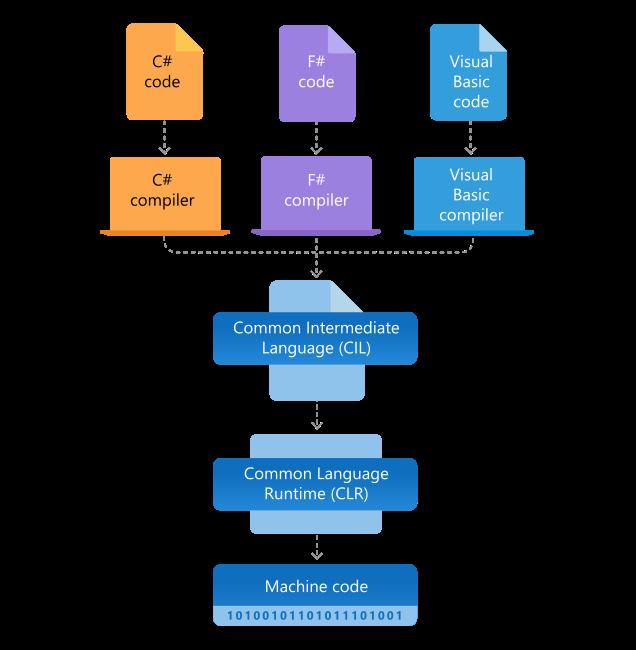
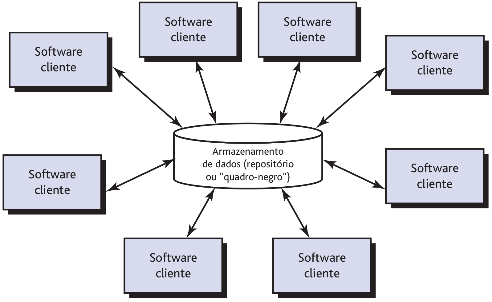
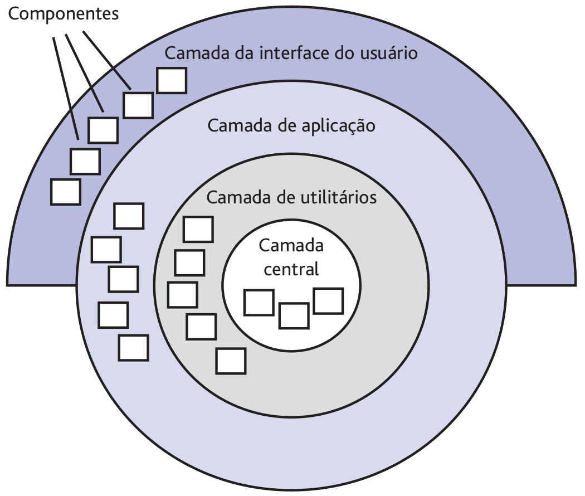
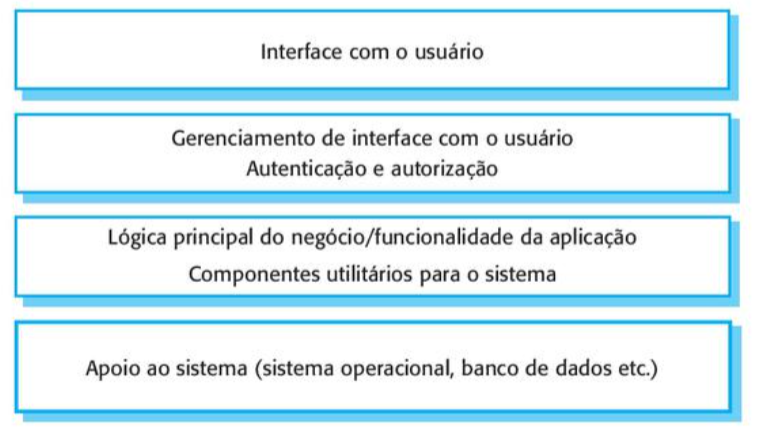
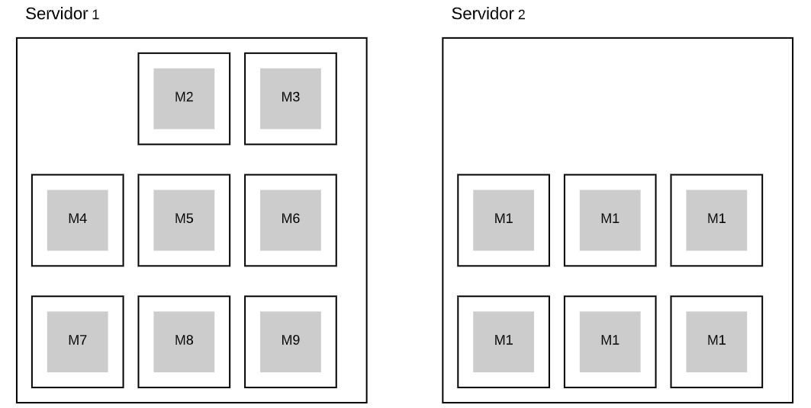
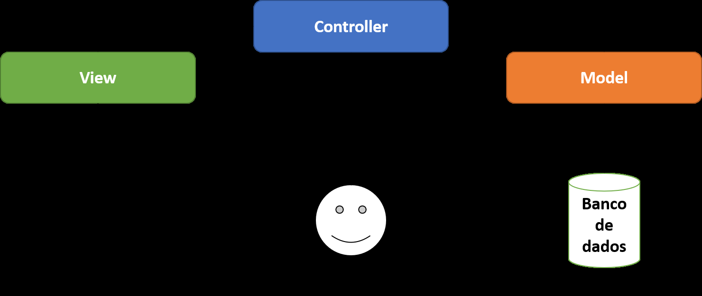
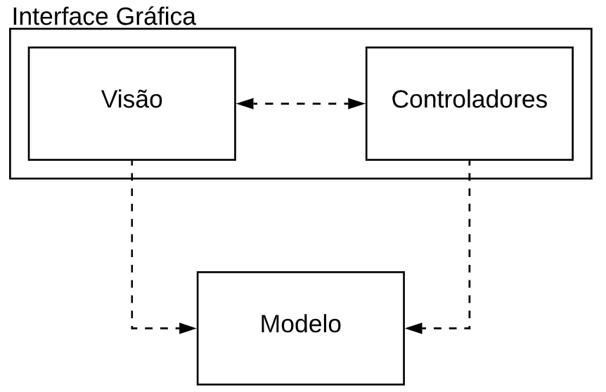
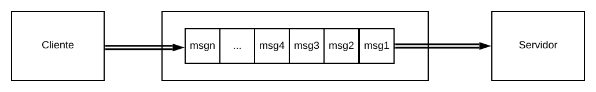
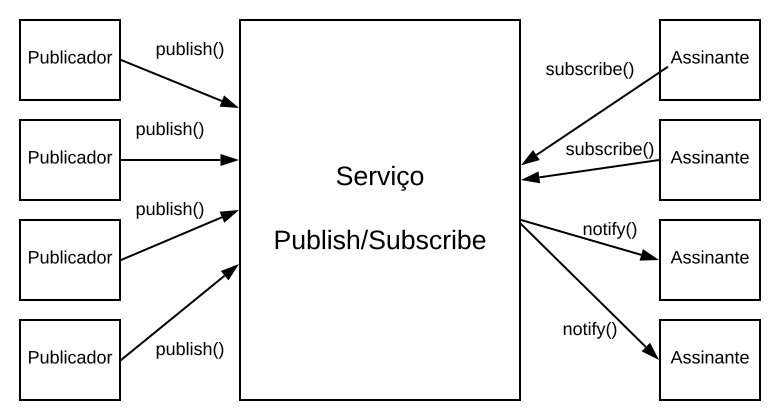

# 03
_Total de páginas: 73_

## Página 1 — Engenharia de Software II

Engenharia de Software II
Andr´e L. D. Rossi
Universidade Estadual Paulista “J´ulio de Mesquita Filho” (UNESP)
Faculdade de Ciˆencias (FC) / Departamento de Computa¸c˜ao (DCo)
Bauru, SP - Brasil

## Página 2 — Projeto de Arquitetura

Projeto de Arquitetura

## Página 3 — O que e Arquitetura

O que ´e Arquitetura?

## Página 4 — O que e Arquitetura

O que ´e Arquitetura?
Quando consideramos um edif´ıcio, a arquitetura ´e:
ˆ Como os v´arios componentes do edif´ıcio s˜ao integrados para formar
um todo coeso.
ˆ O modo como o edif´ıcio se ajusta ao seu ambiente e se integra a
outros edif´ıcios pr´oximos.
ˆ O grau com que o edif´ıcio atende a seu prop´osito declarado e
satisfaz `as necessidades de seu propriet´ario.
ˆ A maneira como texturas, cores e materiais s˜ao combinados para
criar a fachada e o impacto visual do edif´ıcio.
ˆ A lista ´e intermin´avel.
1

## Página 5 — O que e Arquitetura

O que ´e Arquitetura?
A arquitetura n˜ao ´e o software operacional, ´e uma representa¸c˜ao que nos
permite:
1. analisar a efetividade do projeto no atendimento dos requisitos
declarados;
2. considerar alternativas de arquitetura em um est´agio em que fazer
mudan¸cas de projeto ainda ´e relativamente f´acil; e
3. reduzir os riscos associados `a constru¸c˜ao do software.
2

## Página 6 — O que e Arquitetura

O que ´e Arquitetura?
A IEEE 1471 define arquitetura como:
“the fundamental organization of a system embodied in its components,
their relationships to each other and to the environment, and the
principles guiding its design and evolution.”
3

## Página 7 — O que e Arquitetura

O que ´e Arquitetura?
De acordo com Martin Fowler (Who Needs an Architect?), Ralph
Johnson, um dos revisores da defini¸c˜ao, escreveu em uma lista de e-mails:
“[...] esta claramente ´e uma defini¸c˜ao completamente falsa.”
4

## Página 8 — O que e Arquitetura

O que ´e Arquitetura?
Segundo Ralph Johnson:
ˆ Os clientes tˆem um conceito diferente dos desenvolvedores
ˆ Os clientes n˜ao se importam com a estrutura dos componentes
significativos
ˆ O que torna um componente significativo?
ˆ Ele ´e significativo porque os desenvolvedores especialistas assim o
afirmam.
ˆ Um dos fatores ´e a dificuldade do componente ser alterado.
ˆ Por isso, uma arquitetura ´e o conceito mais elevado que os
desenvolvedores tˆem de um sistema em seu ambiente.
5

## Página 9 — O que e Arquitetura

O que ´e Arquitetura?
In most successful software projects, the expert developers working on
that project have a shared understanding of the system design. This
shared understanding is called architecture.
Martin Fowler (2003)
6

## Página 10 — O que e Arquitetura

O que ´e Arquitetura?
Esse entendimento inclui:
ˆ Como o sistema ´e dividido em componentes.
ˆ Como esses componentes interagem atrav´es de interfaces.
7

## Página 11 — O que e Arquitetura

O que ´e Arquitetura?
Por exemplo, em aplica¸c˜oes empresariais, o que os desenvolvedores
especialistas tendem a considerar que ´e crucial?
8

## Página 12 — O que e Arquitetura

O que ´e Arquitetura?
Por exemplo, em aplica¸c˜oes empresariais, o que os desenvolvedores
especialistas tendem a considerar que ´e crucial?
Persistˆencia!
“N´os usamos Oracle e temos nossa pr´opria camada de persistˆencia para
mapear os objetos para o BD”.
9

## Página 13 — O que e Arquitetura

O que ´e Arquitetura?
Essa ´e a ´ULTIMA, prometo!
10

## Página 14 — O que e Arquitetura

O que ´e Arquitetura?
Architecture is about the important stuff. Whatever that is.
Ralph Johnson
11

## Página 15 — Por que a arquitetura e importante

Por que a arquitetura ´e importante?
ˆ Fornece uma representa¸c˜ao que facilita a comunica¸c˜ao entre todos
os envolvidos.
ˆ Constitui um modelo relativamente pequeno e compreens´ıvel de
como o sistema ´e estruturado e como seus componentes interagem.
ˆ Destaca desde o in´ıcio as decis˜oes de projeto que ter˜ao um profundo
impacto no trabalho de engenharia de software que se segue.
12

## Página 16 — Por que a arquitetura e importante

Por que a arquitetura ´e importante?
Figura 1: Arquitetura do .NET framework.
13

## Página 17 — Decisoes de Arquitetura

Decis˜oes de Arquitetura
ˆ As decis˜oes de arquitetura (entre uma variedade de possibilidades)
podem ser consideradas uma vis˜ao de arquitetura.
ˆ Para desenvolvedores ´ageis:
ˆ Um Architectural Decision Record (ADR) poderia conter apenas um
t´ıtulo, um contexto, a decis˜ao, o status e as consequˆencias.
ˆ Projeto dominante: arquitetura ou processo de software inovador
que se torna padr˜ao ap´os per´ıodo de adapta¸c˜ao e uso bem-sucedido
no mercado.
14

## Página 18 — Arquitetura e Agilidade

Arquitetura e Agilidade
ˆ O arquiteto de software junto com o product owner:
ˆ Confronta hist´orias de usu´arios arquiteturais vs hist´orias de usu´arios
de neg´ocio.
ˆ As equipes tˆem liberdade para fazer mudan¸cas `a medida que surgem
novos requisitos.
ˆ O produto em evolu¸c˜ao deve ser aprovado conforme cada ‘prot´otipo’
´e conclu´ıdo.
15

## Página 19 — Por que a arquitetura e importante

Por que a arquitetura ´e importante?
Martin Fowler:
https://youtu.be/DngAZyWMGR0?si=4bqdDdSo1ldBsnGC
16

## Página 20 — Estilos de Arquitetura

Estilos de Arquitetura

## Página 21 — Estilos de Arquitetura

Estilos de Arquitetura
Procure no Google por imagens com as seguintes express˜oes:
ˆ American colonial style with central hall.
ˆ Prefabricated house on an A-shaped wooden frame.
ˆ O software tamb´em apresenta um estilo de arquitetura.
17

## Página 22 — Estilos de Arquitetura

Estilos de Arquitetura
Cada estilo descreve uma categoria de sistema:
ˆ um conjunto de componentes (por exemplo, um banco de dados,
m´odulos computacionais) que realiza uma fun¸c˜ao exigida por um
sistema;
ˆ um conjunto de interfaces que habilitam a “comunica¸c˜ao,
coordena¸c˜ao e coopera¸c˜ao” entre os componentes;
ˆ restri¸c˜oes que definem como os componentes podem ser integrados
para formar o sistema;
18

## Página 23 — Estilos de Arquitetura

Estilos de Arquitetura
Diferen¸ca entre estilo arquitetural e padr˜ao de arquitetura (Pressman):
ˆ Um estilo arquitetural ´e estabelecer uma estrutura para todos os
componentes do sistema.
ˆ O escopo de um padr˜ao ´e menos abrangente, concentrando-se em
um aspecto da arquitetura e n˜ao na arquitetura em sua totalidade.
Embora milh˜oes de sistemas computacionais tenham sido criados nos
´ultimos 60 anos, a vasta maioria pode ser classificada em um n´umero
relativamente pequeno de estilos de arquitetura.
19

## Página 24 — Estilos de Arquitetura

Estilos de Arquitetura
Assim que a engenharia de requisitos revelar as caracter´ısticas e
restri¸c˜oes do sistema a ser constru´ıdo, o estilo e/ou combina¸c˜ao de
padr˜oes de arquitetura que melhor se adequar pode ser escolhido.
Em muitos casos, mais de um padr˜ao poderia ser apropriado, e estilos de
arquitetura alternativos podem ser projetados e avaliados.
Por exemplo, um estilo em camadas (apropriado para a maioria dos
sistemas) pode ser combinado com uma arquitetura centralizada em
dados em diversas aplica¸c˜oes de bancos de dados.
20

## Página 25 — Estilos de Arquitetura

Estilos de Arquitetura
Centralizada em Dados

## Página 26 — Centralizadas em Dados

Centralizadas em Dados
ˆ Um reposit´orio de dados reside no centro dessa arquitetura
ˆ Em geral, os componentes acessam esses dados para:
ˆ editar
ˆ incluir
ˆ eliminar
ˆ modificar
‘
21

## Página 27 — Centralizadas em Dados

Centralizadas em Dados
A Figura 2 ilustra um estilo centralizado em dados t´ıpico.
Figura 2: Arquitetura centralizada em dados.
22

## Página 28 — Centralizadas em Dados

Centralizadas em Dados
ˆ Sub-sistemas necessitam trocar dados entre si. Essa troca pode
acontecer de duas maneiras:
ˆ Compartilhamento atrav´es de um banco de dados ou reposit´orio
comum a todos os componentes.
ˆ Cada componente mant´em o seu pr´oprio banco de dados e transfere
os dados explicitamente uns aos outros.
ˆ Quando ´e necess´ario compartilhar um grande volume de dados, o
modelo de reposit´orio centralizado ´e mais utilizado.
ˆ As arquiteturas centralizadas em dados promovem a integrabilidade:
ˆ Componentes existentes podem ser alterados e novos componentes
clientes acrescentados `a arquitetura sem se preocupar com outros
clientes.
23

## Página 29 — Centralizadas em Dados

Centralizadas em Dados
Vantagens:
ˆ Proporciona um modo eficiente de compartilhamento de um grande
volume de dados.
ˆ Os componentes n˜ao necessitam conhecer a maneira como os dados
s˜ao produzidos ou gerenciados (backup, seguran¸ca, etc. s˜ao
transparentes).
ˆ O modelo de compartilhamento pode ser definido unicamente pelo
reposit´orio.
24

## Página 30 — Estilos de Arquitetura

Estilos de Arquitetura
Cliente-Servidor

## Página 31 — ClienteServidor

Cliente-Servidor
ˆ Componentes: s˜ao agrupados de acordo com a sua localiza¸c˜ao f´ısica:
cliente ou servidor.
ˆ Conectores: pontes de comunica¸c˜ao entre os componentes clientes e
os componentes servidores (normalmente comunica¸c˜ao remota).
ˆ Restri¸c˜oes: os clientes n˜ao s˜ao unidades autˆonomas, dependendo
explicitamente dos servidores.
25

## Página 32 — ClienteServidor

Cliente-Servidor
´E um estilo voltado para sistemas distribu´ıdos, que mostra como os
dados e o processamento ´e dividido entre um conjunto de componentes.
Um conjunto de servidores oferecem servi¸cos espec´ıficos, tais como
impress˜ao, gerenciamento de dados, etc.
Um conjunto de clientes podem executar esses servi¸cos.
A comunica¸c˜ao entre eles se d´a normalmente atrav´es de uma rede
remota.
26

## Página 33 — ClienteServidor

Cliente-Servidor
Vantagens:
ˆ A distribui¸c˜ao dos dados ´e feita de uma forma direta e natural.
ˆ Torna o uso de redes de computadores uma atividade efetiva.
ˆ ´E escal´avel, isto ´e, f´acil de adicionar novos servidores ou atualizar os
j´a existentes.
27

## Página 34 — ClienteServidor

Cliente-Servidor
Figura 3: Arquitetura cliente-servidor de uma biblioteca de filmes.
28

## Página 35 — Estilos de Arquitetura

Estilos de Arquitetura
Fluxo de Dados

## Página 36 — Fluxo de Dados

Fluxo de Dados
ˆ Essa arquitetura se aplica quando dados de entrada devem ser
transformados por meio de uma s´erie de componentes
computacionais ou de manipula¸c˜ao em dados de sa´ıda.
ˆ Um padr˜ao tubos-e-filtro tem um conjunto de componentes,
denominado filtros, conectados por tubos que transmitem dados de
um componente para o seguinte.
29

## Página 37 — Fluxo de Dados

Fluxo de Dados
ˆ Cada filtro trabalha de modo independente.
ˆ ´E projetado para esperar a entrada de dados de determinada forma e
produz sa´ıda de dados da forma especificada.
ˆ Um filtro n˜ao precisa conhecer o funcionamento interno de seus
filtros vizinhos.
ˆ Se o fluxo de dados ocorre em uma ´unica linha de transforma¸c˜oes,
ele ´e denominado sequencial por lotes.
ˆ Essa estrutura aceita um lote de dados e aplica uma s´erie de
componentes sequenciais (filtros) para transform´a-lo.
30

## Página 38 — Fluxo de Dados

Fluxo de Dados
Figura 4: Arquitetura de fluxo de dados.
31

## Página 39 — Fluxo de Dados

Fluxo de Dados
Na Figura 5 ´e apresentado um exemplo da arquitetura fluxo de dados
(duto e filtro).
Figura 5: Arquitetura de fluxo de dados.
32

## Página 40 — Estilos de Arquitetura

Estilos de Arquitetura
Camadas

## Página 41 — Camadas

Camadas
Na arquitetura em camadas, s˜ao definidas v´arias camadas diferentes:
ˆ Na camada mais externa, os componentes atendem `as opera¸c˜oes da
interface do usu´ario.
ˆ Na camada mais interna, fazem a interface com o sistema
operacional.
ˆ As camadas intermedi´arias fornecem servi¸cos utilit´arios e fun¸c˜oes de
software de aplica¸c˜ao.
33

## Página 42 — Camadas

Camadas
Figura 6: Arquitetura em camadas.
34

## Página 43 — Camadas

Camadas
Figura 7: Uma arquitetura gen´erica em camadas.
35

## Página 44 — Estilos de Arquitetura

Estilos de Arquitetura
Microservi¸cos

## Página 45 — Microservicos

Microservi¸cos
Suponha que um sistema tenha sido particionado em m´odulos
(M1,M2,. . . ,Mn), como mostrado na figura a seguir:
Figura 8: Um sistema particionado em 9 m´odulos.
36

## Página 46 — Microservicos

Microservi¸cos
ˆ Em tempo de execu¸c˜ao esses m´odulos ser˜ao executados pelo sistema
operacional como um processo ´unico.
ˆ Portanto, compartilham o mesmo espa¸co de endere¸camento.
ˆ Isto ´e, o sistema ´e um grande monolito em tempo de execu¸c˜ao.
ˆ A chance de que mudan¸cas em um m´odulo comprometa o
funcionamento de outro m´odulo ´e grande.
ˆ Apesar do desenvolvimento ser ´agil, o processo de testes ainda ´e
lento e burocr´atico.
ˆ Para resolver esse gargalo, empresas passaram a adotar uma
arquitetura baseada em microservi¸cos
37

## Página 47 — Microservicos

Microservi¸cos
Microsservi¸cos s˜ao uma abordagem de arquitetura para a cria¸c˜ao de
aplica¸c˜oes, onde cada peda¸co dessa aplica¸c˜ao ´e desenvolvido e
disponibilizado de forma independente.
ˆ Cada processo da aplica¸c˜ao ´e executado como um servi¸co.
ˆ Quando falamos em microsservi¸cos, estamos nos referindo a uma
funcionalidade que pode ser dividida em partes menores.
ˆ Desse modo, essas pequenas partes se comunicam por meio de uma
interface bem definida, por exemplo APIs.
38

## Página 48 — Microservicos

Microservi¸cos
ˆ Como s˜ao executados de forma independente, cada servi¸co pode ser
atualizado e implantado para atender `as demandas de uma
aplica¸c˜ao.
ˆ Se forem constru´ıdos corretamente, os servi¸cos independentes n˜ao
afetar˜ao uns aos outros: se um deles falhar, o restante da aplica¸c˜ao
permanecer´a em funcionamento.
39

## Página 49 — Microservicos

Microservi¸cos
A figura a seguir mostra os nove m´odulos do exemplo anterior sendo
executados em 6 processos ou como 6 microservi¸cos diferentes:
Figura 9: Nove m´odulos de um sistema sendo executados como 6
microservi¸cos.
40

## Página 50 — Microservicos

Microservi¸cos
Figura 10: Arquitetura de microservi¸cos e arquitetura monol´ıtica.
41

## Página 51 — Microservicos

Microservi¸cos
Figura 11: Arquitetura de microservi¸cos.
42

## Página 52 — Microservicos

Microservi¸cos
Vantagens:
ˆ Agilidade: com os deploys e testes independentes, temos uma maior
agilidade no desenvolvimento e na implanta¸c˜ao;
ˆ Baixo acoplamento: com as aplica¸c˜oes s˜ao independentes, elas n˜ao
possuem um acoplamento forte entre si. Isso facilita processos de
manuten¸c˜ao, implanta¸c˜ao e monitoramento;
ˆ Flexibilidade para implanta¸c˜ao de tecnologias heterogˆeneas:
como n˜ao existe acoplamento expl´ıcito e cada servi¸co ´e
independente, podemos ter diferentes servi¸cos escritos em diferentes
tecnologias comunicando-se entre si.
43

## Página 53 — Microservicos

Microservi¸cos
Vantagens:
ˆ Escalabilidade flex´ıvel: cada servi¸co e funcionalidade pode ser
escalado de maneira mais adequada e granular.
ˆ Com isso, ´e poss´ıvel obter at´e mesmo economia na manuten¸c˜ao da
infraestrutura;
ˆ Suponha que o microservi¸co que cont´em M1 seja respons´avel pela
autentica¸c˜ao de usu´arios. Esse microservi¸co pode ser escalado
horizontalmente:
44

## Página 54 — Estilos de Arquitetura

Estilos de Arquitetura
Model-View-Controller

## Página 55 — ModelViewController

Model-View-Controller
A arquitetura MVC define que uma aplica¸c˜ao pode ser organizada em
trˆes camadas (grupos):
ˆ O modelo armazena todos os dados manipulados pela aplica¸c˜ao e a
l´ogica de processamento espec´ıfica.
ˆ A vis˜ao cont´em todas as fun¸c˜oes espec´ıficas `a interface e possibilita
a apresenta¸c˜ao do conte´udo e l´ogica de processamento exigido pelo
usu´ario;
ˆ O controlador interpreta os eventos gerados e gerencia o acesso ao
modelo e `a vis˜ao e coordena o fluxo de dados entre eles.
45

## Página 56 — ModelViewController

Model-View-Controller
Figura 12: Diagrama do padr˜ao MVC.
46

## Página 57 — ModelViewController

Model-View-Controller
ˆ Por´em, em muitos sistemas n˜ao existe uma distin¸c˜ao clara entre
Vis˜ao e Controladores:
Figura 13: Arquitetura MVC sem a distin¸c˜ao clara entre Vis˜ao e Controladores.
47

## Página 58 — ModelViewController

Model-View-Controller
Vamos utilizar o exemplo de uma p´agina web, onde o usu´ario pode
realizar o cadastro de clientes.
48

## Página 59 — ModelViewController

Model-View-Controller
ˆ Com a popularia¸c˜ao da Web, apareceram frameworks para
implementa¸c˜ao de sistemas Web que se denominaram frameworks
MVC.
ˆ Como exemplo, podemos citar Spring (para Java), Ruby on Rails,
Django (para Python) e CakePHP.
ˆ Esses frameworks expandiram e adaptaram o conceito de MVC para
Web.
49

## Página 60 — ModelViewController

Model-View-Controller
Como mencionamos antes, esses frameworks for¸cam a organiza¸c˜ao de um
sistema Web em trˆes partes:
ˆ Vis˜ao, composta por p´aginas HTML;
ˆ Controladores, que processam uma solicita¸c˜ao e geram uma nova
vis˜ao como resposta;
ˆ Modelo, que ´e a camada que persiste os dados em um banco de
dados.
50

## Página 61 — ModelViewController

Model-View-Controller
Figura 14: Arquitetura MVC Web.
51

## Página 62 — ModelViewController

Model-View-Controller
Vantagens do MVC:
ˆ Favorece a especializa¸c˜ao do trabalho de desenvolvimento:
front-end, back-end, DBA.
ˆ Favorece testabilidade: ´e mais f´acil testar objetos n˜ao-visuais (vis˜ao).
ˆ Permite que classes de Modelo sejam usadas por diferentes Vis˜oes:
Figura 15: Sistema MVC com mais de uma vis˜ao.
52

## Página 63 — Estilos de Arquitetura

Estilos de Arquitetura
Arquiteturas Orientadas a Mensagens

## Página 64 — Orientadas a Mensagens

Orientadas a Mensagens
ˆ A comunica¸c˜ao entre clientes e servidores ´e mediada por um servi¸co.
ˆ Esse servi¸co provˆe uma fila de mensagens.
ˆ A comunica¸c˜ao pelo lado do cliente ´e ass´ıncrona:
ˆ Assim que a mensagem ´e inserida, cliente est´a liberado para
continuar processamento.
53

## Página 65 — Orientadas a Mensagens

Orientadas a Mensagens
Figura 16: Arquitetura Orientada a Mensagens.
54

## Página 66 — Orientadas a Mensagens

Orientadas a Mensagens
ˆ Clientes inserem mensagens na fila (produtores).
ˆ Servidores retiram mensagens da fila (consumidores).
ˆ Nessa aplica¸c˜ao distribu´ıda, clientes e servidores:
ˆ N˜ao precisam se conhecer (desacoplamento no espa¸co).
ˆ N˜ao precisar estar simultaneamente dispon´ıveis para se comunicarem
(desacoplamento no tempo).
ˆ Isso permite escalar mais facilmente um sistema distribu´ıdo.
55

## Página 67 — Orientadas a Mensagens

Orientadas a Mensagens
Figura 17: Arquitetura Orientada a Mensagens.
56

## Página 68 — Estilos de Arquitetura

Estilos de Arquitetura
Publish/Subscribe

## Página 69 — PublishSubscribe

Publish/Subscribe
Na arquitetura Publish/Subscribe, h´a dois componentes (pap´eis)
principais:
ˆ Publicadores
ˆ Assinantes
Os publicadores e assinantes se comunicam por meio de mensagens
denominadas de eventos.
57

## Página 70 — PublishSubscribe

Publish/Subscribe
ˆ Publicadores: produzem eventos e os publicam no servi¸co de
publish/subscribe
ˆ Assinantes: Os assinantes devem assinar os eventos de seu interesse
Quando um evento ´e publicado, os seus assinantes s˜ao notificados.
Em publish/subscribe, os assinantes s˜ao notificados assincronamente.
58

## Página 71 — PublishSubscribe

Publish/Subscribe
Figura 18: Arquitetura Publish/Subscribe.
59

## Página 72 — PublishSubscribe

Publish/Subscribe
Exemplo de uma companhia a´erea:
Figura 19: Arquitetura Publish/Subscribe.
60

## Página 73 — PublishSubscribe

Publish/Subscribe
Essa arquitetura tem as seguintes caracter´ısticas:
1. comunica¸c˜ao em grupo, pois o mesmo evento ´e assinado por trˆes
sistemas;
2. desacoplamento no espa¸co, pois o sistema de vendas n˜ao tem
conhecimento dos sistemas interessados nos eventos que ele publica;
3. desacoplamento no tempo, pois o sistema de publish/subscribe
reenvia os eventos caso os sistemas assinantes estejam fora do ar;
4. notifica¸c˜ao ass´ıncrona, pois os assinantes s˜ao notificados assim que
um evento ocorre; isto ´e, eles n˜ao precisam consultar periodicamente
o sistema publish/subscribe sobre a ocorrˆencia dos eventos de
interesse.
61
