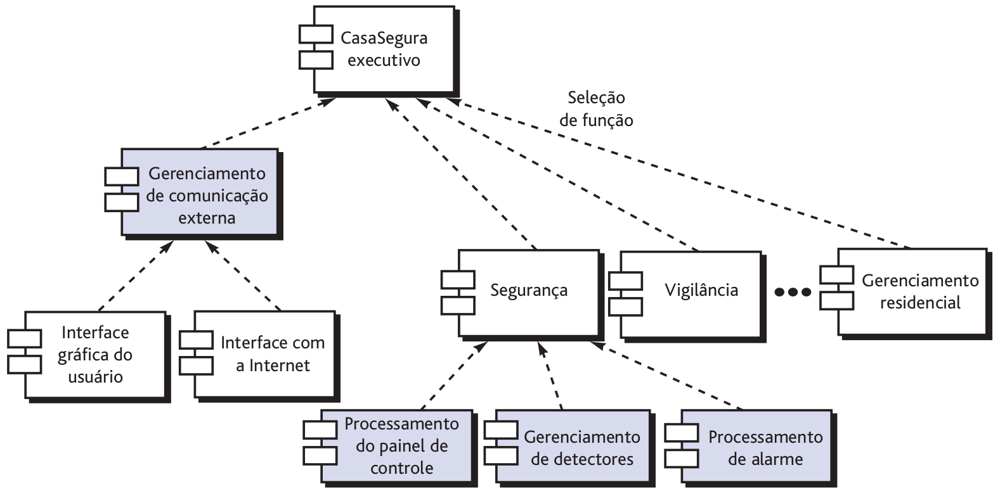
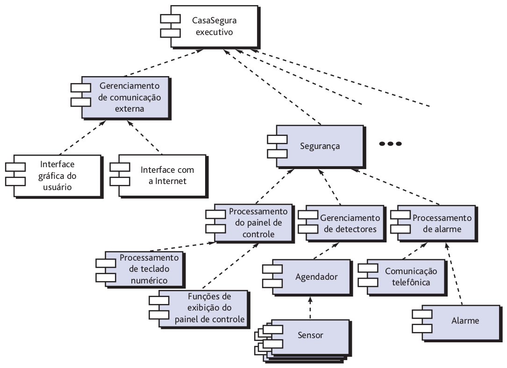
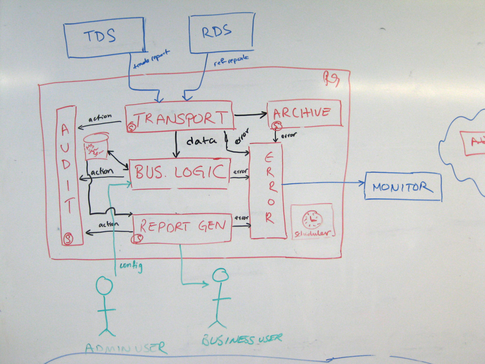
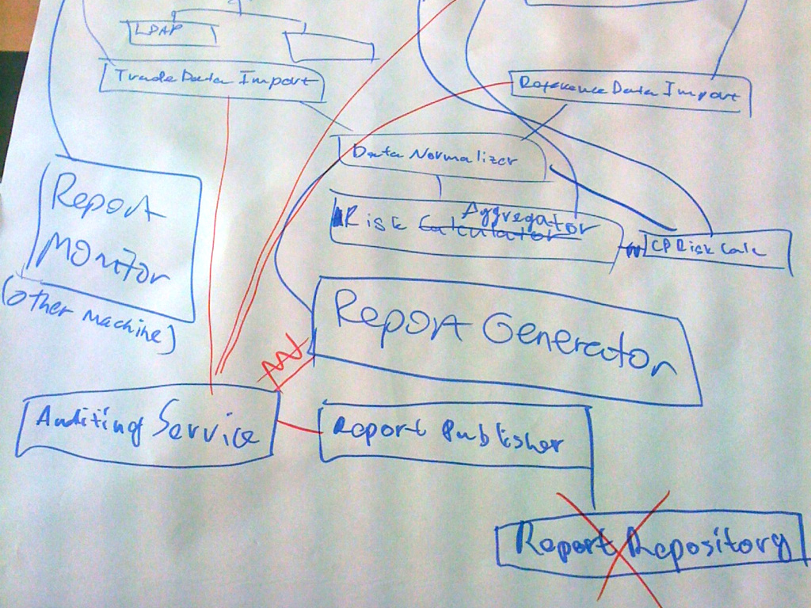
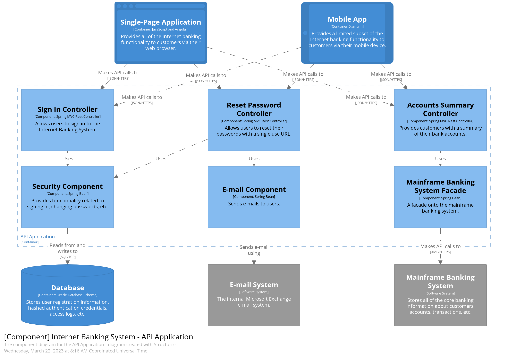

# 04
_Total de páginas: 41_

## Página 1 — Engenharia de Software II

Engenharia de Software II
Andr´e L. D. Rossi
Universidade Estadual Paulista “J´ulio de Mesquita Filho” (UNESP)
Faculdade de Ciˆencias (FC) / Departamento de Computa¸c˜ao (DCo)
Bauru, SP - Brasil

## Página 2 — Estilos de Arquitetura

Estilos de Arquitetura
Organiza¸c˜ao e refinamento

## Página 3 — Organizacao e refinamento

Organiza¸c˜ao e refinamento
Como o processo de projeto muitas vezes permite v´arias alternativas de
arquitetura, ´e importante estabelecer um conjunto de crit´erios de projeto
que possam ser usados para avaliar o projeto de arquitetura obtido. As
seguintes quest˜oes d˜ao uma vis˜ao mais clara sobre um estilo de
arquitetura:
ˆ Controle:
ˆ como o controle ´e gerenciado na arquitetura?
ˆ existe uma hierarquia de controle distinta e, em caso positivo, qual o
papel dos componentes nessa hierarquia de controle?
ˆ como os componentes transferem controle no sistema?
ˆ como o controle ´e compartilhado entre os componentes?
ˆ qual a topologia de controle (ou seja, a forma geom´etrica que o
controle assume)?
ˆ o controle ´e sincronizado ou os componentes operam de maneira
ass´ıncrona?
63

## Página 4 — Organizacao e refinamento

Organiza¸c˜ao e refinamento
ˆ Dados:
ˆ como os dados s˜ao transmitidos entre os componentes?
ˆ o fluxo de dados ´e cont´ınuo ou os objetos de dados s˜ao passados
esporadicamente para o sistema?
ˆ qual o modo de transferˆencia de dados (ou seja, os dados s˜ao
passados de um componente para outro ou os dados est˜ao
dispon´ıveis globalmente para serem compartilhados entre os
componentes do sistema)?
ˆ existem componentes de dados (por exemplo, reposit´orio) e, em caso
positivo, qual o seu papel?
ˆ como os componentes funcionais interagem com os componentes de
dados?
ˆ os componentes de dados s˜ao passivos ou ativos (isto ´e, o
componente de dados interage ativamente com outros componentes
do sistema)?
ˆ como os dados e controle interagem no sistema?
64

## Página 5 — Estilos de Arquitetura

Estilos de Arquitetura
Projeto de Arquitetura

## Página 6 — Projeto de arquitetura

Projeto de arquitetura
No in´ıcio do projeto de arquitetura, deve-se estabelecer o contexto.
Para isso, s˜ao descritas as entidades externas (por exemplo, outros
sistemas, dispositivos, pessoas) que interagem com o software e a
natureza de sua intera¸c˜ao.
De modo geral, essa informa¸c˜ao pode ser obtida a partir do modelo de
requisitos.
Uma vez que o contexto ´e modelado e todas as interfaces de software
externas foram descritas, podemos identificar um conjunto de arqu´etipos
arquiteturais.
65

## Página 7 — Projeto de arquitetura

Projeto de arquitetura
V´arias perguntas devem ser formuladas e respondidas `a medida que um
engenheiro de software cria diagramas arquiteturais significativos:
ˆ O diagrama mostra como o sistema responde `as entradas ou aos
eventos?
ˆ Quais visualiza¸c˜oes devem ser consideradas para ajudar a destacar
´areas de risco?
ˆ Como os padr˜oes de projeto de sistema ocultos podem se tornar
mais evidentes para outros desenvolvedores?
ˆ V´arios pontos de vista podem mostrar a melhor maneira de refatorar
partes espec´ıficas do sistema?
ˆ Os balanceamentos (trade-offs) do projeto podem ser representados
de uma maneira significativa?
Se uma representa¸c˜ao esquem´atica da arquitetura do software responde a
essas perguntas, ela ter´a valor para o engenheiro de software que a
utilizar.
66

## Página 8 — Representacao do sistema no contexto

Representa¸c˜ao do sistema no contexto
No n´ıvel do projeto de arquitetura, um arquiteto de software usa um
diagrama de contexto arquitetural para modelar a maneira como o
software interage com entidades externas `as suas fronteiras.
Figura 20: Diagrama de contexto arquitetural.
67

## Página 9 — Representacao do sistema no contexto

Representa¸c˜ao do sistema no contexto
Os sistemas que interoperam com o sistema-alvo (o sistema para o qual
um projeto de arquitetura deve ser desenvolvido) s˜ao representados
como:
ˆ Sistemas superiores – sistemas que usam o sistema-alvo como parte
de algum esquema de processamento de n´ıvel mais alto.
ˆ Sistemas subordinados – sistemas que s˜ao utilizados pelo
sistema-alvo e fornecem dados ou processamento necess´arios para
completar a funcionalidade do sistema-alvo.
ˆ Sistemas de mesmo n´ıvel (pares) – sistemas que interagem em uma
base par-a-par (ou seja, as informa¸c˜oes s˜ao produzidas ou
consumidas pelos pares e pelo sistema-alvo).
ˆ Atores – entidades (pessoas, dispositivos) que interagem com o
sistema-alvo por meio da produ¸c˜ao ou consumo de informa¸c˜oes
necess´arias para o processamento.
Cada entidade externa se comunica com o sistema alvo por meio de uma
interface.
68

## Página 10 — Representacao do sistema no contexto

Representa¸c˜ao do sistema no contexto
Figura 21: Exemplo de diagrama de contexto arquitetural.
69

## Página 11 — Refinamento da arquitetura em componentes

Refinamento da arquitetura em componentes
Conforme a arquitetura de software ´e refinada em componentes, a
estrutura do sistema come¸ca a emergir.
Mas como os componentes s˜ao escolhidos?
Para responder a essa pergunta, come¸camos pelas classes descritas como
parte do modelo de requisitos.
70

## Página 12 — Refinamento da arquitetura em componentes

Refinamento da arquitetura em componentes
Essas classes de an´alise representam entidades no dom´ınio de aplica¸c˜ao
que devem ser tratadas na arquitetura do software.
Portanto, o dom´ınio de aplica¸c˜ao ´e uma fonte para deriva¸c˜ao e
refinamento de componentes. Outra fonte ´e o dom´ınio da infraestrutura.
A arquitetura deve acomodar muitos componentes de infraestrutura que
permitem componentes de aplica¸c˜ao, mas que n˜ao tˆem nenhuma rela¸c˜ao
de neg´ocio com o dom´ınio de aplica¸c˜ao.
Por exemplo, componentes de gerenciamento de mem´oria, componentes
de comunica¸c˜ao, componentes de bancos de dados e componentes de
gerenciamento de tarefas em geral s˜ao integrados `a arquitetura do
software.
71

## Página 13 — Refinamento da arquitetura em componentes

Refinamento da arquitetura em componentes
As interfaces representadas no diagrama de contexto arquitetural
implicam um ou mais componentes especializados que processam os
dados que fluem pela interface.
Em alguns casos (por exemplo, uma interface gr´afica do usu´ario), tem de
ser projetada uma arquitetura de subsistemas completa, com v´arios
componentes.
72

## Página 14 — Refinamento da arquitetura em componentes

Refinamento da arquitetura em componentes
Continuando com o exemplo da fun¸c˜ao de seguran¸ca domiciliar do
CasaSegura, poder´ıamos definir o conjunto de componentes de alto n´ıvel
que trata da seguinte funcionalidade:
ˆ Gerenciamento da comunica¸c˜ao externa – coordena a comunica¸c˜ao
da fun¸c˜ao de seguran¸ca com entidades externas, como sistemas
baseados na Internet e notifica¸c˜ao externa de alarme.
ˆ Processamento de painel de controle – gerencia toda a
funcionalidade do painel de controle.
ˆ Gerenciamento de detectores – coordena o acesso a todos os
detectores conectados ao sistema.
ˆ Processamento de alarme – verifica e atua sobre todas as condi¸c˜oes
de alarme.
73

## Página 15 — Refinamento da arquitetura em componentes

Refinamento da arquitetura em componentes
Figura 22: Estrutura arquitetural global para o sistema CasaSegura com os
componentes de alto n´ıvel.
74

## Página 16 — Descricao das instancias do sistema

Descri¸c˜ao das instˆancias do sistema
At´e este ponto, o projeto de arquitetura modelado ainda ´e relativamente
de alto n´ıvel.
O contexto do sistema foi representado, a estrutura global do sistema
est´a evidente e os principais componentes de software foram identificados.
Entretanto, um maior refinamento (recorde-se que todo projeto ´e
iterativo) ainda ´e necess´ario.
75

## Página 17 — Descricao das instancias do sistema

Descri¸c˜ao das instˆancias do sistema
Figura 23: Uma instˆancia da fun¸c˜ao de seguran¸ca com elabora¸c˜ao de
componentes.
76

## Página 18 — Exerccio

Exerc´ıcio
Considere o problema de construir o site para uma pequena livraria
virtual.
Qual arquitetura vocˆe utilizar´a? Justifique.
Elabore um diagrama (livre) para representar sua arquitetura.
77

## Página 19 — Modelo C4

Modelo C4

## Página 20 — Modelagem da Arquitetura

Modelagem da Arquitetura
Quando vocˆe pede para um projetista da ´area de engenharia c´ıvil a
arquitetura de um edif´ıcio, vocˆe receber´a plantas do local, plantas baixas,
vistas de eleva¸c˜ao, vistas de se¸c˜ao transversal e desenhos detalhados.
Quando vocˆe pede para um projetista da ´area de engenharia de software
a arquitetura de um sistema, vocˆe provavelmente receber´a algo como :
78

## Página 21 — Modelagem da Arquitetura

Modelagem da Arquitetura
79

## Página 22 — Modelagem da Arquitetura

Modelagem da Arquitetura
80

## Página 23 — Modelagem da Arquitetura

Modelagem da Arquitetura
81

## Página 24 — Modelagem da Arquitetura

Modelagem da Arquitetura
82

## Página 25 — Modelagem da Arquitetura

Modelagem da Arquitetura
Uma verdadeira bagun¸ca com caixas e linhas:
ˆ nota¸c˜ao inconsistente (c´odigo de cores, formas, estilos de linha etc.).
ˆ nomenclatura amb´ıgua e terminologia gen´erica.
ˆ relacionamentos n˜ao rotulados.
ˆ escolhas tecnol´ogicas ausentes.
ˆ etc
83

## Página 26 — Modelagem da Arquitetura

Modelagem da Arquitetura
“UMA GRANDE BOLA DE LAMA (Big Ball of Mud) ´e estruturada ao
acaso, espalhada, desleixada, fita adesiva e arame de seguran¸ca, [...]. O
seu c´odigo mostra sinais inequ´ıvocos de crescimento desregulado, e reparo
repetido e conveniente. A informa¸c˜ao ´e compartilhada promiscuamente
entre elementos distantes do sistema. ” (Foote e Yoder, 1997)
84

## Página 27 — Modelo C4

Modelo C4
O modelo C4 foi criado por Simon Brown com a ideia de facilitar a
contru¸c˜ao de modelos de arquitetura de software.
https://c4model.com/
85

## Página 28 — Modelo C4

Modelo C4
Figura 24: N´ıvel 1: Um diagrama de contexto do sistema fornece um ponto de
partida, mostrando como o sistema de software em escopo se encaixa no
mundo ao seu redor.
86

## Página 29 — Modelo C4

Modelo C4
Diagrama de Contexto
Um diagrama de contexto do sistema ´e um bom ponto de partida para
diagramar e documentar um sistema de software.
Desenhe um diagrama mostrando seu sistema como uma caixa no centro,
cercada por seus usu´arios e outros sistemas com os quais ele interage.
O detalhe n˜ao ´e importante aqui, pois esta ´e a sua vis˜ao ampliada
mostrando uma imagem grande da paisagem do sistema.
O foco deve estar nas pessoas (atores, fun¸c˜oes, personas, etc.) e sistemas
de software, em vez de tecnologias, protocolos e outros detalhes de baixo
n´ıvel.
´E o tipo de diagrama que vocˆe pode mostrar para pessoas n˜ao t´ecnicas.
87

## Página 30 — Modelo C4

Modelo C4
Diagrama de Contˆeiner
Depois de entender como seu sistema se encaixa no ambiente geral, uma
pr´oxima etapa ´e ampliar o limite do sistema com um diagrama de
contˆeiner.
Um “contˆeiner” ´e algo como um aplicativo da Web do lado do servidor,
aplicativo de p´agina ´unica, aplicativo de desktop, aplicativo m´ovel,
esquema de banco de dados, sistema de arquivos etc.
Essencialmente, um contˆeiner ´e uma unidade execut´avel/implant´avel
separadamente (por exemplo, um espa¸co de processo separado) que
executa c´odigo ou armazena dados.
O diagrama do contˆeiner mostra a forma de alto n´ıvel da arquitetura de
software e como as responsabilidades s˜ao distribu´ıdas por ela.
Ele tamb´em mostra as principais op¸c˜oes de tecnologia e como os
contˆeineres se comunicam entre si.
´E um diagrama simples e focado em tecnologia de alto n´ıvel que ´e ´util
88

## Página 31 — Modelo C4

Modelo C4
Figura 25: N´ıvel 2: um diagrama de contˆeiner amplia o sistema de software no
escopo, mostrando os blocos de constru¸c˜ao t´ecnicos de alto n´ıvel.
89

## Página 32 — Modelo C4

Modelo C4
Diagrama de Componentes
Em seguida, vocˆe pode ampliar e decompor cada contˆeiner ainda mais
para identificar os principais blocos de constru¸c˜ao estruturais e suas
intera¸c˜oes.
O diagrama de componentes mostra como um contˆeiner ´e composto de
v´arios “componentes”, o que cada um desses componentes s˜ao, suas
responsabilidades e os detalhes de tecnologia/implementa¸c˜ao.
´E importante observar que todos os componentes dentro de um contˆeiner
normalmente executam no mesmo espa¸co de processo.
No modelo C4, os componentes n˜ao s˜ao unidades executadas
separadamente.
90

## Página 33 — Modelo C4

Modelo C4
Figura 26: N´ıvel 3: um diagrama de componentes amplia um contˆeiner
individual, mostrando os componentes dentro dele.
91

## Página 34 — Modelo C4

Modelo C4
Diagramas de Classe UML, ER, ...
Por fim, vocˆe pode ampliar cada componente para mostrar como ele ´e
implementado como c´odigo; usando diagramas de classe UML, diagramas
de entidade relacionamento ou similares.
Este ´e um n´ıvel opcional de detalhe e geralmente est´a dispon´ıvel sob
demanda de ferramentas como IDEs.
Idealmente, esse diagrama seria gerado automaticamente usando
ferramentas (por exemplo, uma ferramenta de modelagem IDE ou UML),
e vocˆe deve considerar mostrar apenas os atributos e m´etodos que
permitem contar a hist´oria que vocˆe deseja contar.
Este n´ıvel de detalhe n˜ao ´e recomendado para nada al´em dos
componentes mais importantes ou complexos.
92

## Página 35 — Modelo C4

Modelo C4
Figura 27: N´ıvel 4: Um diagrama de c´odigo (por exemplo, classe UML) pode
ser usado para ampliar um componente individual, mostrando como esse
componente ´e implementado.
93

## Página 36 — Modelo C4

Modelo C4
Figura 28: Diferentes n´ıveis de zoom permitem que vocˆe conte diferentes
hist´orias para diferentes p´ublicos.
94

## Página 37 — Exerccio

Exerc´ıcio
Considere novamente o problema de construir o site para uma pequena
livraria virtual.
Redesenhe a sua arquitetura usando o modelo C4.
Projete a arquitetura da livraria virtual usando microsservi¸cos.
Implemente essa arquitetura a partir do reposit´orio
https://github.com/aserg-ufmg/micro-livraria.
95

## Página 38 — Referencias

Referˆencias

## Página 39 — 12354

[1][2][3][5][4]
[1] R. S. Pressman and B. R. Maxim.
Engenharia de Software uma abordagem profissional, volume 1.
AMGH Editora Ltda, 9. edition, 2021.
[2] S. R. Schach.
Engenharia de Software: Os paradigmas cl´assicos & orientados
a objetos, volume 1.
McGraw-Hill, 7. edition, 2008.
[3] I. Sommerville.
Engenharia de Software, volume 1.
S˜ao Paulo: Addison-Wesley, 10. edition, 2019.
[4] M. T. Valente.
Engenharia de software moderna, volume 1.
Independente, 2020.
96

## Página 40 — 5 R S Wazlawick

[5] R. S. Wazlawick.
Engenharia de Software - Conceitos e Pr´atica, volume 1.
Rio de Janeiro: GEN LTC, 2. edition, 2019.
97

## Página 41 — Perguntas

Perguntas?
Obrigado pela aten¸c˜ao!
