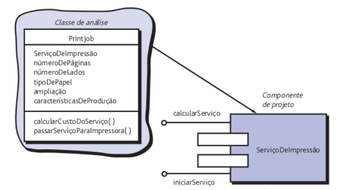
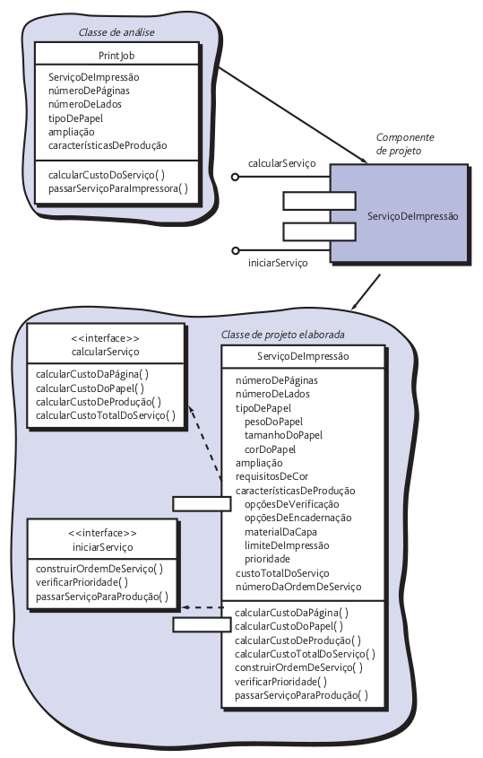
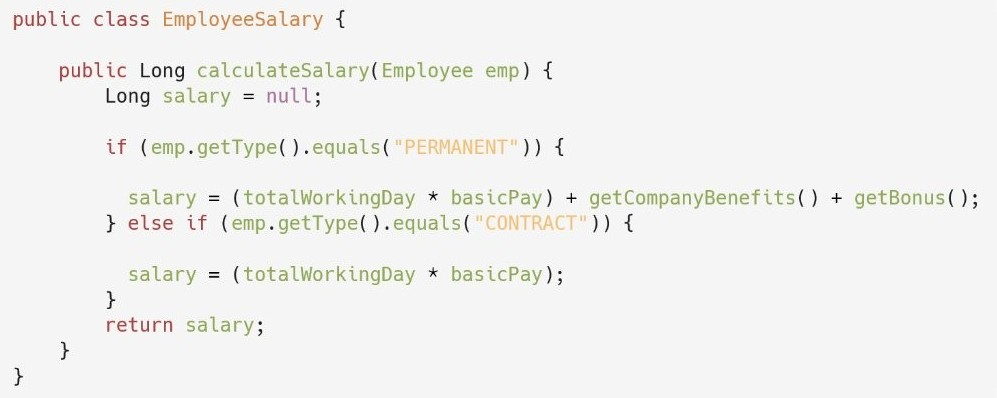
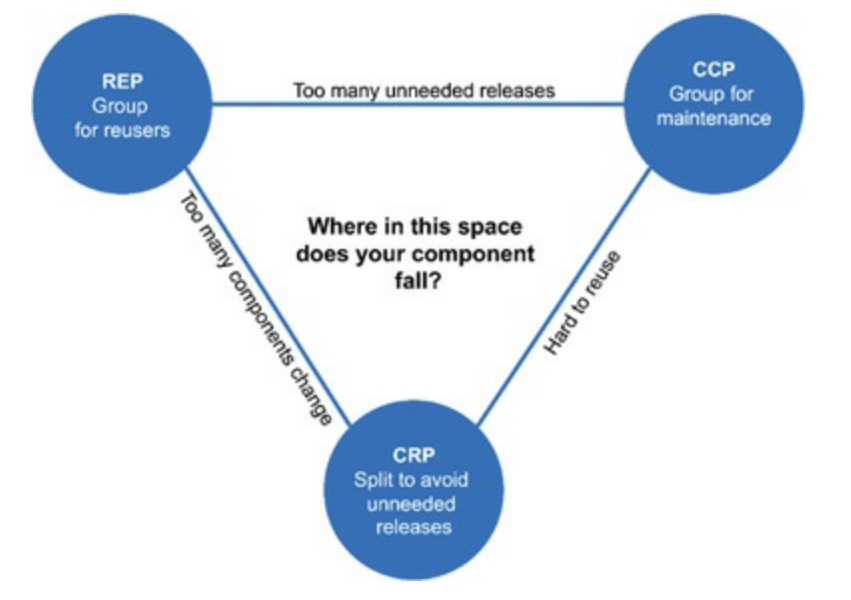
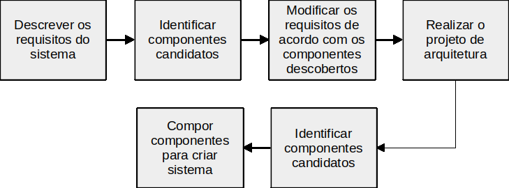

# 05
_Total de páginas: 69_

## Página 1 — Engenharia de Software II

Engenharia de Software II
Andr´e L. D. Rossi
Universidade Estadual Paulista “J´ulio de Mesquita Filho” (UNESP)
Faculdade de Ciˆencias (FC) / Departamento de Computa¸c˜ao (DCo)
Bauru, SP - Brasil

## Página 2 — Sumario

Sum´ario
1. Panorama Geral
2. Projeto de Componentes
3. Condu¸c˜ao de projetos de componentes
4. Desenvolvimento baseado em componentes
1

## Página 3 — Panorama Geral

Panorama Geral

## Página 4 — Panorama

Panorama
O que ´e:
• Um conjunto completo de componentes de software ´e definido
durante o projeto da arquitetura.
• Por´em, os detalhes de processamento e estruturas de dados internas
de cada componente n˜ao s˜ao representados em um n´ıvel de
abstra¸c˜ao pr´oximo ao c´odigo.
• O projeto de componentes define as estruturas de dados, os
algoritmos, as caracter´ısticas das interfaces e os mecanismos de
comunica¸c˜ao alocados a cada componente de software.
2

## Página 5 — Panorama

Panorama
Por que ´e importante?
• Permite revisar os detalhes do projeto em termos de corre¸c˜ao e
consistˆencia com outras representa¸c˜oes:
• Interfaces
• Arquitetura de dados
• ...
3

## Página 6 — Panorama

Panorama
Qual ´e o artefato?
O projeto para cada componente, representado em nota¸c˜ao gr´afica,
tabular ou baseada em texto, ´e o principal artefato durante o projeto de
componentes.
4

## Página 7 — Projeto de Componentes

Projeto de Componentes

## Página 8 — Projeto de Componentes

Projeto de Componentes
• O projeto de componentes ocorre depois que a primeira itera¸c˜ao do
projeto da arquitetura tiver sido conclu´ıda.
• Nesse est´agio, a estrutura geral dos dados e programas do software
j´a foi estabelecida.
• O intuito ´e transformar o modelo de projeto em software operacional.
• Por´em, o n´ıvel de abstra¸c˜ao do modelo de projetos existente ´e
relativamente alto, e o n´ıvel de abstra¸c˜ao do programa operacional ´e
baixo.
5

## Página 9 — O que e componente

O que ´e componente?
• Componente ´e um bloco construtivo modular para software de
computador.
• Mais formalmente, a UML define componente como:
[...]
uma parte modular, poss´ıvel de ser implantada e subs-
titu´ıvel de um sistema que encapsula implementa¸c˜ao e exp˜oe
um conjunto de interfaces.
6

## Página 10 — O que e componente

O que ´e componente?
• Os componentes devem se comunicar e colaborar com outros
componentes e entidades externas:
• Outros sistemas
• Dispositivos
• Pessoas
• O verdadeiro significado do termo componente depender´a do ponto
de vista do engenheiro de software que o utiliza.
7

## Página 11 — Projeto de Componentes

Projeto de Componentes
Uma vis˜ao orientada a objetos

## Página 12 — Uma visao orientada a objetos

Uma vis˜ao orientada a objetos
• No contexto da engenharia de software orientada a objetos, um
componente cont´em um conjunto de classes colaborativas.
• Tamb´em precisam ser definidas todas as interfaces que permitem
que as classes se comuniquem e colaborem com outras classes de
projeto.
8

## Página 13 — Uma visao orientada a objetos

Uma vis˜ao orientada a objetos
• Por exemplo, considere um software a ser criado para uma gr´afica.
• O objetivo geral do software ´e coletar os requisitos do cliente na
recep¸c˜ao da loja, or¸car um trabalho e, em seguida, passar a tarefa
para um centro de produ¸c˜ao automatizado.
• Durante a engenharia de requisitos, foi obtida uma classe de an´alise
denominada Servi¸coDeImpress˜ao (PrintJob)
9

## Página 14 — Uma visao orientada a objetos

Uma vis˜ao orientada a objetos
Figura 1: Classe de an´alise e componente.
10

## Página 15 — Uma visao orientada a objetos

Uma vis˜ao orientada a objetos
• Os detalhes do componente Servi¸coDeImpress˜ao devem ser
elaborados a fim de fornecer informa¸c˜oes suficientes para orientar a
implementa¸c˜ao.
• A classe de an´alise original ´e detalhada para implementar a classe na
forma do componente Servi¸coDeImpress˜ao.
11

## Página 16 — Uma visao orientada a objetos

Uma vis˜ao orientada a objetos
Figura 2: Classe de projeto para o componente Servi¸coDeImpress˜ao.
12

## Página 17 — Projeto de componentes baseados em classes

Projeto de componentes baseados em classes
Na abordagem de engenharia de software orientada a objetos, o projeto
de componentes se concentra na elabora¸c˜ao de classes contidas no
modelo de requisitos/arquitetura:
• Classes espec´ıficas do dom´ınio do problema
• Classes de infraestrutura, que d˜ao suporte a servi¸cos
A descri¸c˜ao detalhada dos atributos, opera¸c˜oes e interfaces utilizados por
essas classes ´e o detalhe de projeto exigido como precursor da atividade
de constru¸c˜ao.
Cinco princ´ıpios b´asicos aplic´aveis ao projeto de componentes tˆem sido
amplamente adotados quando se aplica `a ES orientada a objetos.
13

## Página 18 — Projeto de Componentes

Projeto de Componentes
Princ´ıpios b´asicos de projeto

## Página 19 — Princpios basicos de projeto

Princ´ıpios b´asicos de projeto
14

## Página 20 — Princpios basicos de projeto

Princ´ıpios b´asicos de projeto
• Motiva¸c˜ao ´e criar projetos mais f´aceis de modificar.
• Isso inclui reduzir a propaga¸c˜ao de efeitos colaterais na ocorrˆencia de
modifica¸c˜oes.
• Podemos usar tais princ´ıpios como guias, `a medida que cada
componente de software ´e desenvolvido.
15

## Página 21 — Princpios basicos de projeto

Princ´ıpios b´asicos de projeto
A Tabela 1 a seguir mostra as propriedades contempladas ao seguir cada
um desses princ´ıpios.
Princ´ıpio de Projeto
Propriedade de Projeto
(S) Responsabilidade ´Unica
Coes˜ao
(O) Aberto/Fechado
Extensibilidade
(L) Substitui¸c˜ao de Liskov
Extensibilidade
(I) Segrega¸c˜ao de Interfaces
Coes˜ao
(D) Invers˜ao de Dependˆencia
Acoplamento
Tabela 1: Os cinco princ´ıpios de projeto denominados de SOLID.
16

## Página 22 — Projeto de Componentes

Projeto de Componentes
Princ´ıpio da Responsabilidade ´Unica

## Página 23 — Princpio da Responsabilidade Unica

Princ´ıpio da Responsabilidade ´Unica
“Toda classe deve ter uma ´unica responsabilidade!”
• Esse princ´ıpio ´e uma aplica¸c˜ao direta da ideia de coes˜ao.
• Um corol´ario desse princ´ıpio recomenda separar apresenta¸c˜ao de
regras de neg´ocio, pois as classes de apresenta¸c˜ao e as classes de
regras de neg´ocio podem evoluir e sofrer modifica¸c˜oes por raz˜oes
distintas.
• Quem implementa as classes de apresenta¸c˜ao? E quem implementa
as classes de regras de neg´ocio?
17

## Página 24 — Princpio da Responsabilidade Unica

Princ´ıpio da Responsabilidade ´Unica
public class Employee {
private String fullName;
private String dateOfJoining;
private String annualSalaryPackage;
// standard getters and setters methods
public long calculateEmployeeSalary(Employee emp) { ... }
public long calculateEmployeeLeaves(Employee emp) { ... }
public long calculateTaxOnSalary(Employee emp) { ... }
public Employee saveEmployee(Employee emp) { ... }
public Employee updateEmployee(Employee emp) { ... }
}
18

## Página 25 — Princpio da Responsabilidade Unica

Princ´ıpio da Responsabilidade ´Unica
class Animal:
def __init__(self, nome, pernas, quantidade, imagem):
self.nome = nome
self.pernas = pernas
self.quantidade = quantidade
self.imagem = imagem
def calcular_pernas(self):
return f'N´umero de pernas em {self.nome} ´e: ', self.pernas * self.
quantidade
def calcular_olhos(self):
return f'N´umero de olhos em {self.nome} ´e: ', self.quantidade * 2
def alterar_tamanho_imagem(self):
# Este m´etodo altera o tamanho da imagem do animal
pass
def rotacionar_imagem(self):
# Este m´etodo rotaciona a imagem do animal
pass
19

## Página 26 — Princpio da Responsabilidade Unica

Princ´ıpio da Responsabilidade ´Unica
Exerc´ıcio de refatora¸c˜ao:
public String statement() {
double totalAmount = 0;
int frequentRenterPoints = 0;
Enumeration rentals = _rentals.elements();
String result = 'Rental Record for '+ getName() + '\n';
while (rentals.hasMoreElements()) {
double thisAmount = 0;
Rental each = (Rental) rentals.nextElement();
//determine amounts for each line
switch (each.getMovie().getPriceCode()) {
case Movie.REGULAR:
thisAmount += 2;
if (each.getDaysRented() > 2)
thisAmount += (each.getDaysRented() - 2) * 1.5;
break;
...
20

## Página 27 — Projeto de Componentes

Projeto de Componentes
Princ´ıpio da Segrega¸c˜ao de Interfaces
(Interface Segregation Principle -ISP)

## Página 28 — Princpio da Segregacao de Interfaces

Princ´ıpio da Segrega¸c˜ao de Interfaces
• ´E melhor usar v´arias interfaces espec´ıficas do cliente do que uma
´unica interface de prop´osito geral.
• H´a diversas ocasi˜oes em que componentes para v´arios clientes usam
uma opera¸c˜ao fornecida por uma classe-servidora.
• O ISP sugere a cria¸c˜ao de uma interface especializada para atender
cada categoria principal de clientes.
• O objetivo ´e evitar que clientes dependam de interfaces com
m´etodos que eles n˜ao v˜ao usar.
• O ISP ´e um caso particular do princ´ıpio SRP.
21

## Página 29 — Princpio da Segregacao de Interfaces

Princ´ıpio da Segrega¸c˜ao de Interfaces
Exemplo de interface que viola o ISP:
interface Funcionario {
double getSalario();
double getFGTS();
int getSIAPE();
...
}
Por que o ISP ´e violado nesse caso?
22

## Página 30 — Princpio da Segregacao de Interfaces

Princ´ıpio da Segrega¸c˜ao de Interfaces
public interface Vehicle{
void accelerate();
void applyBrakes();
void fly();
}
public class Bus implements Vehicle{
@Override
public void accelerate() {...}
@Override
public void applyBrakes() {...}
@Override
public void fly(){
// dummy implementation
}
}
public class Aeroplane implements
Vehicle{
@Override
public void accelerate() {...}
@Override
public void applyBrakes() {...}
@Override
public void fly(){...}
}
23

## Página 31 — Princpio da Segregacao de Interfaces

Princ´ıpio da Segrega¸c˜ao de Interfaces
Sugest˜oes para resolver o problema e n˜ao violar o princ´ıpio ISP?
24

## Página 32 — Projeto de Componentes

Projeto de Componentes
Princ´ıpio da Invers˜ao da Dependˆencia
(Dependency Inversion Principle - DIP)

## Página 33 — Princpio da Inversao da Dependencia

Princ´ıpio da Invers˜ao da Dependˆencia
• “Dependa de abstra¸c˜oes. N˜ao dependa de concretiza¸c˜oes”.
• Abstra¸c˜oes (interfaces) s˜ao mais est´aveis do que implementa¸c˜oes
concretas (classes).
• Quanto mais um componente depender de outros componentes
concretos (e n˜ao de abstra¸c˜oes), mais dif´ıcil ser´a estendˆe-lo.
25

## Página 34 — Princpio da Inversao da Dependencia

Princ´ıpio da Invers˜ao da Dependˆencia
Exemplo 1:
interface I { ... }
class C1 implements I {
...
}
class C2 implements I {
...
}
class Cliente {
I i;
Cliente (I i) {
this.i = i;
...
} ...
}
26

## Página 35 — Princpio da Inversao da Dependencia

Princ´ıpio da Invers˜ao da Dependˆencia
Exemplo 1:
interface I { ... }
class C1 implements I {
...
}
class C2 implements I {
...
}
class Cliente {
I i;
Cliente (I i) {
this.i = i;
...
} ...
}
class Main {
void main () {
C1 c1 = new C1();
new Cliente(c1);
...
C2 c2 = new C2();
new Cliente(c2);
...
}
}
27

## Página 36 — Princpio da Inversao da Dependencia

Princ´ıpio da Invers˜ao da Dependˆencia
Exemplo 2 - viola o DIP:
class SQLRepository {
public void save() {
...
}
}
class NoSQLRepository {
public void save() {
...
}
}
public class Service {
private SQLRepository repository = new SQLRepository();
public void save() {
repository.save();
}
}
28

## Página 37 — Princpio do AbertoFechado

Princ´ıpio do Aberto-Fechado
• “Um m´odulo [componente] deve ser aberto para a extens˜ao, mas
fechado para modifica¸c˜oes”.
• Essa afirma¸c˜ao pode parecer uma contradi¸c˜ao, mas representa uma
das caracter´ısticas mais importantes de um bom projeto de
componentes.
• Em outras palavras, devemos especificar o componente para permitir
que ele seja estendido (em seu dom´ınio funcional) sem a necessidade
de fazer modifica¸c˜oes internas (em n´ıvel de c´odigo ou l´ogica) no
pr´oprio componente.
• Para tanto, criamos abstra¸c˜oes que servem como um divisor entre a
funcionalidade que provavelmente ser´a estendida e a classe de
projeto em si.
29

## Página 38 — Princpio do AbertoFechado OCP OpenClosed Principle

Princ´ıpio do Aberto-Fechado (OCP, Open-Closed Principle)
Por exemplo, suponhamos que a fun¸c˜ao de seguran¸ca do CasaSegura fa¸ca
uso de uma classe Detector que deve verificar o estado de cada tipo de
sensor de seguran¸ca.
´E prov´avel que, `a medida que o tempo for passando, o n´umero e os tipos
de sensores de seguran¸ca cres¸cam.
Se a l´ogica de processamento interna for implementada como uma
sequˆencia de constru¸c˜oes se-ent˜ao-sen˜ao (ou switch), cada uma delas
tratando de um tipo de sensor diferente, a adi¸c˜ao de um novo tipo de
sensor exigir´a l´ogica de processamento interna adicional.
Isso ´e uma viola¸c˜ao do OCP.
30

## Página 39 — Princpio do AbertoFechado

Princ´ıpio do Aberto-Fechado
A interface sensor apresenta uma vis˜ao consistente dos sensores para o
componente detector. Se for adicionado um novo tipo de sensor,
nenhuma mudan¸ca ser´a necess´aria na classe Detector (componente). O
OCP ´e preservado.
Figura 3: Seguindo o OCP.
31

## Página 40 — Princpio do AbertoFechado

Princ´ıpio do Aberto-Fechado
32

## Página 41 — Princpio do AbertoFechado

Princ´ıpio do Aberto-Fechado
A classe Collections de Java segue o Princ´ıpio Aberto/Fechado.
List<String> nomes;
nomes = Arrays.asList('joao', 'maria', 'alexandre', 'ze');
Collections.sort(nomes);
System.out.println(nomes);
// resultado: ['alexandre','joao','maria','ze']
33

## Página 42 — Princpio do AbertoFechado

Princ´ıpio do Aberto-Fechado
Se for necess´ario usar o sorte para ordenar as strings de acordo com o
tamanho em caracteres, s´o preciso implementar um objeto Comparator.
Comparator<String> comparador = new Comparator<String>() {
public int compare(String s1, String s2) {
return s1.length() - s2.length();
}
};
Collections.sort(nomes, comparador);
System.out.println(nomes);
// resultado: [ze, joao, maria, alexandre]
34

## Página 43 — Princpio da Substituicao de Liskov

Princ´ıpio da Substitui¸c˜ao de Liskov
• “As subclasses devem ser substitutas de suas classes-base”.
• Esse princ´ıpio, originalmente proposto por Barbara Liskov, explicita
regras para redefini¸c˜ao de m´etodos de classes base em classes filhas.
• Com isso, um componente que usa uma classe-base deve continuar a
funcionar apropriadamente caso uma classe derivada da classe-base
seja passada para o componente em seu lugar.
35

## Página 44 — Princpio da Substituicao de Liskov

Princ´ıpio da Substitui¸c˜ao de Liskov
O LSP exige que qualquer classe derivada de uma classe-base deve
honrar qualquer contrato impl´ıcito entre a classe-base e os componentes
que a utilizam.
No contexto desta discuss˜ao, um “contrato” ´e uma precondi¸c˜ao que deve
ser verdadeira antes de o componente usar uma classe-base e uma
p´os-condi¸c˜ao que deve ser verdadeira ap´os o componente usar uma
classe-base.
Ao criar classes derivadas, certifique-se de que atendem `as precondi¸c˜oes e
`as p´os-condi¸c˜oes.
36

## Página 45 — Princpio da Substituicao de Liskov

Princ´ıpio da Substitui¸c˜ao de Liskov
Exemplo que viola (fortemente) o LSP:
class A {
int soma(int a, int b) {
return a+b;
}
}
class B extends A {
int soma(int a, int b) {
String r = String.valueOf(a)
+ String.valueOf(b);
return Integer.parseInt(r);
}
}
class Cliente {
void f(A a) {
// pode retornar 3 ou 12
a.soma(1,2);
...
}
}
class Main {
void main() {
A a = new A();
B b = new B();
Cliente cli = new Cliente();
cli.f(a);
cli.f(b);
}
}
37

## Página 46 — Princpio da Inversao da Dependencia

Princ´ıpio da Invers˜ao da Dependˆencia
public class Car {
public void fuel() { ...}
public void wheels() { ... }
public void run() { ... }
}
public class TeslaToyCar extends Car {
@Override
public void fuel() {
throw new IllegalStateException('Not
Supported');
}
@Override
public void run() {...}
@Override
public void wheels() {...}
}
public class TeslaRealCar extends
Car {
@Override
public void fuel() {...}
@Override
public void run() {...}
@Override
public void wheels() {...}
}
38

## Página 47 — Projeto de Componentes

Projeto de Componentes
Princ´ıpios de empacotamento aplic´aveis
ao projeto de componentes

## Página 48 — Princpios de empacotamento aplicaveis ao projeto de compo

Princ´ıpios de empacotamento aplic´aveis ao projeto de compo-
nentes
• Embora os princ´ıpios de projeto de componentes sejam ´uteis em
termos de orienta¸c˜ao, os componentes em si n˜ao vivem de forma
isolada.
• Em muitos casos, componentes ou classes individuais s˜ao
organizados em subsistemas ou pacotes.
• Faz sentido perguntar como deve ocorrer a atividade de
empacotamento.
• Exatamente de que forma os componentes devem ser organizados `a
medida que o projeto prossegue?
39

## Página 49 — Princpio da Equivalencia de Reutilizacao de Versoes REP Re

Princ´ıpio da Equivalˆencia de Reutiliza¸c˜ao de Vers˜oes (REP, Re-
lease Reuse Equivalency Principle)
• “A granularidade da reutiliza¸c˜ao ´e a granularidade da vers˜ao”.
• ´E estabelecido um contrato impl´ıcito entre o desenvolvedor da
entidade reutiliz´avel e quem vai us´a-la.
• O desenvolvedor se compromete a estabelecer um sistema de
controle de vers˜oes que ofere¸ca suporte e manuten¸c˜ao para as
vers˜oes mais antigas da entidade, enquanto os usu´arios v˜ao
atualizando gradualmente para a vers˜ao mais recente.
40

## Página 50 — Princpio do Fechamento Comum CCP Common Closure Prin

Princ´ıpio do Fechamento Comum (CCP, Common Closure Prin-
ciple)
• “Classes que mudam juntas, devem ficar juntas”.
• As classes devem ser empacotadas de forma coesa.
• Ao serem empacotadas como parte de um projeto, devem tratar da
mesma ´area funcional ou comportamental.
• Quando alguma caracter´ıstica dessa ´area tiver de mudar, ´e prov´avel
que apenas as classes contidas no pacote precisem ser modificadas.
•
• Isso leva a um controle de mudan¸cas e gerenciamento de vers˜oes
mais eficiente.
41

## Página 51 — Princpio Comum da Reutilizacao CRP Common Reuse Prin

Princ´ıpio Comum da Reutiliza¸c˜ao (CRP, Common Reuse Prin-
ciple)
• “As classes que n˜ao s˜ao reutilizadas juntas n˜ao devem ser agrupadas
juntas”.
• Quando uma ou mais classes com um pacote muda(m), o n´umero
da vers˜ao do pacote muda.
• Se as classes n˜ao forem agrupadas de forma coesa, ´e poss´ıvel que
uma classe sem nenhuma rela¸c˜ao com as demais contidas em um
pacote seja alterada.
• Por essa raz˜ao, apenas as classes reutilizadas juntas devem ser
inclu´ıdas em um pacote.
42

## Página 52 — Coesao de Componentes o diagrama de tensao

Coes˜ao de Componentes: o diagrama de tens˜ao
• Observe que os trˆes princ´ıpios de coes˜ao lutam entre eles:
• REP e CCP s˜ao princ´ıpios que tendem a gerar componentes maiores
• O CRP ´e um princ´ıpio que tende a gerar componentes menores
• Por isso, ao escolher entre os princ´ıpios, sempre haver´a perdas.
43

## Página 53 — Coesao de Componentes o diagrama de tensao

Coes˜ao de Componentes: o diagrama de tens˜ao
Figura 4: Diagrama de tens˜ao: como os trˆes princ´ıpios de coes˜ao interagem.
As arestas indicam o “custo” de abandonar o princ´ıpio no v´ertice oposto [1].
44

## Página 54 — Conducao de projetos de

Condu¸c˜ao de projetos de
componentes

## Página 55 — Conducao de projetos de componentes

Condu¸c˜ao de projetos de componentes
Temos de transformar informa¸c˜oes de modelos de arquitetura e requisitos
em uma representa¸c˜ao de projeto que nos dˆe detalhes suficientes para
orientar a atividade da constru¸c˜ao (codifica¸c˜ao e testes).
Tais etapas representam um conjunto de tarefas t´ıpicas para um projeto
de componentes – quando ele ´e aplicado a um sistema orientado a
objetos.
45

## Página 56 — Conducao de projetos de componentes

Condu¸c˜ao de projetos de componentes
“Se eu tivesse mais tempo, teria escrito uma carta mais curta.” Blaise
Pascal
“One of my most productive days was throwing away 1000 lines of
code.” (atribu´ıdo a Ken Thompson no livro: The Art of UNIX
Programming, de Eric S. Raymond, p. 24.)
46

## Página 57 — Conducao de projetos de componentes

Condu¸c˜ao de projetos de componentes
• Etapa 1: Identificar todas as classes de projeto correspondentes ao
dom´ınio do problema.
• Etapa 2: Identificar todas as classes de projeto correspondentes ao
dom´ınio de infraestrutura. Exemplos: GUI (muitas vezes dispon´ıveis
na forma de componentes reutiliz´aveis), componentes de
administra¸c˜ao de dados, etc.
• Etapa 3: Elaborar todas as classes de projeto que n˜ao s˜ao obtidas
como componentes reutiliz´aveis.
• Etapa 3a: Especificar detalhes de mensagens quando classes ou
componentes colaboram entre si.
• Etapa 3b: Identificar interfaces adequadas para cada componente.
• Etapa 3c: Elaborar atributos e definir tipos de dados e estruturas de
dados necess´arias para implement´a-los.
• Etapa 3d: Descrever detalhadamente o fluxo de processamento
contido em cada opera¸c˜ao.
47

## Página 58 — Conducao de projetos de componentes

Condu¸c˜ao de projetos de componentes
• Etapa 4: Descrever fontes de dados persistentes (bancos de dados e
arquivos) e identificar as classes necess´arias para gerenci´a-los.
• Etapa 5: Desenvolver e elaborar representa¸c˜oes comportamentais
para uma classe ou componente.
• Etapa 6: Elaborar diagramas de implanta¸c˜ao para fornecer detalhes
de implementa¸c˜ao adicionais.
• Etapa 7: Refatorar toda representa¸c˜ao de projetos de componentes
e sempre considerar alternativas.
48

## Página 59 — Desenvolvimento baseado em

Desenvolvimento baseado em
componentes

## Página 60 — Desenvolvimento baseado em componentes

Desenvolvimento baseado em componentes
No contexto da engenharia de software, a reutiliza¸c˜ao ´e uma ideia ao
mesmo tempo antiga e nova.
Os programadores tˆem reutilizado ideias, abstra¸c˜oes e processos desde os
prim´ordios da computa¸c˜ao, mas a abordagem inicial para a reutiliza¸c˜ao
era improvisada.
Hoje em dia, sistemas computacionais complexos e de alta qualidade
devem ser constru´ıdos em prazos muito curtos e exigem uma abordagem
mais organizada para a reutiliza¸c˜ao.
49

## Página 61 — Desenvolvimento baseado em componentes

Desenvolvimento baseado em componentes
A engenharia de software baseada em componentes (CBSE) ´e um
processo que enfatiza o projeto e a constru¸c˜ao de sistemas baseados em
computadores usando “componentes” de software reutiliz´aveis.
50

## Página 62 — Desenvolvimento baseado em componentes

Desenvolvimento baseado em componentes
Considerando essa descri¸c˜ao, surge uma s´erie de quest˜oes:
• ´E poss´ıvel construir sistemas complexos montando-os por meio de
um cat´alogo de componentes de software reutiliz´aveis?
• Isso pode ser realizado de maneira eficaz em termos de custo e
tempo?
• Podem ser estabelecidos incentivos apropriados para estimular os
engenheiros de software `a reutiliza¸c˜ao em vez de reinventar?
• A gerˆencia est´a disposta a incorrer na despesa adicional associada `a
cria¸c˜ao de componentes de software reutiliz´aveis?
• A biblioteca de componentes necess´arios para a reutiliza¸c˜ao pode ser
criada para torn´a-la acess´ıvel aos que precisam dela?
• Os componentes existentes podem ser encontrados por aqueles que
precisam deles?
Cada vez mais, a resposta a cada uma dessas quest˜oes ´e “sim”.
51

## Página 63 — Desenvolvimento baseado em componentes

Desenvolvimento baseado em componentes
Figura 5: Etapas principais do CBSE. Cada componente possui suas pr´oprias
pr´e e p´os-condi¸c˜oes.
52

## Página 64 — Desenvolvimento baseado em componentes

Desenvolvimento baseado em componentes
A CBSE pode ter as seguintes vantagens:
• Tempo de ciclo reduzido;
• Divis˜ao dos custos do desenvolvimento dos componentes entre
m´ultiplos projetos;
• Maior qualidade, pois os componentes s˜ao reutilizados e testados em
aplicativos diferentes;
• Facilidade de manuten¸c˜ao/substitui¸c˜ao dos componentes.
53

## Página 65 — Desenvolvimento baseado em componentes

Desenvolvimento baseado em componentes
Riscos associados `a CBSE:
• Dificuldade de sele¸c˜ao dos componentes;
• Falta de padr˜ao de interoperabilidade entre componentes;
• Riscos de seguran¸ca (uso inadequado do componente);
• Documenta¸c˜ao inadequada dos componentes.
54

## Página 66 — Referencias

Referˆencias

## Página 67 — 23465

[2][3][4][6][5]
[1] R. C. Martin.
Clean Architecture: A Craftsman’s Guide to Software Structure
and Design.
Pearson, 1 edition, 2017.
[2] R. S. Pressman and B. R. Maxim.
Engenharia de Software uma abordagem profissional, volume 1.
AMGH Editora Ltda, 9. edition, 2021.
[3] S. R. Schach.
Engenharia de Software: Os paradigmas cl´assicos & orientados
a objetos, volume 1.
McGraw-Hill, 7. edition, 2008.
[4] I. Sommerville.
Engenharia de Software, volume 1.
S˜ao Paulo: Addison-Wesley, 10. edition, 2019.
55

## Página 68 — 5 M T Valente

[5] M. T. Valente.
Engenharia de software moderna, volume 1.
Independente, 2020.
[6] R. S. Wazlawick.
Engenharia de Software - Conceitos e Pr´atica, volume 1.
Rio de Janeiro: GEN LTC, 2. edition, 2019.
56

## Página 69 — Perguntas

Perguntas?
Obrigado pela aten¸c˜ao!
