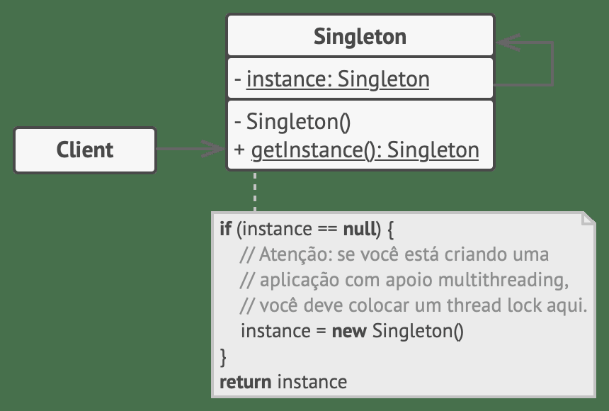

# 06
_Total de páginas: 33_

## Página 1 — Engenharia de Software II

Engenharia de Software II
Andr´e L. D. Rossi
Universidade Estadual Paulista “J´ulio de Mesquita Filho” (UNESP)
Faculdade de Ciˆencias (FC) / Departamento de Computa¸c˜ao (DCo)
Bauru, SP - Brasil

## Página 2 — Projeto baseado em Padroes

Projeto baseado em Padr˜oes

## Página 3 — Projeto baseado em Padroes

Projeto baseado em Padr˜oes
Todos n´os j´a nos deparamos com um problema de projeto e,
silenciosamente, pensamos: ser´a que algu´em j´a desenvolveu uma solu¸c˜ao
para esse problema?
A resposta ´e quase sempre sim!
1

## Página 4 — Projeto baseado em Padroes

Projeto baseado em Padr˜oes
O problema ´e:
ˆ Encontrar a solu¸c˜ao
ˆ Garantir que, de fato, adapte-se ao problema em quest˜ao
ˆ Entender as restri¸c˜oes que talvez limitem a maneira pela qual a
solu¸c˜ao ´e aplicada
ˆ Traduzir a solu¸c˜ao proposta para seu ambiente de projeto
2

## Página 5 — Projeto baseado em Padroes

Projeto baseado em Padr˜oes
Mas e se a solu¸c˜ao fosse codificada de alguma forma?
E se existisse uma maneira padronizada de descrever um problema (de tal
forma que pud´essemos pesquis´a-lo) e um m´etodo organizado para
representar a solu¸c˜ao para o problema?
Os problemas de software seriam codificados e descritos usando-se um
modelo padronizado e seriam propostas solu¸c˜oes (com restri¸c˜oes) para
eles.
Denominado padr˜oes de projeto, esse m´etodo codificado para descri¸c˜ao
de problemas e suas solu¸c˜oes permite que os profissionais da engenharia
de software adquiram conhecimento de projeto para que ele seja
reutilizado.
3

## Página 6 — Projeto baseado em Padroes

Projeto baseado em Padr˜oes
O in´ıcio da hist´oria dos padr˜oes come¸ca com um arquiteto, Christopher
Alexander.
Alexander encontrou um conjunto de problemas recorrentes toda vez que
um edif´ıcio era projetado. Ele caracterizou esses problemas recorrentes e
suas solu¸c˜oes como padr˜oes, descrevendo-os da seguinte maneira:
Cada padr˜ao descreve um problema que ocorre repetidamente
em nosso ambiente e ent˜ao descreve o cerne de uma solu¸c˜ao para
aquele problema para podermos us´a-la repetidamente um milh˜ao
de vezes sem jamais ter de fazer a mesma coisa duas vezes.
4

## Página 7 — Projeto baseado em Padroes

Projeto baseado em Padr˜oes
As ideias de Alexander foram traduzidas inicialmente para o mundo do
software em livros como os de Gamma [1].
Hoje, existem dezenas de reposit´orios de padr˜oes, e projetos baseados em
padr˜oes podem ser aplicados em diversos dom´ınios de aplica¸c˜ao.
5

## Página 8 — Padroes de Projeto

Padr˜oes de Projeto

## Página 9 — Padroes de Projeto

Padr˜oes de Projeto
Um padr˜ao de projeto pode ser caracterizado como “uma regra de trˆes
partes que expressa uma rela¸c˜ao entre um contexto, um problema e
uma solu¸c˜ao”.
Para projeto de software, o contexto permite ao leitor compreender o
ambiente em que o problema reside e qual solu¸c˜ao poderia ser apropriada
nesse ambiente.
Um conjunto de requisitos, incluindo limita¸c˜oes e restri¸c˜oes, atua como
um sistema de for¸cas1 que influencia a maneira pela qual o problema
pode ser interpretado em seu contexto e como a solu¸c˜ao pode ser
aplicada eficientemente.
1For¸cas s˜ao as caracter´ısticas do problema e os atributos de uma solu¸c˜ao que
restringem a maneira como o projeto pode ser desenvolvido.
6

## Página 10 — Padroes de Projeto

Padr˜oes de Projeto
A maioria dos problemas possui v´arias solu¸c˜oes, por´em uma solu¸c˜ao ´e
eficaz somente se for apropriada no contexto do problema existente.
´E o sistema de for¸cas que faz com que um projetista escolha uma solu¸c˜ao
espec´ıfica. O intuito ´e fornecer uma solu¸c˜ao que melhor atenda ao
sistema de for¸cas, mesmo quando essas for¸cas s˜ao contradit´orias.
Por fim, toda solu¸c˜ao tem consequˆencias que poderiam ter um impacto
sobre outros aspectos do software, e ela pr´opria poderia fazer parte do
sistema de for¸cas para outros problemas a serem resolvidos no sistema
mais amplo.
7

## Página 11 — Padroes de Projeto

Padr˜oes de Projeto
Coplien2 caracteriza um padr˜ao de projeto eficaz da seguinte maneira:
ˆ Ele soluciona um problema: os padr˜oes apreendem solu¸c˜oes, n˜ao
apenas estrat´egias ou princ´ıpios abstratos.
ˆ Ele ´e um conceito comprovado: os padr˜oes apreendem solu¸c˜oes com
um hist´orico, n˜ao teorias ou especula¸c˜ao.
ˆ Uma solu¸c˜ao n˜ao ´e ´obvia: muitas t´ecnicas para resolu¸c˜ao de
problemas (como paradigmas ou m´etodos de projeto de software)
tentam obter solu¸c˜oes com base nos primeiros princ´ıpios. Os
melhores padr˜oes geram uma solu¸c˜ao para um problema
indiretamente – uma abordagem necess´aria para os problemas de
projeto mais dif´ıceis.
2Coplien, J., “Software Patterns”, 2005, dispon´ıvel em
http://hillside.net/patterns/definition.html.
8

## Página 12 — Padroes de Projeto

Padr˜oes de Projeto
ˆ Ele descreve uma rela¸c˜ao: os padr˜oes n˜ao apenas descrevem
m´odulos, como tamb´em estruturas e mecanismos de sistema mais
profundos.
ˆ O padr˜ao possui um componente humano significativo (minimizar a
interven¸c˜ao humana). Todo software visa a atender o conforto
humano ou a qualidade de vida; os melhores padr˜oes apelam
explicitamente `a est´etica e `a utilidade.
9

## Página 13 — Padroes de Projeto

Padr˜oes de Projeto
Um padr˜ao de projeto evita que tenhamos de “reinventar a roda” ou, pior
ainda, inventar uma “nova roda” que n˜ao ser´a perfeitamente redonda;
ser´a muito pequena para o uso pretendido e muito estreita para o terreno
onde ir´a rodar.
Os padr˜oes de projeto, se usados de maneira eficiente, invariavelmente o
tornar˜ao um melhor projetista de software.
10

## Página 14 — Padroes de Projeto

Padr˜oes de Projeto
Tipos de Padr˜oes

## Página 15 — Tipos de Padroes

Tipos de Padr˜oes
Uma das raz˜oes para os engenheiros de software se interessarem (e
ficarem intrigados) por padr˜oes de projeto ´e o fato de os seres humanos
serem inerentemente bons no reconhecimento de padr˜oes.
No mundo real, os padr˜oes que reconhecemos s˜ao aprendidos ao longo de
toda uma vida de experiˆencias.
Reconhecemos instantaneamente e compreendemos inerentemente seus
significados e como eles poderiam ser usados.
Alguns desses padr˜oes nos d˜ao uma melhor vis˜ao do fenˆomeno da
recorrˆencia.
11

## Página 16 — Tipos de Padroes

Tipos de Padr˜oes
RubberNecking: olhar com curiosidade
O padr˜ao RubberNecking produz resultados notavelmente previs´ıveis
(um congestionamento), mas nada mais faz do que descrever um
fenˆomeno.
No jarg˜ao dos padr˜oes, ele poderia ser denominado padr˜ao n˜ao
generativo, pois descreve um contexto e um problema, mas n˜ao fornece
nenhuma solu¸c˜ao expl´ıcita.
12

## Página 17 — Tipos de Padroes

Tipos de Padr˜oes
Quando s˜ao considerados padr˜oes de projeto de software, faz-se um
esfor¸co para identificar e documentar padr˜oes generativos.
Em um ambiente ideal, um conjunto de padr˜oes de projeto generativos
poderia ser usado para “gerar” uma aplica¸c˜ao ou sistema computacional
cuja arquitetura permitisse que se adaptasse `a mudan¸ca.
Algumas vezes chamada generatividade, “a aplica¸c˜ao sucessiva de v´arios
padr˜oes, cada um deles encapsulando seu pr´oprio problema e for¸cas,
desdobra-se em uma solu¸c˜ao mais ampla que emerge indiretamente como
resultado das solu¸c˜oes menores”.
13

## Página 18 — Tipos de Padroes

Tipos de Padr˜oes
Os padr˜oes de projeto abrangem um amplo espectro de abstra¸c˜ao e
aplica¸c˜ao.
14

## Página 19 — Tipos de Padroes

Tipos de Padr˜oes
Os padr˜oes de arquitetura descrevem problemas de projeto de car´ater
amplo e diverso, resolvidos usando-se uma abordagem estrutural.
Os padr˜oes de dados descrevem problemas orientados a dados
recorrentes e as solu¸c˜oes de modelagem de dados que podem ser usadas
para resolvˆe-los.
15

## Página 20 — Tipos de Padroes

Tipos de Padr˜oes
Os padr˜oes de componentes (tamb´em conhecidos como padr˜oes de
projeto) tratam de problemas associados ao desenvolvimento de
subsistemas e componentes, da maneira pela qual eles se comunicam
entre si e de seu posicionamento em uma arquitetura maior.
Os padr˜oes de interfaces descrevem problemas comuns de interfaces do
usu´ario e suas solu¸c˜oes, com um sistema de for¸cas que inclui as
caracter´ısticas espec´ıficas dos usu´arios.
16

## Página 21 — Tipos de Padroes

Tipos de Padr˜oes
Os padr˜oes para WebApp tratam de um conjunto de problemas
encontrados ao se construir WebApps.
Em geral, incorporam muitas das demais categorias de padr˜oes
mencionados.
17

## Página 22 — Tipos de Padroes

Tipos de Padr˜oes
Em seu livro seminal sobre padr˜oes de projeto, Gamma [1] e seus colegas
descrevem trˆes tipos de padr˜oes particularmente relevantes para projetos
orientados a objetos:
ˆ padr˜oes criacionais;
ˆ padr˜oes estruturais; e
ˆ padr˜oes comportamentais.
18

## Página 23 — Relacionamento entre padroes de projeto

Relacionamento entre padr˜oes de projeto
19

## Página 24 — Padroes de Projeto

Padr˜oes de Projeto
Padr˜oes Criacionais

## Página 25 — Padroes Criacionais

Padr˜oes Criacionais
Os padr˜oes criacionais se concentram na cria¸c˜ao, composi¸c˜ao e
representa¸c˜ao de objetos e disp˜oem de mecanismos que facilitam a
instancia¸c˜ao de objetos.
Os padr˜oes criacionais tamb´em imp˜oem restri¸c˜oes sobre o tipo e
n´umero de objetos que podem ser criados em um sistema.
Exemplos de padr˜oes criacionais:
ˆ Singleton
ˆ M´etodo f´abrica
ˆ F´abrica abstrata
ˆ Construtor
20

## Página 26 — Singleton

Singleton
Suponha uma classe Logger, usada para registrar as opera¸c˜oes realizadas
em um sistema:
void f() {
Logger log = new Logger();
log.println(‘‘Executando f’’);
...
}
void g() {
Logger log = new Logger();
log.println(‘‘Executando g’’);
...
}
void h() {
Logger log = new Logger();
log.println(‘‘Executando h’’);
...
}
21

## Página 27 — Singleton

Singleton
Problema:
Cada m´etodo cria sua pr´opria instˆancia de Logger. Isso pode n˜ao ser
adequado para acesso a algum recurso (banco de dados, arquivos, etc).
Solu¸c˜ao:
Figura 1: Padr˜ao Criacional Singleton
(https://refactoring.guru/pt-br/design-patterns/singleton).
22

## Página 28 — Singleton

Singleton
class Logger {
// proibe clientes de chamar new
Logger()
private Logger() {}
// instancia unica
private static Logger instance;
public static Logger getInstance()
{
if (instance == null)
instance = new Logger();
return instance;
}
public void println(String msg)
{
// Poderia ser em arquivo
System.out.println(msg);
}
}
void f() {
Logger log = Logger.getInstance();
log.println(‘‘Executando f’’);
...
}
void g() {
Logger log = Logger.getInstance();
log.println(‘‘Executando g’’);
...
}
void h() {
Logger log = Logger.getInstance();
log.println(‘‘Executando h’’);
...
}
23

## Página 29 — Fabrica estatico

F´abrica (est´atico)
Suponha um sistema distribu´ıdo baseado em TCP/IP. Nesse sistema, trˆes
fun¸c˜oes f, g e h criam objetos do tipo TCPChannel para comunica¸c˜ao
remota:
void f() {
TCPChannel c = new TCPChannel();
...
}
void g() {
TCPChannel c = new TCPChannel();
...
}
void h() {
TCPChannel c = new TCPChannel();
...
}
24

## Página 30 — Fabrica estatico

F´abrica (est´atico)
E se o sistema precisar usar UDP ao inv´es do TCP para comunica¸c˜ao?
Esse trecho de c´odigo n˜ao atende ao princ´ıpio Aberto/Fechado!
25

## Página 31 — Fabrica estatico

F´abrica (est´atico)
void f() {
TCPChannel c = new
TCPChannel();
...
}
void g() {
TCPChannel c = new
TCPChannel();
...
}
void h() {
TCPChannel c = new
TCPChannel();
...
}
class ChannelFactory {
// metodo fabrica estatico
public static Channel create() {
return new TCPChannel();
}
}
void f() {
Channel c=ChannelFactory.create();
...
}
void g() {
Channel c=ChannelFactory.create();
...
}
void h() {
Channel c=ChannelFactory.create();
...
}
26

## Página 32 — Metodo Fabrica

M´etodo F´abrica
Imagine agora que vocˆe poder sobreescrever o m´etodo f´abrica em uma
subclasse e mudar o produto que est´a sendo criado.
Figura 2: Uma f´abrica ´e criada para cada produto.
27

## Página 33 — Metodo Fabrica

M´etodo F´abrica
Para o caso da “f´abrica de canais de comunica¸c˜ao”:
Figura 3: Padr˜ao Criacional M´etodo F´abrica para diferentes produtos (TCP e
UDP).
28

