# Todos os Slides

# 01
_Total de páginas: 16_

## Página 1 — Engenharia de Software II

Engenharia de Software II
Andr´e L. D. Rossi
Universidade Estadual Paulista “J´ulio de Mesquita Filho” (UNESP)
Faculdade de Ciˆencias (FC) / Departamento de Computa¸c˜ao (DCo)
Bauru, SP - Brasil

## Página 2 — Sumario

Sum´ario
1. Objetivos
2. Conte´udo
3. Plano de Aula
4. Crit´erios de Avalia¸c˜ao
1

## Página 3 — Objetivos

Objetivos

## Página 4 — Objetivos

Objetivos
Os objetivos desta disciplina s˜ao:
ˆ compreender os aspectos fundamentais do projeto (design) de
software;
ˆ identificar e elaborar diferentes elementos do projeto de software
(arquitetura, dados, interface com usu´ario, padr˜oes);
ˆ entender conceitos de teste de software;
ˆ planejar estrat´egias de teste de software;
ˆ compreender os conceitos de manuten¸c˜ao de software;
ˆ gerenciar a configura¸c˜ao de software
2

## Página 5 — Conteudo

Conte´udo

## Página 6 — Conteudo

Conte´udo
O conte´udo da disciplina inclui:
ˆ Aspectos do projetos de software
ˆ Arquitetura e padr˜oes de software
ˆ Projeto de componentes
ˆ Projeto de interfaces
ˆ Projeto baseado em padr˜oes
ˆ T´ecnicas e estrat´egias de softwre
ˆ Gest˜ao de configura¸c˜ao e manuten¸c˜ao de software
3

## Página 7 — Plano de Aula

Plano de Aula

## Página 8 — Cronograma

Cronograma
Aula
Data
Conte´udo
1
23/02
Aspectos fundamentais do projeto de software
2
02/03
Aspectos fundamentais do projeto de software
3
09/03
Arquitetura e padr˜oes em projeto de software
4
16/03
Arquitetura e padr˜oes em projeto de software
5
23/03
Atividade pr´atica
6
30/03
Projeto de Componentes
7
06/04
Projeto baseado em Padr˜oes
4

## Página 9 — Cronograma

Cronograma
Aula
Data
Conte´udo
8
13/04
P1
-
20/04
N˜ao haver´a aula (feriado 21/04)
9
27/04
Apresenta¸c˜ao
parcial
do
projeto
(arquite-
tura+componentes+classes)
10
04/05
Projeto de interfaces
11
11/05
T´ecnicas e estrat´egias de teste de software
12
18/05
T´ecnicas e estrat´egias de teste de software
13
25/05
Gest˜ao de configura¸c˜ao de software
5

## Página 10 — Cronograma

Cronograma
Aula
Data
Conte´udo
14
01/06
Atividade pr´atica
15
08/06
P2 e apresenta¸c˜oes dos projetos
16
15/06
Apresenta¸c˜oes dos projetos
-
22/06
Exame
* Entrega do projeto: 01/06
6

## Página 11 — Criterios de Avaliacao

Crit´erios de Avalia¸c˜ao

## Página 12 — Criterios de Avaliacao

Crit´erios de Avalia¸c˜ao
Ser˜ao atribu´ıdas notas a provas duas provas e um trabalho pr´atico. A
nota final ser´a calculada pela m´edia ponderada:
MF = MP ∗0, 5 + MA ∗0, 1 + MR ∗0, 4
(1)
Onde:
MF = m´edia final;
MP = M´edia aritm´etica das provas
MA = M´edia aritm´etica das atividades pr´aticas
MR = M´edia aritm´etica do projeto
Para o Regime de Recupera¸c˜ao ser´a aplicada uma avalia¸c˜ao escrita
(prova), cujo conte´udo contemplar´a toda a mat´eria ministrada na
disciplina.
7

## Página 13 — Trabalho final

Trabalho final
Objetivo: Elaborar o Projeto de um Software.
Data de Entrega: O projeto escrito dever´a ser entregue at´e o dia
01/06/2025.
Grupo: m´aximo 4 pessoas.
Os grupos dever˜ao realizar uma apresenta¸c˜ao do Projeto com dura¸c˜ao
entre 15 e 20 minutos.
8

## Página 14 — Referencias

Referˆencias

## Página 15 — 1234

[1][2][3][4]
[1] R. S. Pressman and B. R. Maxim.
Engenharia de Software uma abordagem profissional, volume 1.
AMGH Editora Ltda, 9. edition, 2021.
[2] S. R. Schach.
Engenharia de Software: Os paradigmas cl´assicos & orientados
a objetos, volume 1.
McGraw-Hill, 7. edition, 2008.
[3] I. Sommerville.
Engenharia de Software, volume 1.
S˜ao Paulo: Addison-Wesley, 10. edition, 2019.
[4] M. T. Valente.
Engenharia de software moderna.
Princ´ıpios e Pr´aticas para Desenvolvimento de Software com
Produtividade, 1:24, 2020.
9

## Página 16 — Perguntas

Perguntas?
Obrigado pela aten¸c˜ao!

---

# 02
_Total de páginas: 141_

## Página 1 — Engenharia de Software II

Engenharia de Software II
Andr´e L. D. Rossi
Universidade Estadual Paulista “J´ulio de Mesquita Filho” (UNESP)
Faculdade de Ciˆencias (FC) / Departamento de Computa¸c˜ao (DCo)
Bauru, SP - Brasil

## Página 2 — Conceitos de Projeto

Conceitos de Projeto

## Página 3 — O que e projeto

O que ´e projeto?
ˆ Projeto ´e o que todo engenheiro quer fazer
1

## Página 4 — O que e projeto

O que ´e projeto?
ˆ Projeto ´e o que todo engenheiro quer fazer
ˆ Modelo de projeto: “Como fazer?”
1

## Página 5 — O que e projeto

O que ´e projeto?
ˆ Projeto ´e o que todo engenheiro quer fazer
ˆ Modelo de projeto: “Como fazer?”
ˆ Cria uma representa¸c˜ao ou modelo de software
1

## Página 6 — O que e projeto

O que ´e projeto?
ˆ Projeto ´e o que todo engenheiro quer fazer
ˆ Modelo de projeto: “Como fazer?”
ˆ Cria uma representa¸c˜ao ou modelo de software
ˆ Fornece detalhes:
ˆ Arquitetura de sotware
ˆ Estruturas de dados
ˆ Interfaces
ˆ Componentes
1

## Página 7 — O que e Projeto

O que ´e Projeto?
Segundo Mitchell Kapor (1990) no seu Manifesto do Projeto (Design) de
Software:
2

## Página 8 — O que e Projeto

O que ´e Projeto?
Segundo Mitchell Kapor (1990) no seu Manifesto do Projeto (Design) de
Software:
“It’s where you stand with a foot in two worlds—the world of
technology and the world of people and human purposes—and
you try to bring the two together.”
2

## Página 9 — Por que elaborar um projeto

Por que elaborar um projeto?
ˆ Permite “modelar” o sistema (produto) antes de ser codificado
(constru´ıdo)
3

## Página 10 — Por que elaborar um projeto

Por que elaborar um projeto?
ˆ Permite “modelar” o sistema (produto) antes de ser codificado
(constru´ıdo)
ˆ Etapa em que a qualidade ´e estabelecida
3

## Página 11 — Por que elaborar um projeto

Por que elaborar um projeto?
Atributos de qualidade – FURPS:
ˆ Funcionalidade (Functionality): caracter´ısticas e capacidades do
software
4

## Página 12 — Por que elaborar um projeto

Por que elaborar um projeto?
Atributos de qualidade – FURPS:
ˆ Funcionalidade (Functionality): caracter´ısticas e capacidades do
software
ˆ Usabilidade (Usability) : fatores humanos, est´etica, consistˆencia e
documenta¸c˜ao
4

## Página 13 — Por que elaborar um projeto

Por que elaborar um projeto?
Atributos de qualidade – FURPS:
ˆ Funcionalidade (Functionality): caracter´ısticas e capacidades do
software
ˆ Usabilidade (Usability) : fatores humanos, est´etica, consistˆencia e
documenta¸c˜ao
ˆ Confiabilidade (Reliability) : frequˆencia (MTTF) e gravidade das
falhas
4

## Página 14 — Por que elaborar um projeto

Por que elaborar um projeto?
Atributos de qualidade – FURPS:
ˆ Funcionalidade (Functionality): caracter´ısticas e capacidades do
software
ˆ Usabilidade (Usability) : fatores humanos, est´etica, consistˆencia e
documenta¸c˜ao
ˆ Confiabilidade (Reliability) : frequˆencia (MTTF) e gravidade das
falhas
ˆ Desempenho (Performance) : eficiˆencia e efic´acia
4

## Página 15 — Por que elaborar um projeto

Por que elaborar um projeto?
Atributos de qualidade – FURPS:
ˆ Funcionalidade (Functionality): caracter´ısticas e capacidades do
software
ˆ Usabilidade (Usability) : fatores humanos, est´etica, consistˆencia e
documenta¸c˜ao
ˆ Confiabilidade (Reliability) : frequˆencia (MTTF) e gravidade das
falhas
ˆ Desempenho (Performance) : eficiˆencia e efic´acia
ˆ Facilidade de Suporte (Suportability) : facilidade de manuten¸c˜ao
(estender, adptar, reparar, ...)
4

## Página 16 — Por que elaborar um projeto

Por que elaborar um projeto?
Pr´aticas de projeto:
5

## Página 17 — Por que elaborar um projeto

Por que elaborar um projeto?
Pr´aticas de projeto:
ˆ Diversifica¸c˜ao: identificar pos´ıveis alternativas de projeto
5

## Página 18 — Por que elaborar um projeto

Por que elaborar um projeto?
Pr´aticas de projeto:
ˆ Diversifica¸c˜ao: identificar pos´ıveis alternativas de projeto
ˆ Convergˆencia: rejeitar alternativas que n˜ao atendam os requisitos
5

## Página 19 — O Modelo de Projeto

O Modelo de Projeto
ˆ A modelagem de projetos de software equivale aos planos de um
arquiteto para uma casa
6

## Página 20 — O Modelo de Projeto

O Modelo de Projeto
ˆ A modelagem de projetos de software equivale aos planos de um
arquiteto para uma casa
ˆ Come¸ca pela representa¸c˜ao do todo a ser constru´ıdo (p. ex., uma
representa¸c˜ao tridimensional da casa)
6

## Página 21 — O Modelo de Projeto

O Modelo de Projeto
ˆ A modelagem de projetos de software equivale aos planos de um
arquiteto para uma casa
ˆ Come¸ca pela representa¸c˜ao do todo a ser constru´ıdo (p. ex., uma
representa¸c˜ao tridimensional da casa)
ˆ Gradualmente, concentra-se nos detalhes, oferecendo um roteiro
para a sua constru¸c˜ao (p. ex., a estrutura do encanamento)
6

## Página 22 — O Modelo de Projeto

O Modelo de Projeto
Figura 1: Encanamento e tomadas da minha casa!
7

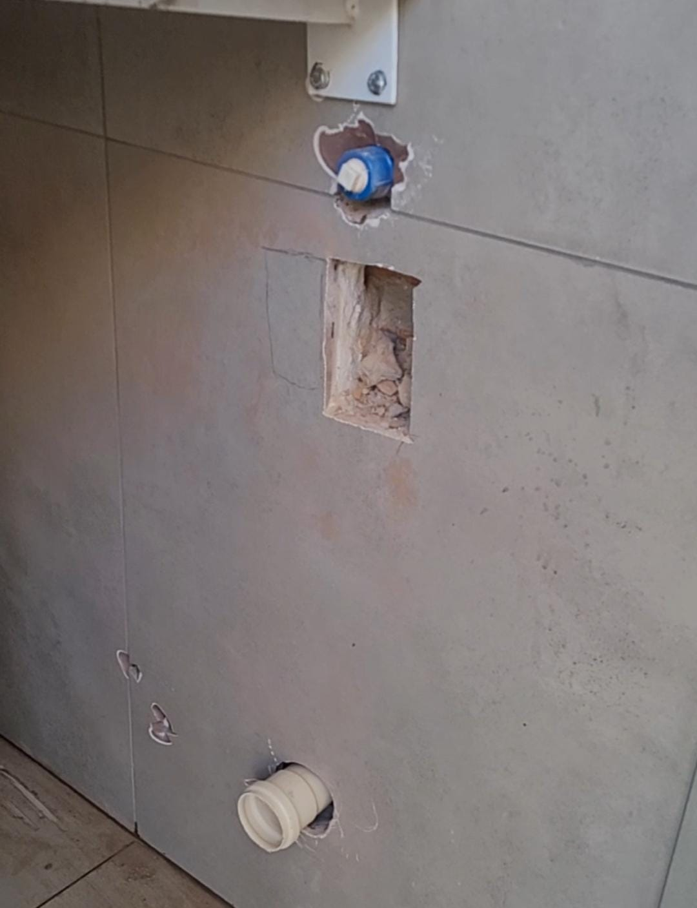

## Página 23 — O Modelo de Projeto

O Modelo de Projeto
Figura 2: Encanamento e tomadas da minha casa!
8

## Página 24 — O Modelo de Projeto

O Modelo de Projeto
Figura 3: Encanamento e tomadas da minha casa!
9

## Página 25 — O Modelo de Projeto

O Modelo de Projeto
Exemplo: quais os principais m´odulos de um compilador?
10

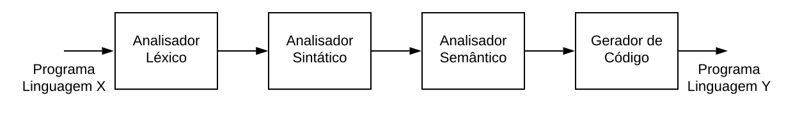

## Página 26 — O Modelo de Projeto

O Modelo de Projeto
Exemplo: quais os principais m´odulos de um compilador?
Figura 4: Principais m´odulos de um compilador.
10

## Página 27 — O Modelo de Projeto

O Modelo de Projeto
ˆ Os elementos do modelo de projeto usam v´arios dos diagramas da
UML utilizados no modelo de an´alise
11

## Página 28 — O Modelo de Projeto

O Modelo de Projeto
ˆ Os elementos do modelo de projeto usam v´arios dos diagramas da
UML utilizados no modelo de an´alise
ˆ A diferen¸ca ´e o grau de refinamento, fornecendo detalhes para a
implementa¸c˜ao em rela¸c˜ao `a:
ˆ Estrutura e o estilo da arquitetura
ˆ Os componentes que residem nessa arquitetura
ˆ Interfaces entre os componentes e com o mundo exterior
11

## Página 29 — Modelo de Projeto

Modelo de Projeto
Figura 5: Descri¸c˜ao do sistema, modelo de an´alise e modelo de projeto.
12

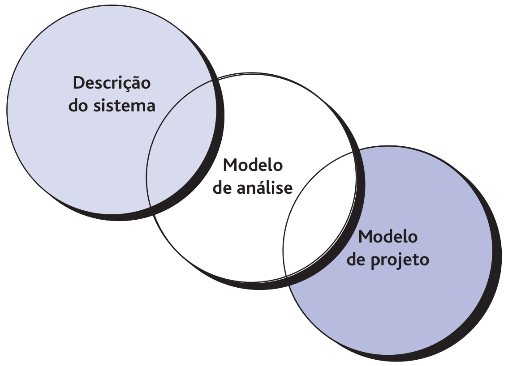

## Página 30 — Projeto de Software

Projeto de Software
Figura 6: O modelo de projeto a partir do modelo de requisitos.
13

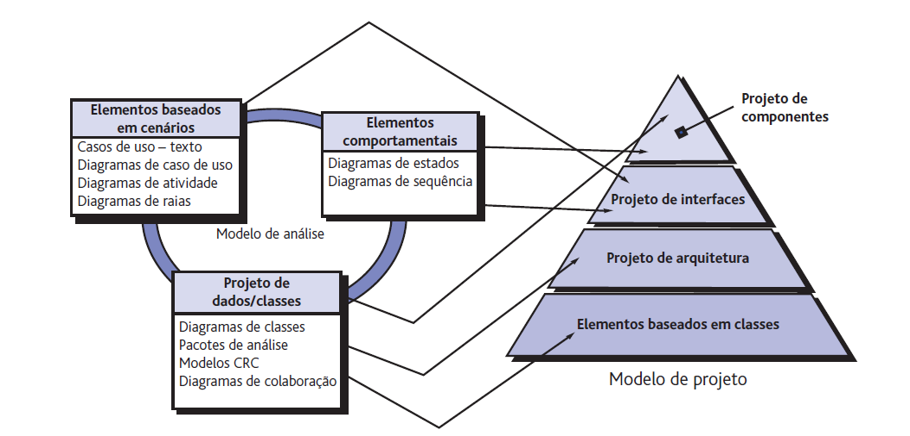

## Página 31 — O Modelo de Projeto

O Modelo de Projeto
Figura 7: Dimens˜oes do modelo de projeto.
14

## Página 32 — O Modelo de Projeto

O Modelo de Projeto
Princ´ıpios da modelagem de projetos:
ˆ Representa¸c˜oes de projetos (modelos) devem ser de f´acil
compreens˜ao
15

## Página 33 — O Modelo de Projeto

O Modelo de Projeto
Princ´ıpios da modelagem de projetos:
ˆ Representa¸c˜oes de projetos (modelos) devem ser de f´acil
compreens˜ao
ˆ O projeto deve ser desenvolvido iterativamente
15

## Página 34 — O Modelo de Projeto

O Modelo de Projeto
Princ´ıpios da modelagem de projetos:
ˆ Representa¸c˜oes de projetos (modelos) devem ser de f´acil
compreens˜ao
ˆ O projeto deve ser desenvolvido iterativamente
ˆ A cria¸c˜ao de um modelo de projeto n˜ao exclui uma abordagem ´agil
15

## Página 35 — O Modelo de Projeto

O Modelo de Projeto
Princ´ıpios da modelagem de projetos:
ˆ Representa¸c˜oes de projetos (modelos) devem ser de f´acil
compreens˜ao
ˆ O projeto deve ser desenvolvido iterativamente
ˆ A cria¸c˜ao de um modelo de projeto n˜ao exclui uma abordagem ´agil
ˆ Alguns proponentes do desenvolvimento de software ´agil dizem que o
c´odigo ´e a ´unica documenta¸c˜ao de projeto necess´aria
15

## Página 36 — O Modelo de Projeto

O Modelo de Projeto
Princ´ıpios da modelagem de projetos:
ˆ Representa¸c˜oes de projetos (modelos) devem ser de f´acil
compreens˜ao
ˆ O projeto deve ser desenvolvido iterativamente
ˆ A cria¸c˜ao de um modelo de projeto n˜ao exclui uma abordagem ´agil
ˆ Alguns proponentes do desenvolvimento de software ´agil dizem que o
c´odigo ´e a ´unica documenta¸c˜ao de projeto necess´aria
ˆ Contudo, o objetivo de um modelo de projeto ´e ajudar outros que
dever˜ao manter e evoluir o sistema
15

## Página 37 — O Modelo de Projeto

O Modelo de Projeto
Princ´ıpios da modelagem de projetos:
ˆ Representa¸c˜oes de projetos (modelos) devem ser de f´acil
compreens˜ao
ˆ O projeto deve ser desenvolvido iterativamente
ˆ A cria¸c˜ao de um modelo de projeto n˜ao exclui uma abordagem ´agil
ˆ Alguns proponentes do desenvolvimento de software ´agil dizem que o
c´odigo ´e a ´unica documenta¸c˜ao de projeto necess´aria
ˆ Contudo, o objetivo de um modelo de projeto ´e ajudar outros que
dever˜ao manter e evoluir o sistema
ˆ Ao final do empreendimento, o projeto deve estar documentado em
um n´ıvel que permita o entendimento e a manuten¸c˜ao do c´odigo
15

## Página 38 — O processo de Projeto

O processo de Projeto

## Página 39 — O processo de projeto

O processo de projeto
ˆ Processo iterativo:
16

## Página 40 — O processo de projeto

O processo de projeto
ˆ Processo iterativo:
ˆ Requisitos s˜ao traduzidos em uma “planta” para o desenvolvimento
do software
16

## Página 41 — O processo de projeto

O processo de projeto
ˆ Processo iterativo:
ˆ Requisitos s˜ao traduzidos em uma “planta” para o desenvolvimento
do software
ˆ Nota¸c˜ao para representar componentes funcionais e suas interfaces
16

## Página 42 — O processo de projeto

O processo de projeto
ˆ Processo iterativo:
ˆ Requisitos s˜ao traduzidos em uma “planta” para o desenvolvimento
do software
ˆ Nota¸c˜ao para representar componentes funcionais e suas interfaces
ˆ Heur´ıstica para refinamento e divis˜oes
16

## Página 43 — O processo de projeto

O processo de projeto
ˆ Processo iterativo:
ˆ Requisitos s˜ao traduzidos em uma “planta” para o desenvolvimento
do software
ˆ Nota¸c˜ao para representar componentes funcionais e suas interfaces
ˆ Heur´ıstica para refinamento e divis˜oes
ˆ Diretrizes para avalia¸c˜ao da qualidade
16

## Página 44 — O processo de projeto

O processo de projeto
ˆ Processo iterativo:
ˆ Requisitos s˜ao traduzidos em uma “planta” para o desenvolvimento
do software
ˆ Nota¸c˜ao para representar componentes funcionais e suas interfaces
ˆ Heur´ıstica para refinamento e divis˜oes
ˆ Diretrizes para avalia¸c˜ao da qualidade
16

## Página 45 — O processo de projeto

O processo de projeto
ˆ Deve implementar todos os requisitos expl´ıcitos do modelos de
requisitos e tentar acomodar os requisitos impl´ıcitos
17

## Página 46 — O processo de projeto

O processo de projeto
ˆ Deve implementar todos os requisitos expl´ıcitos do modelos de
requisitos e tentar acomodar os requisitos impl´ıcitos
ˆ Deve ser um guia leg´ıvel para os desenvolvedores de c´odigo, os que
testam e d˜ao suporte
17

## Página 47 — O processo de projeto

O processo de projeto
ˆ Deve implementar todos os requisitos expl´ıcitos do modelos de
requisitos e tentar acomodar os requisitos impl´ıcitos
ˆ Deve ser um guia leg´ıvel para os desenvolvedores de c´odigo, os que
testam e d˜ao suporte
ˆ Deve fornecer uma vis˜ao hol´ıstica do software
ˆ Abstra¸c˜ao de alto n´ıvel
ˆ Refinamentos subsequentes
ˆ N´ıveis menores de abstra¸c˜ao
17

## Página 48 — Tarefas genericas para projeto

Tarefas gen´ericas para projeto
1. Examinar o modelo de informa¸c˜ao e projetar estruturas de dados
apropriadas para objetos de dados e seus atributos
18

## Página 49 — Tarefas genericas para projeto

Tarefas gen´ericas para projeto
1. Examinar o modelo de informa¸c˜ao e projetar estruturas de dados
apropriadas para objetos de dados e seus atributos
2. Usar o modelo de an´alise, selecionar um estilo de arquitetura
(padr˜ao) apropriado ao software
18

## Página 50 — Tarefas genericas para projeto

Tarefas gen´ericas para projeto
1. Examinar o modelo de informa¸c˜ao e projetar estruturas de dados
apropriadas para objetos de dados e seus atributos
2. Usar o modelo de an´alise, selecionar um estilo de arquitetura
(padr˜ao) apropriado ao software
3. Dividir o modelo de an´alise em subsistemas de projeto e aloc´a-los na
arquitetura:
ˆ Certificar-se de que cada subsistema seja funcionalmente coeso
ˆ Projetar interfaces de subsistemas
ˆ Alocar classes ou fun¸c˜oes de an´alise para cada subsistema
18

## Página 51 — Tarefas genericas para projeto

Tarefas gen´ericas para projeto
1. Examinar o modelo de informa¸c˜ao e projetar estruturas de dados
apropriadas para objetos de dados e seus atributos
2. Usar o modelo de an´alise, selecionar um estilo de arquitetura
(padr˜ao) apropriado ao software
3. Dividir o modelo de an´alise em subsistemas de projeto e aloc´a-los na
arquitetura:
ˆ Certificar-se de que cada subsistema seja funcionalmente coeso
ˆ Projetar interfaces de subsistemas
ˆ Alocar classes ou fun¸c˜oes de an´alise para cada subsistema
4. Criar um conjunto de classes ou componentes de projeto:
ˆ Transformar a descri¸c˜ao de classes de an´alise em uma classe de
projeto
ˆ Verificar cada classe de projeto em rela¸c˜ao aos crit´erios de projeto
ˆ Definir m´etodos e mensagens associadas a cada classe de projeto
ˆ Avaliar e selecionar padr˜oes de projeto para uma classe ou um
subsistema de projeto
ˆ Rever as classes de projeto e revisar quando necess´ario
18

## Página 52 — Tarefas genericas para projeto

Tarefas gen´ericas para projeto
5. Projetar qualquer interface necess´aria para sistemas ou dispositivos
externos
19

## Página 53 — Tarefas genericas para projeto

Tarefas gen´ericas para projeto
5. Projetar qualquer interface necess´aria para sistemas ou dispositivos
externos
6. Projetar a interface do usu´ario
ˆ Revisar os resultados da an´alise de tarefas
ˆ Especificar a sequˆencia de a¸c˜oes baseando-se nos cen´arios de usu´ario
ˆ Criar um modelo comportamental da interface
ˆ Definir objetos de interface e mecanismos de controle
ˆ Rever o projeto de interfaces e revisar quando necess´ario
19

## Página 54 — Tarefas genericas para projeto

Tarefas gen´ericas para projeto
5. Projetar qualquer interface necess´aria para sistemas ou dispositivos
externos
6. Projetar a interface do usu´ario
ˆ Revisar os resultados da an´alise de tarefas
ˆ Especificar a sequˆencia de a¸c˜oes baseando-se nos cen´arios de usu´ario
ˆ Criar um modelo comportamental da interface
ˆ Definir objetos de interface e mecanismos de controle
ˆ Rever o projeto de interfaces e revisar quando necess´ario
7. Conduzir o projeto de componentes.
ˆ Especificar todos os algoritmos em um n´ıvel de abstra¸c˜ao
relativamente baixo
ˆ Refinar a interface de cada componente
ˆ Definir estruturas de dados dos componentes
ˆ Revisar cada componente e corrigir todos os erros descobertos
19

## Página 55 — Tarefas genericas para projeto

Tarefas gen´ericas para projeto
5. Projetar qualquer interface necess´aria para sistemas ou dispositivos
externos
6. Projetar a interface do usu´ario
ˆ Revisar os resultados da an´alise de tarefas
ˆ Especificar a sequˆencia de a¸c˜oes baseando-se nos cen´arios de usu´ario
ˆ Criar um modelo comportamental da interface
ˆ Definir objetos de interface e mecanismos de controle
ˆ Rever o projeto de interfaces e revisar quando necess´ario
7. Conduzir o projeto de componentes.
ˆ Especificar todos os algoritmos em um n´ıvel de abstra¸c˜ao
relativamente baixo
ˆ Refinar a interface de cada componente
ˆ Definir estruturas de dados dos componentes
ˆ Revisar cada componente e corrigir todos os erros descobertos
8. Desenvolver um modelo de implanta¸c˜ao
19

## Página 56 — Conceitos de projetos

Conceitos de projetos

## Página 57 — Abstracao

Abstra¸c˜ao
ˆ Abstra¸c˜ao procedural: refere-se a uma sequˆencia de instru¸c˜oes que
possui uma fun¸c˜ao espec´ıfica
20

## Página 58 — Abstracao

Abstra¸c˜ao
ˆ Abstra¸c˜ao procedural: refere-se a uma sequˆencia de instru¸c˜oes que
possui uma fun¸c˜ao espec´ıfica
ˆ O nome indica sua fun¸c˜ao, mas detalhes s˜ao omitidos
ˆ Por exemplo, a palavra abrir para uma porta
ˆ Define uma sequˆencia de etapas procedurais (caminhar, alcan¸car
ma¸caneta, girar etc)
20

## Página 59 — Abstracao

Abstra¸c˜ao
ˆ Abstra¸c˜ao procedural: refere-se a uma sequˆencia de instru¸c˜oes que
possui uma fun¸c˜ao espec´ıfica
ˆ O nome indica sua fun¸c˜ao, mas detalhes s˜ao omitidos
ˆ Por exemplo, a palavra abrir para uma porta
ˆ Define uma sequˆencia de etapas procedurais (caminhar, alcan¸car
ma¸caneta, girar etc)
ˆ Diferentes n´ıveis de abstra¸c˜ao podem ser usados
ˆ Hist´orias de usu´ario
20

## Página 60 — Abstracao

Abstra¸c˜ao
ˆ Abstra¸c˜ao procedural: refere-se a uma sequˆencia de instru¸c˜oes que
possui uma fun¸c˜ao espec´ıfica
ˆ O nome indica sua fun¸c˜ao, mas detalhes s˜ao omitidos
ˆ Por exemplo, a palavra abrir para uma porta
ˆ Define uma sequˆencia de etapas procedurais (caminhar, alcan¸car
ma¸caneta, girar etc)
ˆ Diferentes n´ıveis de abstra¸c˜ao podem ser usados
ˆ Hist´orias de usu´ario
ˆ Casos de uso
20

## Página 61 — Abstracao

Abstra¸c˜ao
ˆ Abstra¸c˜ao procedural: refere-se a uma sequˆencia de instru¸c˜oes que
possui uma fun¸c˜ao espec´ıfica
ˆ O nome indica sua fun¸c˜ao, mas detalhes s˜ao omitidos
ˆ Por exemplo, a palavra abrir para uma porta
ˆ Define uma sequˆencia de etapas procedurais (caminhar, alcan¸car
ma¸caneta, girar etc)
ˆ Diferentes n´ıveis de abstra¸c˜ao podem ser usados
ˆ Hist´orias de usu´ario
ˆ Casos de uso
ˆ Diagramas de classes ou pseudoc´odigo
20

## Página 62 — Arquitetura

Arquitetura
ˆ Refere-se `a organiza¸c˜ao geral do software
21

## Página 63 — Arquitetura

Arquitetura
ˆ Refere-se `a organiza¸c˜ao geral do software
ˆ Organiza¸c˜ao de componentes de programa (m´odulos)
21

## Página 64 — Arquitetura

Arquitetura
ˆ Refere-se `a organiza¸c˜ao geral do software
ˆ Organiza¸c˜ao de componentes de programa (m´odulos)
ˆ A maneira como esses componentes interagem
21

## Página 65 — Arquitetura

Arquitetura
ˆ Refere-se `a organiza¸c˜ao geral do software
ˆ Organiza¸c˜ao de componentes de programa (m´odulos)
ˆ A maneira como esses componentes interagem
ˆ A estrutura de dados que s˜ao usados pelos componentes
21

## Página 66 — Arquitetura

Arquitetura
ˆ Refere-se `a organiza¸c˜ao geral do software
ˆ Organiza¸c˜ao de componentes de programa (m´odulos)
ˆ A maneira como esses componentes interagem
ˆ A estrutura de dados que s˜ao usados pelos componentes
21

## Página 67 — Arquitetura

Arquitetura
ˆ Refere-se `a organiza¸c˜ao geral do software
ˆ Organiza¸c˜ao de componentes de programa (m´odulos)
ˆ A maneira como esses componentes interagem
ˆ A estrutura de dados que s˜ao usados pelos componentes
ˆ Em um sentido mais amplo, os componentes podem ser
generalizados para representar os principais elementos de um sistema
e suas intera¸c˜oes
21

## Página 68 — Arquitetura

Arquitetura
Como a arquitetura ´e vista em processos ag´eis?
22

## Página 69 — Arquitetura

Arquitetura
Como a arquitetura ´e vista em processos ag´eis?
ˆ Geralmente ´e aceito que um est´agio inicial do processo de
desenvolvimento ´agil esteja focado na cria¸c˜ao do projeto de
arquitetura geral do sistema
22

## Página 70 — Arquitetura

Arquitetura
Como a arquitetura ´e vista em processos ag´eis?
ˆ Geralmente ´e aceito que um est´agio inicial do processo de
desenvolvimento ´agil esteja focado na cria¸c˜ao do projeto de
arquitetura geral do sistema
ˆ O desenvolvimento incremental das arquiteturas normalmente n˜ao ´e
bem sucedido
22

## Página 71 — Arquitetura

Arquitetura
Como a arquitetura ´e vista em processos ag´eis?
ˆ Geralmente ´e aceito que um est´agio inicial do processo de
desenvolvimento ´agil esteja focado na cria¸c˜ao do projeto de
arquitetura geral do sistema
ˆ O desenvolvimento incremental das arquiteturas normalmente n˜ao ´e
bem sucedido
ˆ Refatorar componentes ´e f´acil. Por´em, refatorar a arquitetura pode
implicar em ter que alterar a maior parte dos componentes
22

## Página 72 — Arquitetura

Arquitetura
Figura 8: Rascunho de uma arquitetura de software.
23

## Página 73 — Padroes

Padr˜oes
O que ´e um padr˜ao de projeto?
24

## Página 74 — Padroes

Padr˜oes
O que ´e um padr˜ao de projeto?
Brad Appleton define da seguinte maneira:
“Padr˜ao ´e parte de um conhecimento consolidado j´a existente
que transmite a essˆencia de uma solu¸c˜ao comprovada para um
problema recorrente em certo contexto, em meio a preocupa¸c˜oes
concorrentes.”
24

## Página 75 — Padroes

Padr˜oes
ˆ O objetivo de um padr˜ao ´e fornecer uma descri¸c˜ao que permita a um
projetista determinar:
ˆ Se o padr˜ao se aplica ou n˜ao ao problema em quest˜ao
25

## Página 76 — Padroes

Padr˜oes
ˆ O objetivo de um padr˜ao ´e fornecer uma descri¸c˜ao que permita a um
projetista determinar:
ˆ Se o padr˜ao se aplica ou n˜ao ao problema em quest˜ao
ˆ Se o padr˜ao pode ou n˜ao ser reutilizado
25

## Página 77 — Padroes

Padr˜oes
ˆ O objetivo de um padr˜ao ´e fornecer uma descri¸c˜ao que permita a um
projetista determinar:
ˆ Se o padr˜ao se aplica ou n˜ao ao problema em quest˜ao
ˆ Se o padr˜ao pode ou n˜ao ser reutilizado
ˆ Se o padr˜ao pode servir como um guia para desenvolver um padr˜ao
similar, mas funcional ou estruturalmente diferente
25

## Página 78 — Separacao por interesses afinidades

Separa¸c˜ao por interesses (afinidades)
ˆ Interesse: caracter´ıstica, funcionalidade, comportamento ou
requisito
26

## Página 79 — Separacao por interesses afinidades

Separa¸c˜ao por interesses (afinidades)
ˆ Interesse: caracter´ıstica, funcionalidade, comportamento ou
requisito
ˆ Sugere que qualquer problema complexo pode ser tratado mais
facilmente se for subdividido em trechos a serem resolvidos e/ou
otimizados independentemente
26

## Página 80 — Separacao por interesses afinidades

Separa¸c˜ao por interesses (afinidades)
ˆ Interesse: caracter´ıstica, funcionalidade, comportamento ou
requisito
ˆ Sugere que qualquer problema complexo pode ser tratado mais
facilmente se for subdividido em trechos a serem resolvidos e/ou
otimizados independentemente
ˆ Estrat´egia: dividir-para-conquistar.
26

## Página 81 — Separacao por interesses afinidades

Separa¸c˜ao por interesses (afinidades)
ˆ A separa¸c˜ao por interesses se manifesta em outros conceitos de
projeto:
ˆ Modularidade
ˆ Independˆencia funcional
ˆ Refinamento
27

## Página 82 — Modularidade

Modularidade
“[...] modularidade ´e o ´unico atributo de software que possi-
bilita um programa ser intelectualmente gerenci´avel.”
Myers (1978)
28

## Página 83 — Modularidade

Modularidade
“[...] modularidade ´e o ´unico atributo de software que possi-
bilita um programa ser intelectualmente gerenci´avel.”
Myers (1978)
ˆ Componentes separadamente especificados e localiz´aveis
28

## Página 84 — Modularidade

Modularidade
“[...] modularidade ´e o ´unico atributo de software que possi-
bilita um programa ser intelectualmente gerenci´avel.”
Myers (1978)
ˆ Componentes separadamente especificados e localiz´aveis
ˆ Podem ser denominados de “m´odulos” (ou n˜ao)
ˆ S˜ao integrados para satisfazer os requisitos de um problema
28

## Página 85 — Modularidade

Modularidade
Portanto, quanto mais m´odulos, melhor?
29

## Página 86 — Modularidade

Modularidade
Figura 9: Rela¸c˜ao entre o n´umero de m´odulos e o esfor¸co (custo) do software.
30

## Página 87 — Modularidade

Modularidade
Como decompor uma solu¸c˜ao de software para obter o melhor conjunto
de m´odulos?
31

## Página 88 — Encapsulamento

Encapsulamento
Isso nos leva ao conceito de encapsulamento de informa¸c˜oes!
32

## Página 89 — Encapsulamento

Encapsulamento
Isso nos leva ao conceito de encapsulamento de informa¸c˜oes!
ˆ Modularidade efetiva: obtida por meio de um conjunto de
m´odulos independentes que comunicam entre si apenas as
informa¸c˜oes necess´arias para realizar determinada fun¸c˜ao
32

## Página 90 — Encapsulamento

Encapsulamento
Isso nos leva ao conceito de encapsulamento de informa¸c˜oes!
ˆ Modularidade efetiva: obtida por meio de um conjunto de
m´odulos independentes que comunicam entre si apenas as
informa¸c˜oes necess´arias para realizar determinada fun¸c˜ao
ˆ O encapsulamento define e imp˜oe restri¸c˜oes de acesso
32

## Página 91 — Encapsulamento

Encapsulamento
Isso nos leva ao conceito de encapsulamento de informa¸c˜oes!
ˆ Modularidade efetiva: obtida por meio de um conjunto de
m´odulos independentes que comunicam entre si apenas as
informa¸c˜oes necess´arias para realizar determinada fun¸c˜ao
ˆ O encapsulamento define e imp˜oe restri¸c˜oes de acesso
ˆ Informa¸c˜oes (m´etodos e dados) contidas em um m´odulo devem ser
inacess´ıveis por parte de outros m´odulos que n˜ao necessitam de tais
informa¸c˜oes
32

## Página 92 — Encapsulamento

Encapsulamento
Figura 10: Partes do carro devem ser encapsuladas.
33

## Página 93 — Encapsulamento

Encapsulamento
Em 2002, consta que Jeff Bezos enviou um mail para todos os
desenvolvedores da empresa:
ˆ Todos os times devem, daqui em diante, garantir que os sistemas
exponham seus dados e funcionalidades por meio de interfaces
34

## Página 94 — Encapsulamento

Encapsulamento
Em 2002, consta que Jeff Bezos enviou um mail para todos os
desenvolvedores da empresa:
ˆ Todos os times devem, daqui em diante, garantir que os sistemas
exponham seus dados e funcionalidades por meio de interfaces
ˆ Os sistemas devem se comunicar apenas por meio de interfaces
34

## Página 95 — Encapsulamento

Encapsulamento
Em 2002, consta que Jeff Bezos enviou um mail para todos os
desenvolvedores da empresa:
ˆ Todos os times devem, daqui em diante, garantir que os sistemas
exponham seus dados e funcionalidades por meio de interfaces
ˆ Os sistemas devem se comunicar apenas por meio de interfaces
ˆ N˜ao deve haver outra forma de comunica¸c˜ao: sem links diretos, sem
leitura direta em bases de dados de outros sistemas, sem mem´oria
compartilhada ou vari´aveis globais ou qualquer tipo de backdoor.
34

## Página 96 — Encapsulamento

Encapsulamento
Em 2002, consta que Jeff Bezos enviou um mail para todos os
desenvolvedores da empresa:
ˆ Todos os times devem, daqui em diante, garantir que os sistemas
exponham seus dados e funcionalidades por meio de interfaces
ˆ Os sistemas devem se comunicar apenas por meio de interfaces
ˆ N˜ao deve haver outra forma de comunica¸c˜ao: sem links diretos, sem
leitura direta em bases de dados de outros sistemas, sem mem´oria
compartilhada ou vari´aveis globais ou qualquer tipo de backdoor.
ˆ N˜ao importa qual tecnologia vocˆes v˜ao usar: HTTP, CORBA,
PubSub, protocolos espec´ıficos — isso n˜ao interessa. Bezos n˜ao liga
para isso.
34

## Página 97 — Encapsulamento

Encapsulamento
Em 2002, consta que Jeff Bezos enviou um mail para todos os
desenvolvedores da empresa:
ˆ Todos os times devem, daqui em diante, garantir que os sistemas
exponham seus dados e funcionalidades por meio de interfaces
ˆ Os sistemas devem se comunicar apenas por meio de interfaces
ˆ N˜ao deve haver outra forma de comunica¸c˜ao: sem links diretos, sem
leitura direta em bases de dados de outros sistemas, sem mem´oria
compartilhada ou vari´aveis globais ou qualquer tipo de backdoor.
ˆ N˜ao importa qual tecnologia vocˆes v˜ao usar: HTTP, CORBA,
PubSub, protocolos espec´ıficos — isso n˜ao interessa. Bezos n˜ao liga
para isso.
ˆ Os times devem planejar e projetar interfaces pensando em usu´arios
externos. Sem nenhuma exce¸c˜ao `a regra.
34

## Página 98 — Encapsulamento

Encapsulamento
Em 2002, consta que Jeff Bezos enviou um mail para todos os
desenvolvedores da empresa:
ˆ Todos os times devem, daqui em diante, garantir que os sistemas
exponham seus dados e funcionalidades por meio de interfaces
ˆ Os sistemas devem se comunicar apenas por meio de interfaces
ˆ N˜ao deve haver outra forma de comunica¸c˜ao: sem links diretos, sem
leitura direta em bases de dados de outros sistemas, sem mem´oria
compartilhada ou vari´aveis globais ou qualquer tipo de backdoor.
ˆ N˜ao importa qual tecnologia vocˆes v˜ao usar: HTTP, CORBA,
PubSub, protocolos espec´ıficos — isso n˜ao interessa. Bezos n˜ao liga
para isso.
ˆ Os times devem planejar e projetar interfaces pensando em usu´arios
externos. Sem nenhuma exce¸c˜ao `a regra.
ˆ Quem n˜ao seguir essas recomenda¸c˜oes est´a demitido.
34

## Página 99 — Encapsulamento

Encapsulamento
Em 2002, consta que Jeff Bezos enviou um mail para todos os
desenvolvedores da empresa:
ˆ Todos os times devem, daqui em diante, garantir que os sistemas
exponham seus dados e funcionalidades por meio de interfaces
ˆ Os sistemas devem se comunicar apenas por meio de interfaces
ˆ N˜ao deve haver outra forma de comunica¸c˜ao: sem links diretos, sem
leitura direta em bases de dados de outros sistemas, sem mem´oria
compartilhada ou vari´aveis globais ou qualquer tipo de backdoor.
ˆ N˜ao importa qual tecnologia vocˆes v˜ao usar: HTTP, CORBA,
PubSub, protocolos espec´ıficos — isso n˜ao interessa. Bezos n˜ao liga
para isso.
ˆ Os times devem planejar e projetar interfaces pensando em usu´arios
externos. Sem nenhuma exce¸c˜ao `a regra.
ˆ Quem n˜ao seguir essas recomenda¸c˜oes est´a demitido.
34

## Página 100 — Encapsulamento

Encapsulamento
Maiores benef´ıcios do encapsulamento ocorrem quando s˜ao
necess´arias modifica¸c˜oes durante os testes e, posteriormente,
durante a manuten¸c˜ao do software!
35

## Página 101 — Encapsulamento

Encapsulamento
Maiores benef´ıcios do encapsulamento ocorrem quando s˜ao
necess´arias modifica¸c˜oes durante os testes e, posteriormente,
durante a manuten¸c˜ao do software!
Por quˆe?
35

## Página 102 — Encapsulamento

Encapsulamento
Erros introduzidos inadvertidamente durante a modifica¸c˜ao em um
m´odulo tˆem menor probabilidade de se propagar para outros m´odulos ou
locais dentro do software.
36

## Página 103 — Independencia funcional

Independˆencia funcional
ˆ A independˆencia funcional ´e atingida desenvolvendo-se m´odulos:
37

## Página 104 — Independencia funcional

Independˆencia funcional
ˆ A independˆencia funcional ´e atingida desenvolvendo-se m´odulos:
ˆ Com fun¸c˜ao ´unica
37

## Página 105 — Independencia funcional

Independˆencia funcional
ˆ A independˆencia funcional ´e atingida desenvolvendo-se m´odulos:
ˆ Com fun¸c˜ao ´unica
ˆ Com avers˜ao `a intera¸c˜ao excessiva com outros m´odulos
37

## Página 106 — Independencia funcional

Independˆencia funcional
ˆ A independˆencia funcional ´e atingida desenvolvendo-se m´odulos:
ˆ Com fun¸c˜ao ´unica
ˆ Com avers˜ao `a intera¸c˜ao excessiva com outros m´odulos
ˆ Por isso, a independˆencia ´e avaliada por dois crit´erios qualitativos:
37

## Página 107 — Independencia funcional

Independˆencia funcional
ˆ A independˆencia funcional ´e atingida desenvolvendo-se m´odulos:
ˆ Com fun¸c˜ao ´unica
ˆ Com avers˜ao `a intera¸c˜ao excessiva com outros m´odulos
ˆ Por isso, a independˆencia ´e avaliada por dois crit´erios qualitativos:
ˆ Coes˜ao: indica a robustez funcional relativa de um m´odulo, ou seja,
tem apenas uma fun¸c˜ao
37

## Página 108 — Independencia funcional

Independˆencia funcional
ˆ A independˆencia funcional ´e atingida desenvolvendo-se m´odulos:
ˆ Com fun¸c˜ao ´unica
ˆ Com avers˜ao `a intera¸c˜ao excessiva com outros m´odulos
ˆ Por isso, a independˆencia ´e avaliada por dois crit´erios qualitativos:
ˆ Coes˜ao: indica a robustez funcional relativa de um m´odulo, ou seja,
tem apenas uma fun¸c˜ao
ˆ Acoplamento: indica a interdependˆencia relativa entre os m´odulos
37

## Página 109 — Independencia funcional

Independˆencia funcional
Coes˜ao:
38

## Página 110 — Independencia funcional

Independˆencia funcional
Coes˜ao:
As hist´orias de usu´ario que contˆem muitas instˆancias de palavras como e
ou exceto provavelmente n˜ao o incentivar˜ao a projetar m´odulos com
fun¸c˜oes coesas
38

## Página 111 — Independencia funcional

Independˆencia funcional
Coes˜ao:
As hist´orias de usu´ario que contˆem muitas instˆancias de palavras como e
ou exceto provavelmente n˜ao o incentivar˜ao a projetar m´odulos com
fun¸c˜oes coesas
Exemplo para uma fun¸c˜ao com s´erio problema de coes˜ao:
38

## Página 112 — Independencia funcional

Independˆencia funcional
Coes˜ao:
As hist´orias de usu´ario que contˆem muitas instˆancias de palavras como e
ou exceto provavelmente n˜ao o incentivar˜ao a projetar m´odulos com
fun¸c˜oes coesas
Exemplo para uma fun¸c˜ao com s´erio problema de coes˜ao:
float sin_or_cos(double x, int op) {
if (op == 1)
calcula e retorna seno de x
else
calcula e retorna cosseno de x
}
38

## Página 113 — Independencia funcional

Independˆencia funcional
Coes˜ao:
39

## Página 114 — Independencia funcional

Independˆencia funcional
Coes˜ao:
Exemplo de classe coesa:
39

## Página 115 — Independencia funcional

Independˆencia funcional
Coes˜ao:
Exemplo de classe coesa:
class Stack<T> {
boolean empty() { ... }
T pop() { ... }
push (T) { ... }
int size() { ... }
}
39

## Página 116 — Independencia funcional

Independˆencia funcional
Exemplo de acoplamento ruim entre classes:: um arquivo ´e
compartilhado por duas classes, A e B, mantidas por desenvolvedores
distintos. O m´etodo B.g() grava um inteiro no arquivo, que ´e lido por
A.f().
40

## Página 117 — Independencia funcional

Independˆencia funcional
Exemplo de acoplamento ruim entre classes:: um arquivo ´e
compartilhado por duas classes, A e B, mantidas por desenvolvedores
distintos. O m´etodo B.g() grava um inteiro no arquivo, que ´e lido por
A.f().
class A {
private void f() {
int total; ...
File arq = File.open("arq1.
db");
total = arq.readInt();
...
}
}
class B {
private void g() {
int total;
// computa valor de total
File arq = File.open("arq1.
db");
arq.writeInt(total);
...
arq.close();
}
}
40

## Página 118 — Independencia funcional

Independˆencia funcional
Uma solu¸c˜ao melhor para o acoplamento::
41

## Página 119 — Independencia funcional

Independˆencia funcional
Uma solu¸c˜ao melhor para o acoplamento::
class A {
private void f(B b) {
int total;
total = b.getTotal();
...
}
}
class B {
int total;
public int getTotal() {
return total;
}
private void g() {
// computa valor de total
File arq = File.open("arq1");
arq.writeInt(total);
...
}
}
41

## Página 120 — Modularidade

Modularidade
Figura 11: Rela¸c˜ao entre coes˜ao e acoplamento.
42

## Página 121 — Refatoracao

Refatora¸c˜ao
ˆ ´E uma t´ecnica de reorganiza¸c˜ao que simplifica o projeto (ou
c´odigo) de um componente sem mudar sua fun¸c˜ao
43

## Página 122 — Refatoracao

Refatora¸c˜ao
ˆ ´E uma t´ecnica de reorganiza¸c˜ao que simplifica o projeto (ou
c´odigo) de um componente sem mudar sua fun¸c˜ao
ˆ Melhora a estrutura interna sem modificar seu comportamento
externo
43

## Página 123 — Refatoracao

Refatora¸c˜ao
ˆ ´E uma t´ecnica de reorganiza¸c˜ao que simplifica o projeto (ou
c´odigo) de um componente sem mudar sua fun¸c˜ao
ˆ Melhora a estrutura interna sem modificar seu comportamento
externo
ˆ Podem ocorrer efeitos colaterais involunt´arios
43

## Página 124 — Refatoracao

Refatora¸c˜ao
ˆ ´E uma t´ecnica de reorganiza¸c˜ao que simplifica o projeto (ou
c´odigo) de um componente sem mudar sua fun¸c˜ao
ˆ Melhora a estrutura interna sem modificar seu comportamento
externo
ˆ Podem ocorrer efeitos colaterais involunt´arios
ˆ Quais aspectos devem ser observados para refatora¸c˜ao?
43

## Página 125 — Refatoracao

Refatora¸c˜ao
ˆ Para refatora¸c˜ao, o projeto ´e examinado em termos de:
44

## Página 126 — Refatoracao

Refatora¸c˜ao
ˆ Para refatora¸c˜ao, o projeto ´e examinado em termos de:
ˆ Redundˆancia (elementos de projeto n˜ao utilizados)
44

## Página 127 — Refatoracao

Refatora¸c˜ao
ˆ Para refatora¸c˜ao, o projeto ´e examinado em termos de:
ˆ Redundˆancia (elementos de projeto n˜ao utilizados)
ˆ Algoritmos ineficientes ou desnecess´arios
44

## Página 128 — Refatoracao

Refatora¸c˜ao
ˆ Para refatora¸c˜ao, o projeto ´e examinado em termos de:
ˆ Redundˆancia (elementos de projeto n˜ao utilizados)
ˆ Algoritmos ineficientes ou desnecess´arios
ˆ Estruturas de dados mal constru´ıdas ou inadequadas
44

## Página 129 — Refatoracao

Refatora¸c˜ao
ˆ Para refatora¸c˜ao, o projeto ´e examinado em termos de:
ˆ Redundˆancia (elementos de projeto n˜ao utilizados)
ˆ Algoritmos ineficientes ou desnecess´arios
ˆ Estruturas de dados mal constru´ıdas ou inadequadas
ˆ Qualquer outra deficiˆencia ou falha de projeto que possa ser
melhorada ou corrigida para produzir um projeto melhor
44

## Página 130 — Refatoracao

Refatora¸c˜ao
Refatora¸c˜ao preparat´oria:
45

## Página 131 — Refatoracao

Refatora¸c˜ao
Refatora¸c˜ao preparat´oria:
ˆ O c´odigo n˜ao est´a estruturado para a adi¸c˜ao de uma nova
caracter´ıstica ou funcionalidade
45

## Página 132 — Refatoracao

Refatora¸c˜ao
Refatora¸c˜ao preparat´oria:
ˆ O c´odigo n˜ao est´a estruturado para a adi¸c˜ao de uma nova
caracter´ıstica ou funcionalidade
ˆ Portanto, deve-se, primeiro, refatorar o c´odigo para facilitar a adi¸c˜ao
da caracter´ıstica
45

## Página 133 — Refatoracao

Refatora¸c˜ao
Refatora¸c˜ao preparat´oria:
Figura 12: Refatora¸c˜ao preparat´oria.
46

## Página 134 — Refatoracao

Refatora¸c˜ao
Cat´alogo online de refatora¸c˜oes:
https://www.refactoring.com/catalog/index.html
47

## Página 135 — Classes de projeto

Classes de projeto
ˆ Com a evolu¸c˜ao do modelo de projeto, define-se um conjunto de
classes de projeto que refina as classes de an´alise
48

## Página 136 — Classes de projeto

Classes de projeto
ˆ Com a evolu¸c˜ao do modelo de projeto, define-se um conjunto de
classes de projeto que refina as classes de an´alise
ˆ As classes de an´alise representam objetos de dados e servi¸cos
associados aplicados a eles
48

## Página 137 — Classes de projeto

Classes de projeto
ˆ Com a evolu¸c˜ao do modelo de projeto, define-se um conjunto de
classes de projeto que refina as classes de an´alise
ˆ As classes de an´alise representam objetos de dados e servi¸cos
associados aplicados a eles
ˆ Classes de projeto apresentam um detalhe significativamente mais
t´ecnico como um guia para a implementa¸c˜ao
48

## Página 138 — Referencias

Referˆencias

## Página 139 — 12354

[1][2][3][5][4]
[1] R. S. Pressman and B. R. Maxim.
Engenharia de Software uma abordagem profissional, volume 1.
AMGH Editora Ltda, 9. edition, 2021.
[2] S. R. Schach.
Engenharia de Software: Os paradigmas cl´assicos & orientados
a objetos, volume 1.
McGraw-Hill, 7. edition, 2008.
[3] I. Sommerville.
Engenharia de Software, volume 1.
S˜ao Paulo: Addison-Wesley, 10. edition, 2019.
[4] M. T. Valente.
Engenharia de software moderna, volume 1.
2020.
49

## Página 140 — 5 R S Wazlawick

[5] R. S. Wazlawick.
Engenharia de Software - Conceitos e Pr´atica, volume 1.
Rio de Janeiro: GEN LTC, 2. edition, 2019.
50

## Página 141 — Perguntas

Perguntas?
Obrigado pela aten¸c˜ao!

---

# 03
_Total de páginas: 73_

## Página 1 — Engenharia de Software II

Engenharia de Software II
Andr´e L. D. Rossi
Universidade Estadual Paulista “J´ulio de Mesquita Filho” (UNESP)
Faculdade de Ciˆencias (FC) / Departamento de Computa¸c˜ao (DCo)
Bauru, SP - Brasil

## Página 2 — Projeto de Arquitetura

Projeto de Arquitetura

## Página 3 — O que e Arquitetura

O que ´e Arquitetura?

## Página 4 — O que e Arquitetura

O que ´e Arquitetura?
Quando consideramos um edif´ıcio, a arquitetura ´e:
ˆ Como os v´arios componentes do edif´ıcio s˜ao integrados para formar
um todo coeso.
ˆ O modo como o edif´ıcio se ajusta ao seu ambiente e se integra a
outros edif´ıcios pr´oximos.
ˆ O grau com que o edif´ıcio atende a seu prop´osito declarado e
satisfaz `as necessidades de seu propriet´ario.
ˆ A maneira como texturas, cores e materiais s˜ao combinados para
criar a fachada e o impacto visual do edif´ıcio.
ˆ A lista ´e intermin´avel.
1

## Página 5 — O que e Arquitetura

O que ´e Arquitetura?
A arquitetura n˜ao ´e o software operacional, ´e uma representa¸c˜ao que nos
permite:
1. analisar a efetividade do projeto no atendimento dos requisitos
declarados;
2. considerar alternativas de arquitetura em um est´agio em que fazer
mudan¸cas de projeto ainda ´e relativamente f´acil; e
3. reduzir os riscos associados `a constru¸c˜ao do software.
2

## Página 6 — O que e Arquitetura

O que ´e Arquitetura?
A IEEE 1471 define arquitetura como:
“the fundamental organization of a system embodied in its components,
their relationships to each other and to the environment, and the
principles guiding its design and evolution.”
3

## Página 7 — O que e Arquitetura

O que ´e Arquitetura?
De acordo com Martin Fowler (Who Needs an Architect?), Ralph
Johnson, um dos revisores da defini¸c˜ao, escreveu em uma lista de e-mails:
“[...] esta claramente ´e uma defini¸c˜ao completamente falsa.”
4

## Página 8 — O que e Arquitetura

O que ´e Arquitetura?
Segundo Ralph Johnson:
ˆ Os clientes tˆem um conceito diferente dos desenvolvedores
ˆ Os clientes n˜ao se importam com a estrutura dos componentes
significativos
ˆ O que torna um componente significativo?
ˆ Ele ´e significativo porque os desenvolvedores especialistas assim o
afirmam.
ˆ Um dos fatores ´e a dificuldade do componente ser alterado.
ˆ Por isso, uma arquitetura ´e o conceito mais elevado que os
desenvolvedores tˆem de um sistema em seu ambiente.
5

## Página 9 — O que e Arquitetura

O que ´e Arquitetura?
In most successful software projects, the expert developers working on
that project have a shared understanding of the system design. This
shared understanding is called architecture.
Martin Fowler (2003)
6

## Página 10 — O que e Arquitetura

O que ´e Arquitetura?
Esse entendimento inclui:
ˆ Como o sistema ´e dividido em componentes.
ˆ Como esses componentes interagem atrav´es de interfaces.
7

## Página 11 — O que e Arquitetura

O que ´e Arquitetura?
Por exemplo, em aplica¸c˜oes empresariais, o que os desenvolvedores
especialistas tendem a considerar que ´e crucial?
8

## Página 12 — O que e Arquitetura

O que ´e Arquitetura?
Por exemplo, em aplica¸c˜oes empresariais, o que os desenvolvedores
especialistas tendem a considerar que ´e crucial?
Persistˆencia!
“N´os usamos Oracle e temos nossa pr´opria camada de persistˆencia para
mapear os objetos para o BD”.
9

## Página 13 — O que e Arquitetura

O que ´e Arquitetura?
Essa ´e a ´ULTIMA, prometo!
10

## Página 14 — O que e Arquitetura

O que ´e Arquitetura?
Architecture is about the important stuff. Whatever that is.
Ralph Johnson
11

## Página 15 — Por que a arquitetura e importante

Por que a arquitetura ´e importante?
ˆ Fornece uma representa¸c˜ao que facilita a comunica¸c˜ao entre todos
os envolvidos.
ˆ Constitui um modelo relativamente pequeno e compreens´ıvel de
como o sistema ´e estruturado e como seus componentes interagem.
ˆ Destaca desde o in´ıcio as decis˜oes de projeto que ter˜ao um profundo
impacto no trabalho de engenharia de software que se segue.
12

## Página 16 — Por que a arquitetura e importante

Por que a arquitetura ´e importante?
Figura 1: Arquitetura do .NET framework.
13

## Página 17 — Decisoes de Arquitetura

Decis˜oes de Arquitetura
ˆ As decis˜oes de arquitetura (entre uma variedade de possibilidades)
podem ser consideradas uma vis˜ao de arquitetura.
ˆ Para desenvolvedores ´ageis:
ˆ Um Architectural Decision Record (ADR) poderia conter apenas um
t´ıtulo, um contexto, a decis˜ao, o status e as consequˆencias.
ˆ Projeto dominante: arquitetura ou processo de software inovador
que se torna padr˜ao ap´os per´ıodo de adapta¸c˜ao e uso bem-sucedido
no mercado.
14

## Página 18 — Arquitetura e Agilidade

Arquitetura e Agilidade
ˆ O arquiteto de software junto com o product owner:
ˆ Confronta hist´orias de usu´arios arquiteturais vs hist´orias de usu´arios
de neg´ocio.
ˆ As equipes tˆem liberdade para fazer mudan¸cas `a medida que surgem
novos requisitos.
ˆ O produto em evolu¸c˜ao deve ser aprovado conforme cada ‘prot´otipo’
´e conclu´ıdo.
15

## Página 19 — Por que a arquitetura e importante

Por que a arquitetura ´e importante?
Martin Fowler:
https://youtu.be/DngAZyWMGR0?si=4bqdDdSo1ldBsnGC
16

## Página 20 — Estilos de Arquitetura

Estilos de Arquitetura

## Página 21 — Estilos de Arquitetura

Estilos de Arquitetura
Procure no Google por imagens com as seguintes express˜oes:
ˆ American colonial style with central hall.
ˆ Prefabricated house on an A-shaped wooden frame.
ˆ O software tamb´em apresenta um estilo de arquitetura.
17

## Página 22 — Estilos de Arquitetura

Estilos de Arquitetura
Cada estilo descreve uma categoria de sistema:
ˆ um conjunto de componentes (por exemplo, um banco de dados,
m´odulos computacionais) que realiza uma fun¸c˜ao exigida por um
sistema;
ˆ um conjunto de interfaces que habilitam a “comunica¸c˜ao,
coordena¸c˜ao e coopera¸c˜ao” entre os componentes;
ˆ restri¸c˜oes que definem como os componentes podem ser integrados
para formar o sistema;
18

## Página 23 — Estilos de Arquitetura

Estilos de Arquitetura
Diferen¸ca entre estilo arquitetural e padr˜ao de arquitetura (Pressman):
ˆ Um estilo arquitetural ´e estabelecer uma estrutura para todos os
componentes do sistema.
ˆ O escopo de um padr˜ao ´e menos abrangente, concentrando-se em
um aspecto da arquitetura e n˜ao na arquitetura em sua totalidade.
Embora milh˜oes de sistemas computacionais tenham sido criados nos
´ultimos 60 anos, a vasta maioria pode ser classificada em um n´umero
relativamente pequeno de estilos de arquitetura.
19

## Página 24 — Estilos de Arquitetura

Estilos de Arquitetura
Assim que a engenharia de requisitos revelar as caracter´ısticas e
restri¸c˜oes do sistema a ser constru´ıdo, o estilo e/ou combina¸c˜ao de
padr˜oes de arquitetura que melhor se adequar pode ser escolhido.
Em muitos casos, mais de um padr˜ao poderia ser apropriado, e estilos de
arquitetura alternativos podem ser projetados e avaliados.
Por exemplo, um estilo em camadas (apropriado para a maioria dos
sistemas) pode ser combinado com uma arquitetura centralizada em
dados em diversas aplica¸c˜oes de bancos de dados.
20

## Página 25 — Estilos de Arquitetura

Estilos de Arquitetura
Centralizada em Dados

## Página 26 — Centralizadas em Dados

Centralizadas em Dados
ˆ Um reposit´orio de dados reside no centro dessa arquitetura
ˆ Em geral, os componentes acessam esses dados para:
ˆ editar
ˆ incluir
ˆ eliminar
ˆ modificar
‘
21

## Página 27 — Centralizadas em Dados

Centralizadas em Dados
A Figura 2 ilustra um estilo centralizado em dados t´ıpico.
Figura 2: Arquitetura centralizada em dados.
22

## Página 28 — Centralizadas em Dados

Centralizadas em Dados
ˆ Sub-sistemas necessitam trocar dados entre si. Essa troca pode
acontecer de duas maneiras:
ˆ Compartilhamento atrav´es de um banco de dados ou reposit´orio
comum a todos os componentes.
ˆ Cada componente mant´em o seu pr´oprio banco de dados e transfere
os dados explicitamente uns aos outros.
ˆ Quando ´e necess´ario compartilhar um grande volume de dados, o
modelo de reposit´orio centralizado ´e mais utilizado.
ˆ As arquiteturas centralizadas em dados promovem a integrabilidade:
ˆ Componentes existentes podem ser alterados e novos componentes
clientes acrescentados `a arquitetura sem se preocupar com outros
clientes.
23

## Página 29 — Centralizadas em Dados

Centralizadas em Dados
Vantagens:
ˆ Proporciona um modo eficiente de compartilhamento de um grande
volume de dados.
ˆ Os componentes n˜ao necessitam conhecer a maneira como os dados
s˜ao produzidos ou gerenciados (backup, seguran¸ca, etc. s˜ao
transparentes).
ˆ O modelo de compartilhamento pode ser definido unicamente pelo
reposit´orio.
24

## Página 30 — Estilos de Arquitetura

Estilos de Arquitetura
Cliente-Servidor

## Página 31 — ClienteServidor

Cliente-Servidor
ˆ Componentes: s˜ao agrupados de acordo com a sua localiza¸c˜ao f´ısica:
cliente ou servidor.
ˆ Conectores: pontes de comunica¸c˜ao entre os componentes clientes e
os componentes servidores (normalmente comunica¸c˜ao remota).
ˆ Restri¸c˜oes: os clientes n˜ao s˜ao unidades autˆonomas, dependendo
explicitamente dos servidores.
25

## Página 32 — ClienteServidor

Cliente-Servidor
´E um estilo voltado para sistemas distribu´ıdos, que mostra como os
dados e o processamento ´e dividido entre um conjunto de componentes.
Um conjunto de servidores oferecem servi¸cos espec´ıficos, tais como
impress˜ao, gerenciamento de dados, etc.
Um conjunto de clientes podem executar esses servi¸cos.
A comunica¸c˜ao entre eles se d´a normalmente atrav´es de uma rede
remota.
26

## Página 33 — ClienteServidor

Cliente-Servidor
Vantagens:
ˆ A distribui¸c˜ao dos dados ´e feita de uma forma direta e natural.
ˆ Torna o uso de redes de computadores uma atividade efetiva.
ˆ ´E escal´avel, isto ´e, f´acil de adicionar novos servidores ou atualizar os
j´a existentes.
27

## Página 34 — ClienteServidor

Cliente-Servidor
Figura 3: Arquitetura cliente-servidor de uma biblioteca de filmes.
28

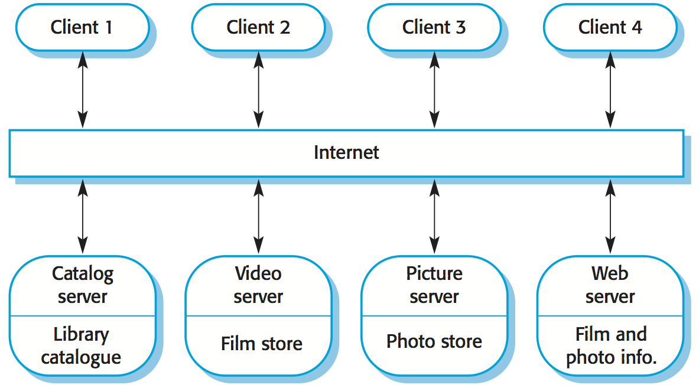

## Página 35 — Estilos de Arquitetura

Estilos de Arquitetura
Fluxo de Dados

## Página 36 — Fluxo de Dados

Fluxo de Dados
ˆ Essa arquitetura se aplica quando dados de entrada devem ser
transformados por meio de uma s´erie de componentes
computacionais ou de manipula¸c˜ao em dados de sa´ıda.
ˆ Um padr˜ao tubos-e-filtro tem um conjunto de componentes,
denominado filtros, conectados por tubos que transmitem dados de
um componente para o seguinte.
29

## Página 37 — Fluxo de Dados

Fluxo de Dados
ˆ Cada filtro trabalha de modo independente.
ˆ ´E projetado para esperar a entrada de dados de determinada forma e
produz sa´ıda de dados da forma especificada.
ˆ Um filtro n˜ao precisa conhecer o funcionamento interno de seus
filtros vizinhos.
ˆ Se o fluxo de dados ocorre em uma ´unica linha de transforma¸c˜oes,
ele ´e denominado sequencial por lotes.
ˆ Essa estrutura aceita um lote de dados e aplica uma s´erie de
componentes sequenciais (filtros) para transform´a-lo.
30

## Página 38 — Fluxo de Dados

Fluxo de Dados
Figura 4: Arquitetura de fluxo de dados.
31

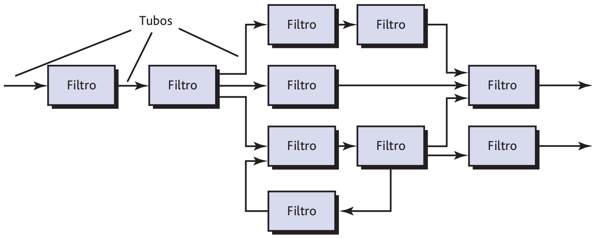

## Página 39 — Fluxo de Dados

Fluxo de Dados
Na Figura 5 ´e apresentado um exemplo da arquitetura fluxo de dados
(duto e filtro).
Figura 5: Arquitetura de fluxo de dados.
32

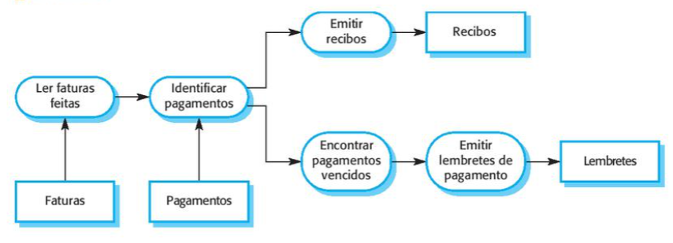

## Página 40 — Estilos de Arquitetura

Estilos de Arquitetura
Camadas

## Página 41 — Camadas

Camadas
Na arquitetura em camadas, s˜ao definidas v´arias camadas diferentes:
ˆ Na camada mais externa, os componentes atendem `as opera¸c˜oes da
interface do usu´ario.
ˆ Na camada mais interna, fazem a interface com o sistema
operacional.
ˆ As camadas intermedi´arias fornecem servi¸cos utilit´arios e fun¸c˜oes de
software de aplica¸c˜ao.
33

## Página 42 — Camadas

Camadas
Figura 6: Arquitetura em camadas.
34

## Página 43 — Camadas

Camadas
Figura 7: Uma arquitetura gen´erica em camadas.
35

## Página 44 — Estilos de Arquitetura

Estilos de Arquitetura
Microservi¸cos

## Página 45 — Microservicos

Microservi¸cos
Suponha que um sistema tenha sido particionado em m´odulos
(M1,M2,. . . ,Mn), como mostrado na figura a seguir:
Figura 8: Um sistema particionado em 9 m´odulos.
36

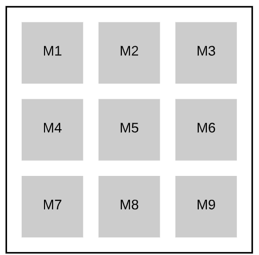

## Página 46 — Microservicos

Microservi¸cos
ˆ Em tempo de execu¸c˜ao esses m´odulos ser˜ao executados pelo sistema
operacional como um processo ´unico.
ˆ Portanto, compartilham o mesmo espa¸co de endere¸camento.
ˆ Isto ´e, o sistema ´e um grande monolito em tempo de execu¸c˜ao.
ˆ A chance de que mudan¸cas em um m´odulo comprometa o
funcionamento de outro m´odulo ´e grande.
ˆ Apesar do desenvolvimento ser ´agil, o processo de testes ainda ´e
lento e burocr´atico.
ˆ Para resolver esse gargalo, empresas passaram a adotar uma
arquitetura baseada em microservi¸cos
37

## Página 47 — Microservicos

Microservi¸cos
Microsservi¸cos s˜ao uma abordagem de arquitetura para a cria¸c˜ao de
aplica¸c˜oes, onde cada peda¸co dessa aplica¸c˜ao ´e desenvolvido e
disponibilizado de forma independente.
ˆ Cada processo da aplica¸c˜ao ´e executado como um servi¸co.
ˆ Quando falamos em microsservi¸cos, estamos nos referindo a uma
funcionalidade que pode ser dividida em partes menores.
ˆ Desse modo, essas pequenas partes se comunicam por meio de uma
interface bem definida, por exemplo APIs.
38

## Página 48 — Microservicos

Microservi¸cos
ˆ Como s˜ao executados de forma independente, cada servi¸co pode ser
atualizado e implantado para atender `as demandas de uma
aplica¸c˜ao.
ˆ Se forem constru´ıdos corretamente, os servi¸cos independentes n˜ao
afetar˜ao uns aos outros: se um deles falhar, o restante da aplica¸c˜ao
permanecer´a em funcionamento.
39

## Página 49 — Microservicos

Microservi¸cos
A figura a seguir mostra os nove m´odulos do exemplo anterior sendo
executados em 6 processos ou como 6 microservi¸cos diferentes:
Figura 9: Nove m´odulos de um sistema sendo executados como 6
microservi¸cos.
40

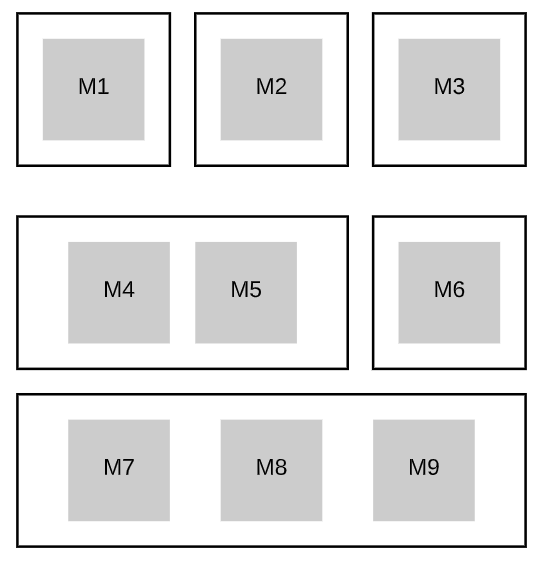

## Página 50 — Microservicos

Microservi¸cos
Figura 10: Arquitetura de microservi¸cos e arquitetura monol´ıtica.
41

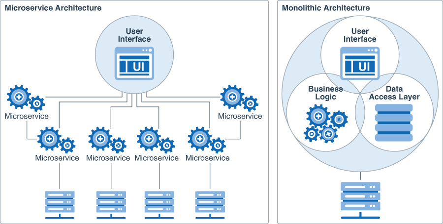

## Página 51 — Microservicos

Microservi¸cos
Figura 11: Arquitetura de microservi¸cos.
42

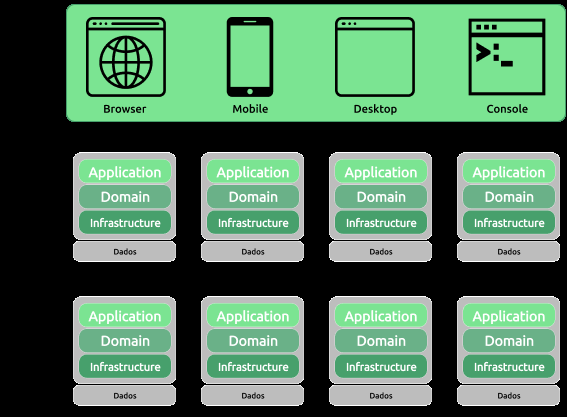

## Página 52 — Microservicos

Microservi¸cos
Vantagens:
ˆ Agilidade: com os deploys e testes independentes, temos uma maior
agilidade no desenvolvimento e na implanta¸c˜ao;
ˆ Baixo acoplamento: com as aplica¸c˜oes s˜ao independentes, elas n˜ao
possuem um acoplamento forte entre si. Isso facilita processos de
manuten¸c˜ao, implanta¸c˜ao e monitoramento;
ˆ Flexibilidade para implanta¸c˜ao de tecnologias heterogˆeneas:
como n˜ao existe acoplamento expl´ıcito e cada servi¸co ´e
independente, podemos ter diferentes servi¸cos escritos em diferentes
tecnologias comunicando-se entre si.
43

## Página 53 — Microservicos

Microservi¸cos
Vantagens:
ˆ Escalabilidade flex´ıvel: cada servi¸co e funcionalidade pode ser
escalado de maneira mais adequada e granular.
ˆ Com isso, ´e poss´ıvel obter at´e mesmo economia na manuten¸c˜ao da
infraestrutura;
ˆ Suponha que o microservi¸co que cont´em M1 seja respons´avel pela
autentica¸c˜ao de usu´arios. Esse microservi¸co pode ser escalado
horizontalmente:
44

## Página 54 — Estilos de Arquitetura

Estilos de Arquitetura
Model-View-Controller

## Página 55 — ModelViewController

Model-View-Controller
A arquitetura MVC define que uma aplica¸c˜ao pode ser organizada em
trˆes camadas (grupos):
ˆ O modelo armazena todos os dados manipulados pela aplica¸c˜ao e a
l´ogica de processamento espec´ıfica.
ˆ A vis˜ao cont´em todas as fun¸c˜oes espec´ıficas `a interface e possibilita
a apresenta¸c˜ao do conte´udo e l´ogica de processamento exigido pelo
usu´ario;
ˆ O controlador interpreta os eventos gerados e gerencia o acesso ao
modelo e `a vis˜ao e coordena o fluxo de dados entre eles.
45

## Página 56 — ModelViewController

Model-View-Controller
Figura 12: Diagrama do padr˜ao MVC.
46

## Página 57 — ModelViewController

Model-View-Controller
ˆ Por´em, em muitos sistemas n˜ao existe uma distin¸c˜ao clara entre
Vis˜ao e Controladores:
Figura 13: Arquitetura MVC sem a distin¸c˜ao clara entre Vis˜ao e Controladores.
47

## Página 58 — ModelViewController

Model-View-Controller
Vamos utilizar o exemplo de uma p´agina web, onde o usu´ario pode
realizar o cadastro de clientes.
48

## Página 59 — ModelViewController

Model-View-Controller
ˆ Com a popularia¸c˜ao da Web, apareceram frameworks para
implementa¸c˜ao de sistemas Web que se denominaram frameworks
MVC.
ˆ Como exemplo, podemos citar Spring (para Java), Ruby on Rails,
Django (para Python) e CakePHP.
ˆ Esses frameworks expandiram e adaptaram o conceito de MVC para
Web.
49

## Página 60 — ModelViewController

Model-View-Controller
Como mencionamos antes, esses frameworks for¸cam a organiza¸c˜ao de um
sistema Web em trˆes partes:
ˆ Vis˜ao, composta por p´aginas HTML;
ˆ Controladores, que processam uma solicita¸c˜ao e geram uma nova
vis˜ao como resposta;
ˆ Modelo, que ´e a camada que persiste os dados em um banco de
dados.
50

## Página 61 — ModelViewController

Model-View-Controller
Figura 14: Arquitetura MVC Web.
51

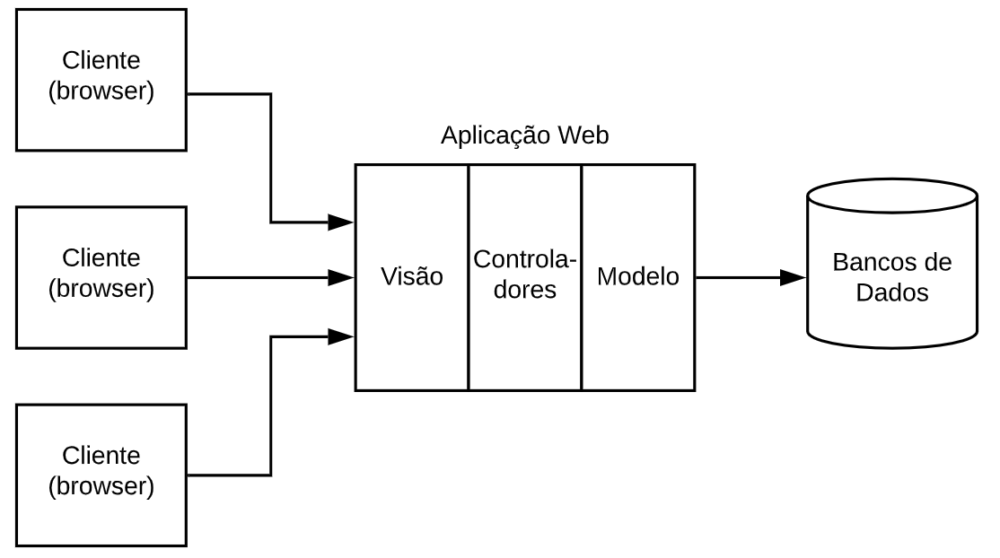

## Página 62 — ModelViewController

Model-View-Controller
Vantagens do MVC:
ˆ Favorece a especializa¸c˜ao do trabalho de desenvolvimento:
front-end, back-end, DBA.
ˆ Favorece testabilidade: ´e mais f´acil testar objetos n˜ao-visuais (vis˜ao).
ˆ Permite que classes de Modelo sejam usadas por diferentes Vis˜oes:
Figura 15: Sistema MVC com mais de uma vis˜ao.
52

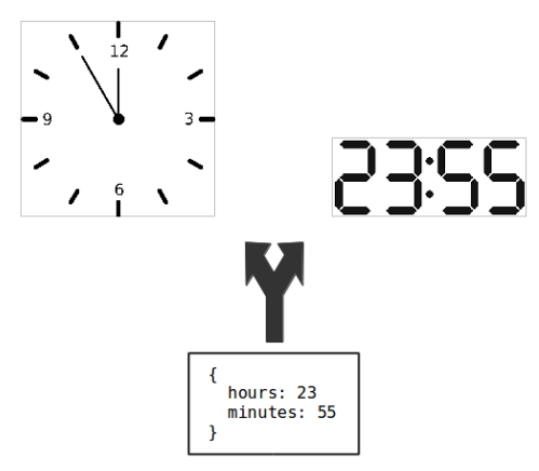

## Página 63 — Estilos de Arquitetura

Estilos de Arquitetura
Arquiteturas Orientadas a Mensagens

## Página 64 — Orientadas a Mensagens

Orientadas a Mensagens
ˆ A comunica¸c˜ao entre clientes e servidores ´e mediada por um servi¸co.
ˆ Esse servi¸co provˆe uma fila de mensagens.
ˆ A comunica¸c˜ao pelo lado do cliente ´e ass´ıncrona:
ˆ Assim que a mensagem ´e inserida, cliente est´a liberado para
continuar processamento.
53

## Página 65 — Orientadas a Mensagens

Orientadas a Mensagens
Figura 16: Arquitetura Orientada a Mensagens.
54

## Página 66 — Orientadas a Mensagens

Orientadas a Mensagens
ˆ Clientes inserem mensagens na fila (produtores).
ˆ Servidores retiram mensagens da fila (consumidores).
ˆ Nessa aplica¸c˜ao distribu´ıda, clientes e servidores:
ˆ N˜ao precisam se conhecer (desacoplamento no espa¸co).
ˆ N˜ao precisar estar simultaneamente dispon´ıveis para se comunicarem
(desacoplamento no tempo).
ˆ Isso permite escalar mais facilmente um sistema distribu´ıdo.
55

## Página 67 — Orientadas a Mensagens

Orientadas a Mensagens
Figura 17: Arquitetura Orientada a Mensagens.
56

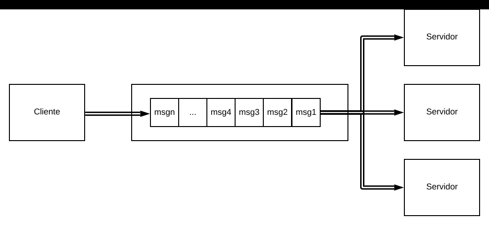

## Página 68 — Estilos de Arquitetura

Estilos de Arquitetura
Publish/Subscribe

## Página 69 — PublishSubscribe

Publish/Subscribe
Na arquitetura Publish/Subscribe, h´a dois componentes (pap´eis)
principais:
ˆ Publicadores
ˆ Assinantes
Os publicadores e assinantes se comunicam por meio de mensagens
denominadas de eventos.
57

## Página 70 — PublishSubscribe

Publish/Subscribe
ˆ Publicadores: produzem eventos e os publicam no servi¸co de
publish/subscribe
ˆ Assinantes: Os assinantes devem assinar os eventos de seu interesse
Quando um evento ´e publicado, os seus assinantes s˜ao notificados.
Em publish/subscribe, os assinantes s˜ao notificados assincronamente.
58

## Página 71 — PublishSubscribe

Publish/Subscribe
Figura 18: Arquitetura Publish/Subscribe.
59

## Página 72 — PublishSubscribe

Publish/Subscribe
Exemplo de uma companhia a´erea:
Figura 19: Arquitetura Publish/Subscribe.
60

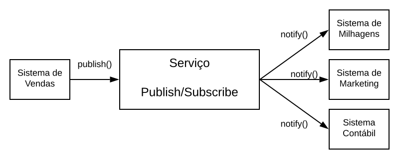

## Página 73 — PublishSubscribe

Publish/Subscribe
Essa arquitetura tem as seguintes caracter´ısticas:
1. comunica¸c˜ao em grupo, pois o mesmo evento ´e assinado por trˆes
sistemas;
2. desacoplamento no espa¸co, pois o sistema de vendas n˜ao tem
conhecimento dos sistemas interessados nos eventos que ele publica;
3. desacoplamento no tempo, pois o sistema de publish/subscribe
reenvia os eventos caso os sistemas assinantes estejam fora do ar;
4. notifica¸c˜ao ass´ıncrona, pois os assinantes s˜ao notificados assim que
um evento ocorre; isto ´e, eles n˜ao precisam consultar periodicamente
o sistema publish/subscribe sobre a ocorrˆencia dos eventos de
interesse.
61

---

# 04
_Total de páginas: 41_

## Página 1 — Engenharia de Software II

Engenharia de Software II
Andr´e L. D. Rossi
Universidade Estadual Paulista “J´ulio de Mesquita Filho” (UNESP)
Faculdade de Ciˆencias (FC) / Departamento de Computa¸c˜ao (DCo)
Bauru, SP - Brasil

## Página 2 — Estilos de Arquitetura

Estilos de Arquitetura
Organiza¸c˜ao e refinamento

## Página 3 — Organizacao e refinamento

Organiza¸c˜ao e refinamento
Como o processo de projeto muitas vezes permite v´arias alternativas de
arquitetura, ´e importante estabelecer um conjunto de crit´erios de projeto
que possam ser usados para avaliar o projeto de arquitetura obtido. As
seguintes quest˜oes d˜ao uma vis˜ao mais clara sobre um estilo de
arquitetura:
ˆ Controle:
ˆ como o controle ´e gerenciado na arquitetura?
ˆ existe uma hierarquia de controle distinta e, em caso positivo, qual o
papel dos componentes nessa hierarquia de controle?
ˆ como os componentes transferem controle no sistema?
ˆ como o controle ´e compartilhado entre os componentes?
ˆ qual a topologia de controle (ou seja, a forma geom´etrica que o
controle assume)?
ˆ o controle ´e sincronizado ou os componentes operam de maneira
ass´ıncrona?
63

## Página 4 — Organizacao e refinamento

Organiza¸c˜ao e refinamento
ˆ Dados:
ˆ como os dados s˜ao transmitidos entre os componentes?
ˆ o fluxo de dados ´e cont´ınuo ou os objetos de dados s˜ao passados
esporadicamente para o sistema?
ˆ qual o modo de transferˆencia de dados (ou seja, os dados s˜ao
passados de um componente para outro ou os dados est˜ao
dispon´ıveis globalmente para serem compartilhados entre os
componentes do sistema)?
ˆ existem componentes de dados (por exemplo, reposit´orio) e, em caso
positivo, qual o seu papel?
ˆ como os componentes funcionais interagem com os componentes de
dados?
ˆ os componentes de dados s˜ao passivos ou ativos (isto ´e, o
componente de dados interage ativamente com outros componentes
do sistema)?
ˆ como os dados e controle interagem no sistema?
64

## Página 5 — Estilos de Arquitetura

Estilos de Arquitetura
Projeto de Arquitetura

## Página 6 — Projeto de arquitetura

Projeto de arquitetura
No in´ıcio do projeto de arquitetura, deve-se estabelecer o contexto.
Para isso, s˜ao descritas as entidades externas (por exemplo, outros
sistemas, dispositivos, pessoas) que interagem com o software e a
natureza de sua intera¸c˜ao.
De modo geral, essa informa¸c˜ao pode ser obtida a partir do modelo de
requisitos.
Uma vez que o contexto ´e modelado e todas as interfaces de software
externas foram descritas, podemos identificar um conjunto de arqu´etipos
arquiteturais.
65

## Página 7 — Projeto de arquitetura

Projeto de arquitetura
V´arias perguntas devem ser formuladas e respondidas `a medida que um
engenheiro de software cria diagramas arquiteturais significativos:
ˆ O diagrama mostra como o sistema responde `as entradas ou aos
eventos?
ˆ Quais visualiza¸c˜oes devem ser consideradas para ajudar a destacar
´areas de risco?
ˆ Como os padr˜oes de projeto de sistema ocultos podem se tornar
mais evidentes para outros desenvolvedores?
ˆ V´arios pontos de vista podem mostrar a melhor maneira de refatorar
partes espec´ıficas do sistema?
ˆ Os balanceamentos (trade-offs) do projeto podem ser representados
de uma maneira significativa?
Se uma representa¸c˜ao esquem´atica da arquitetura do software responde a
essas perguntas, ela ter´a valor para o engenheiro de software que a
utilizar.
66

## Página 8 — Representacao do sistema no contexto

Representa¸c˜ao do sistema no contexto
No n´ıvel do projeto de arquitetura, um arquiteto de software usa um
diagrama de contexto arquitetural para modelar a maneira como o
software interage com entidades externas `as suas fronteiras.
Figura 20: Diagrama de contexto arquitetural.
67

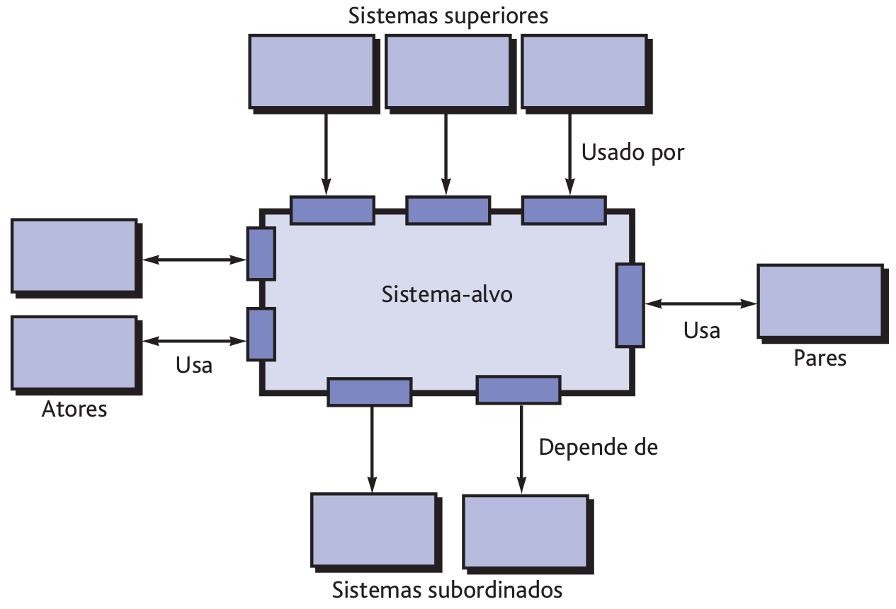

## Página 9 — Representacao do sistema no contexto

Representa¸c˜ao do sistema no contexto
Os sistemas que interoperam com o sistema-alvo (o sistema para o qual
um projeto de arquitetura deve ser desenvolvido) s˜ao representados
como:
ˆ Sistemas superiores – sistemas que usam o sistema-alvo como parte
de algum esquema de processamento de n´ıvel mais alto.
ˆ Sistemas subordinados – sistemas que s˜ao utilizados pelo
sistema-alvo e fornecem dados ou processamento necess´arios para
completar a funcionalidade do sistema-alvo.
ˆ Sistemas de mesmo n´ıvel (pares) – sistemas que interagem em uma
base par-a-par (ou seja, as informa¸c˜oes s˜ao produzidas ou
consumidas pelos pares e pelo sistema-alvo).
ˆ Atores – entidades (pessoas, dispositivos) que interagem com o
sistema-alvo por meio da produ¸c˜ao ou consumo de informa¸c˜oes
necess´arias para o processamento.
Cada entidade externa se comunica com o sistema alvo por meio de uma
interface.
68

## Página 10 — Representacao do sistema no contexto

Representa¸c˜ao do sistema no contexto
Figura 21: Exemplo de diagrama de contexto arquitetural.
69

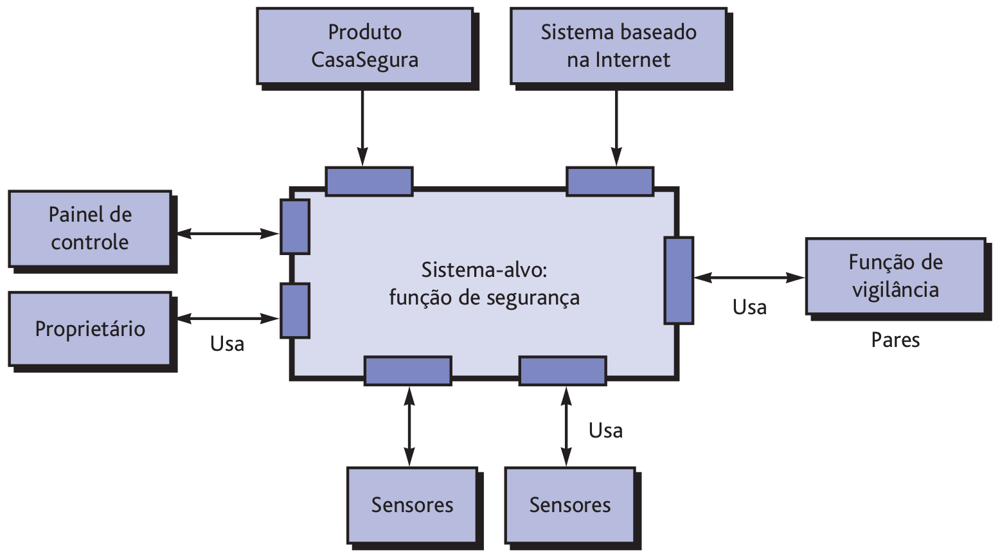

## Página 11 — Refinamento da arquitetura em componentes

Refinamento da arquitetura em componentes
Conforme a arquitetura de software ´e refinada em componentes, a
estrutura do sistema come¸ca a emergir.
Mas como os componentes s˜ao escolhidos?
Para responder a essa pergunta, come¸camos pelas classes descritas como
parte do modelo de requisitos.
70

## Página 12 — Refinamento da arquitetura em componentes

Refinamento da arquitetura em componentes
Essas classes de an´alise representam entidades no dom´ınio de aplica¸c˜ao
que devem ser tratadas na arquitetura do software.
Portanto, o dom´ınio de aplica¸c˜ao ´e uma fonte para deriva¸c˜ao e
refinamento de componentes. Outra fonte ´e o dom´ınio da infraestrutura.
A arquitetura deve acomodar muitos componentes de infraestrutura que
permitem componentes de aplica¸c˜ao, mas que n˜ao tˆem nenhuma rela¸c˜ao
de neg´ocio com o dom´ınio de aplica¸c˜ao.
Por exemplo, componentes de gerenciamento de mem´oria, componentes
de comunica¸c˜ao, componentes de bancos de dados e componentes de
gerenciamento de tarefas em geral s˜ao integrados `a arquitetura do
software.
71

## Página 13 — Refinamento da arquitetura em componentes

Refinamento da arquitetura em componentes
As interfaces representadas no diagrama de contexto arquitetural
implicam um ou mais componentes especializados que processam os
dados que fluem pela interface.
Em alguns casos (por exemplo, uma interface gr´afica do usu´ario), tem de
ser projetada uma arquitetura de subsistemas completa, com v´arios
componentes.
72

## Página 14 — Refinamento da arquitetura em componentes

Refinamento da arquitetura em componentes
Continuando com o exemplo da fun¸c˜ao de seguran¸ca domiciliar do
CasaSegura, poder´ıamos definir o conjunto de componentes de alto n´ıvel
que trata da seguinte funcionalidade:
ˆ Gerenciamento da comunica¸c˜ao externa – coordena a comunica¸c˜ao
da fun¸c˜ao de seguran¸ca com entidades externas, como sistemas
baseados na Internet e notifica¸c˜ao externa de alarme.
ˆ Processamento de painel de controle – gerencia toda a
funcionalidade do painel de controle.
ˆ Gerenciamento de detectores – coordena o acesso a todos os
detectores conectados ao sistema.
ˆ Processamento de alarme – verifica e atua sobre todas as condi¸c˜oes
de alarme.
73

## Página 15 — Refinamento da arquitetura em componentes

Refinamento da arquitetura em componentes
Figura 22: Estrutura arquitetural global para o sistema CasaSegura com os
componentes de alto n´ıvel.
74

## Página 16 — Descricao das instancias do sistema

Descri¸c˜ao das instˆancias do sistema
At´e este ponto, o projeto de arquitetura modelado ainda ´e relativamente
de alto n´ıvel.
O contexto do sistema foi representado, a estrutura global do sistema
est´a evidente e os principais componentes de software foram identificados.
Entretanto, um maior refinamento (recorde-se que todo projeto ´e
iterativo) ainda ´e necess´ario.
75

## Página 17 — Descricao das instancias do sistema

Descri¸c˜ao das instˆancias do sistema
Figura 23: Uma instˆancia da fun¸c˜ao de seguran¸ca com elabora¸c˜ao de
componentes.
76

## Página 18 — Exerccio

Exerc´ıcio
Considere o problema de construir o site para uma pequena livraria
virtual.
Qual arquitetura vocˆe utilizar´a? Justifique.
Elabore um diagrama (livre) para representar sua arquitetura.
77

## Página 19 — Modelo C4

Modelo C4

## Página 20 — Modelagem da Arquitetura

Modelagem da Arquitetura
Quando vocˆe pede para um projetista da ´area de engenharia c´ıvil a
arquitetura de um edif´ıcio, vocˆe receber´a plantas do local, plantas baixas,
vistas de eleva¸c˜ao, vistas de se¸c˜ao transversal e desenhos detalhados.
Quando vocˆe pede para um projetista da ´area de engenharia de software
a arquitetura de um sistema, vocˆe provavelmente receber´a algo como :
78

## Página 21 — Modelagem da Arquitetura

Modelagem da Arquitetura
79

## Página 22 — Modelagem da Arquitetura

Modelagem da Arquitetura
80

## Página 23 — Modelagem da Arquitetura

Modelagem da Arquitetura
81

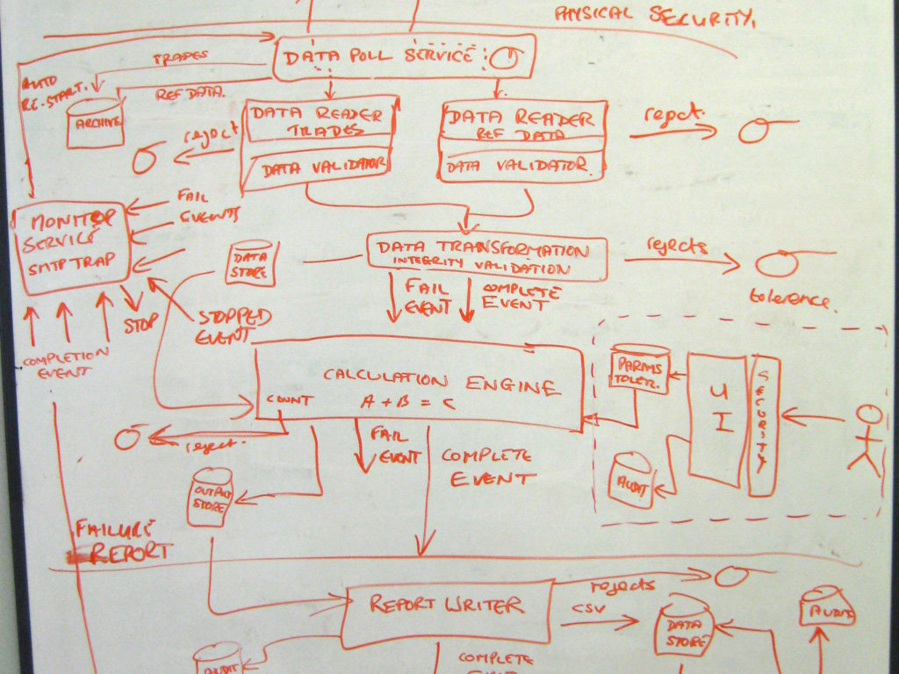

## Página 24 — Modelagem da Arquitetura

Modelagem da Arquitetura
82

## Página 25 — Modelagem da Arquitetura

Modelagem da Arquitetura
Uma verdadeira bagun¸ca com caixas e linhas:
ˆ nota¸c˜ao inconsistente (c´odigo de cores, formas, estilos de linha etc.).
ˆ nomenclatura amb´ıgua e terminologia gen´erica.
ˆ relacionamentos n˜ao rotulados.
ˆ escolhas tecnol´ogicas ausentes.
ˆ etc
83

## Página 26 — Modelagem da Arquitetura

Modelagem da Arquitetura
“UMA GRANDE BOLA DE LAMA (Big Ball of Mud) ´e estruturada ao
acaso, espalhada, desleixada, fita adesiva e arame de seguran¸ca, [...]. O
seu c´odigo mostra sinais inequ´ıvocos de crescimento desregulado, e reparo
repetido e conveniente. A informa¸c˜ao ´e compartilhada promiscuamente
entre elementos distantes do sistema. ” (Foote e Yoder, 1997)
84

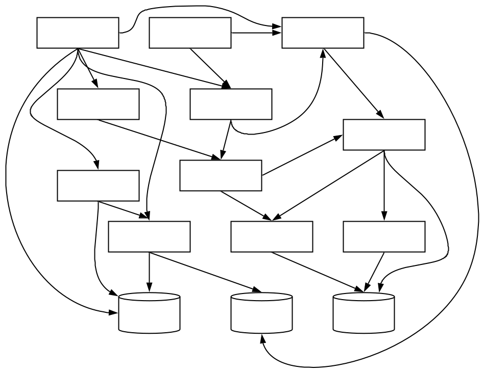

## Página 27 — Modelo C4

Modelo C4
O modelo C4 foi criado por Simon Brown com a ideia de facilitar a
contru¸c˜ao de modelos de arquitetura de software.
https://c4model.com/
85

## Página 28 — Modelo C4

Modelo C4
Figura 24: N´ıvel 1: Um diagrama de contexto do sistema fornece um ponto de
partida, mostrando como o sistema de software em escopo se encaixa no
mundo ao seu redor.
86

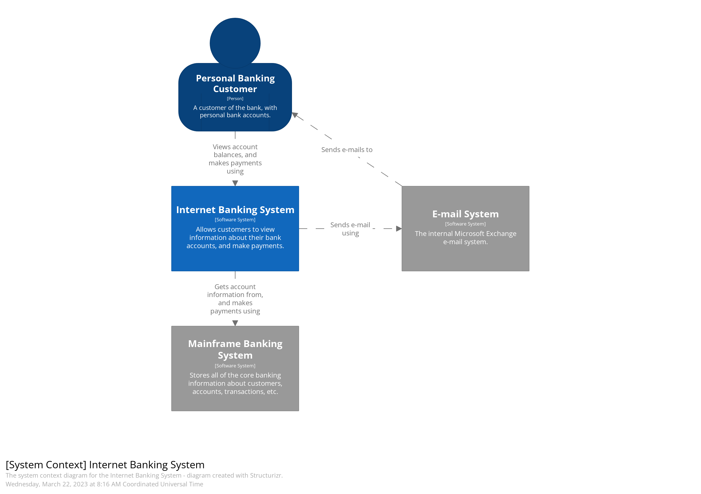

## Página 29 — Modelo C4

Modelo C4
Diagrama de Contexto
Um diagrama de contexto do sistema ´e um bom ponto de partida para
diagramar e documentar um sistema de software.
Desenhe um diagrama mostrando seu sistema como uma caixa no centro,
cercada por seus usu´arios e outros sistemas com os quais ele interage.
O detalhe n˜ao ´e importante aqui, pois esta ´e a sua vis˜ao ampliada
mostrando uma imagem grande da paisagem do sistema.
O foco deve estar nas pessoas (atores, fun¸c˜oes, personas, etc.) e sistemas
de software, em vez de tecnologias, protocolos e outros detalhes de baixo
n´ıvel.
´E o tipo de diagrama que vocˆe pode mostrar para pessoas n˜ao t´ecnicas.
87

## Página 30 — Modelo C4

Modelo C4
Diagrama de Contˆeiner
Depois de entender como seu sistema se encaixa no ambiente geral, uma
pr´oxima etapa ´e ampliar o limite do sistema com um diagrama de
contˆeiner.
Um “contˆeiner” ´e algo como um aplicativo da Web do lado do servidor,
aplicativo de p´agina ´unica, aplicativo de desktop, aplicativo m´ovel,
esquema de banco de dados, sistema de arquivos etc.
Essencialmente, um contˆeiner ´e uma unidade execut´avel/implant´avel
separadamente (por exemplo, um espa¸co de processo separado) que
executa c´odigo ou armazena dados.
O diagrama do contˆeiner mostra a forma de alto n´ıvel da arquitetura de
software e como as responsabilidades s˜ao distribu´ıdas por ela.
Ele tamb´em mostra as principais op¸c˜oes de tecnologia e como os
contˆeineres se comunicam entre si.
´E um diagrama simples e focado em tecnologia de alto n´ıvel que ´e ´util
88

## Página 31 — Modelo C4

Modelo C4
Figura 25: N´ıvel 2: um diagrama de contˆeiner amplia o sistema de software no
escopo, mostrando os blocos de constru¸c˜ao t´ecnicos de alto n´ıvel.
89

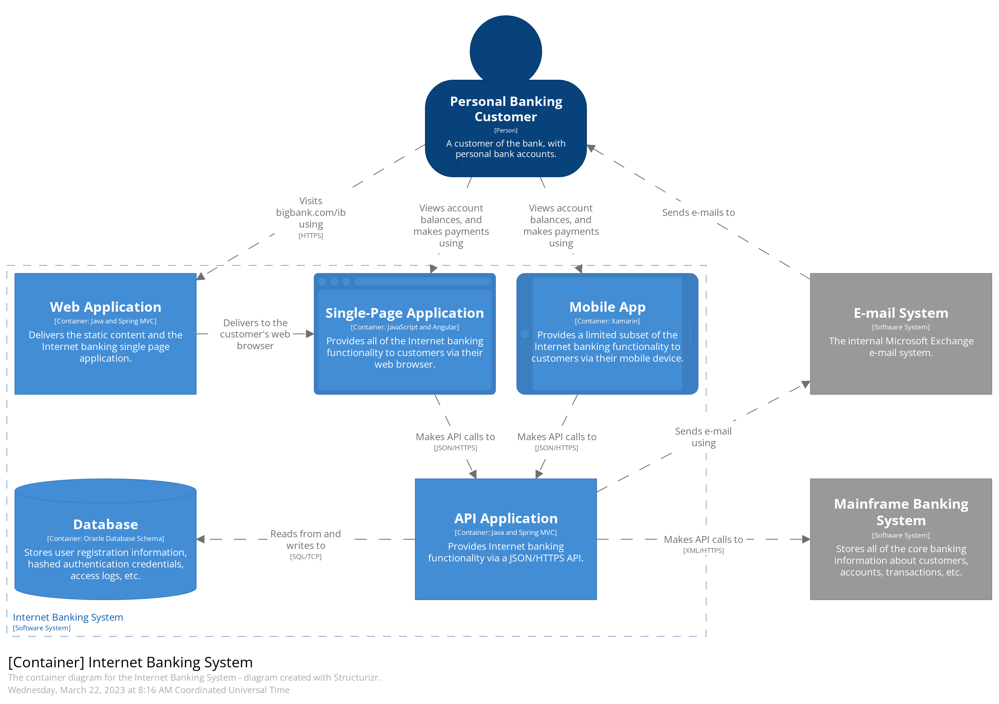

## Página 32 — Modelo C4

Modelo C4
Diagrama de Componentes
Em seguida, vocˆe pode ampliar e decompor cada contˆeiner ainda mais
para identificar os principais blocos de constru¸c˜ao estruturais e suas
intera¸c˜oes.
O diagrama de componentes mostra como um contˆeiner ´e composto de
v´arios “componentes”, o que cada um desses componentes s˜ao, suas
responsabilidades e os detalhes de tecnologia/implementa¸c˜ao.
´E importante observar que todos os componentes dentro de um contˆeiner
normalmente executam no mesmo espa¸co de processo.
No modelo C4, os componentes n˜ao s˜ao unidades executadas
separadamente.
90

## Página 33 — Modelo C4

Modelo C4
Figura 26: N´ıvel 3: um diagrama de componentes amplia um contˆeiner
individual, mostrando os componentes dentro dele.
91

## Página 34 — Modelo C4

Modelo C4
Diagramas de Classe UML, ER, ...
Por fim, vocˆe pode ampliar cada componente para mostrar como ele ´e
implementado como c´odigo; usando diagramas de classe UML, diagramas
de entidade relacionamento ou similares.
Este ´e um n´ıvel opcional de detalhe e geralmente est´a dispon´ıvel sob
demanda de ferramentas como IDEs.
Idealmente, esse diagrama seria gerado automaticamente usando
ferramentas (por exemplo, uma ferramenta de modelagem IDE ou UML),
e vocˆe deve considerar mostrar apenas os atributos e m´etodos que
permitem contar a hist´oria que vocˆe deseja contar.
Este n´ıvel de detalhe n˜ao ´e recomendado para nada al´em dos
componentes mais importantes ou complexos.
92

## Página 35 — Modelo C4

Modelo C4
Figura 27: N´ıvel 4: Um diagrama de c´odigo (por exemplo, classe UML) pode
ser usado para ampliar um componente individual, mostrando como esse
componente ´e implementado.
93

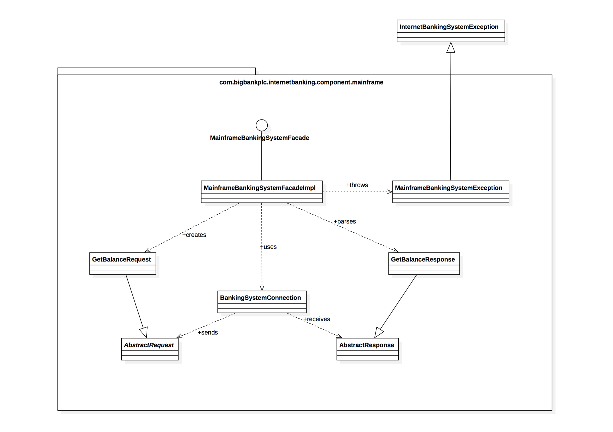

## Página 36 — Modelo C4

Modelo C4
Figura 28: Diferentes n´ıveis de zoom permitem que vocˆe conte diferentes
hist´orias para diferentes p´ublicos.
94

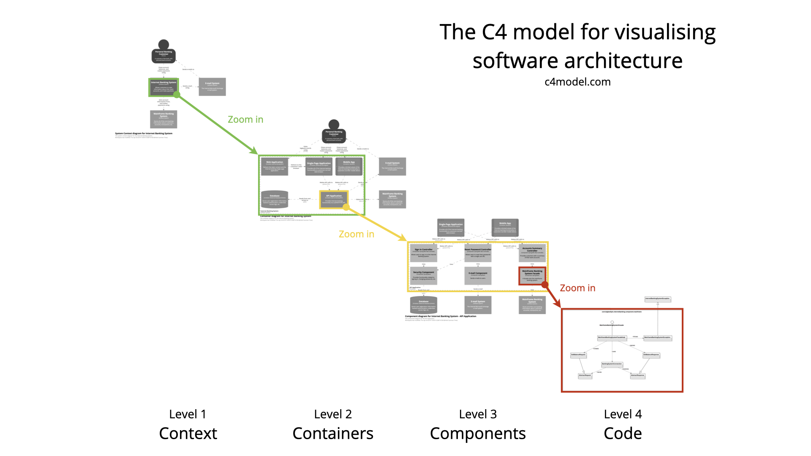

## Página 37 — Exerccio

Exerc´ıcio
Considere novamente o problema de construir o site para uma pequena
livraria virtual.
Redesenhe a sua arquitetura usando o modelo C4.
Projete a arquitetura da livraria virtual usando microsservi¸cos.
Implemente essa arquitetura a partir do reposit´orio
https://github.com/aserg-ufmg/micro-livraria.
95

## Página 38 — Referencias

Referˆencias

## Página 39 — 12354

[1][2][3][5][4]
[1] R. S. Pressman and B. R. Maxim.
Engenharia de Software uma abordagem profissional, volume 1.
AMGH Editora Ltda, 9. edition, 2021.
[2] S. R. Schach.
Engenharia de Software: Os paradigmas cl´assicos & orientados
a objetos, volume 1.
McGraw-Hill, 7. edition, 2008.
[3] I. Sommerville.
Engenharia de Software, volume 1.
S˜ao Paulo: Addison-Wesley, 10. edition, 2019.
[4] M. T. Valente.
Engenharia de software moderna, volume 1.
Independente, 2020.
96

## Página 40 — 5 R S Wazlawick

[5] R. S. Wazlawick.
Engenharia de Software - Conceitos e Pr´atica, volume 1.
Rio de Janeiro: GEN LTC, 2. edition, 2019.
97

## Página 41 — Perguntas

Perguntas?
Obrigado pela aten¸c˜ao!

---

# 05
_Total de páginas: 69_

## Página 1 — Engenharia de Software II

Engenharia de Software II
Andr´e L. D. Rossi
Universidade Estadual Paulista “J´ulio de Mesquita Filho” (UNESP)
Faculdade de Ciˆencias (FC) / Departamento de Computa¸c˜ao (DCo)
Bauru, SP - Brasil

## Página 2 — Sumario

Sum´ario
1. Panorama Geral
2. Projeto de Componentes
3. Condu¸c˜ao de projetos de componentes
4. Desenvolvimento baseado em componentes
1

## Página 3 — Panorama Geral

Panorama Geral

## Página 4 — Panorama

Panorama
O que ´e:
• Um conjunto completo de componentes de software ´e definido
durante o projeto da arquitetura.
• Por´em, os detalhes de processamento e estruturas de dados internas
de cada componente n˜ao s˜ao representados em um n´ıvel de
abstra¸c˜ao pr´oximo ao c´odigo.
• O projeto de componentes define as estruturas de dados, os
algoritmos, as caracter´ısticas das interfaces e os mecanismos de
comunica¸c˜ao alocados a cada componente de software.
2

## Página 5 — Panorama

Panorama
Por que ´e importante?
• Permite revisar os detalhes do projeto em termos de corre¸c˜ao e
consistˆencia com outras representa¸c˜oes:
• Interfaces
• Arquitetura de dados
• ...
3

## Página 6 — Panorama

Panorama
Qual ´e o artefato?
O projeto para cada componente, representado em nota¸c˜ao gr´afica,
tabular ou baseada em texto, ´e o principal artefato durante o projeto de
componentes.
4

## Página 7 — Projeto de Componentes

Projeto de Componentes

## Página 8 — Projeto de Componentes

Projeto de Componentes
• O projeto de componentes ocorre depois que a primeira itera¸c˜ao do
projeto da arquitetura tiver sido conclu´ıda.
• Nesse est´agio, a estrutura geral dos dados e programas do software
j´a foi estabelecida.
• O intuito ´e transformar o modelo de projeto em software operacional.
• Por´em, o n´ıvel de abstra¸c˜ao do modelo de projetos existente ´e
relativamente alto, e o n´ıvel de abstra¸c˜ao do programa operacional ´e
baixo.
5

## Página 9 — O que e componente

O que ´e componente?
• Componente ´e um bloco construtivo modular para software de
computador.
• Mais formalmente, a UML define componente como:
[...]
uma parte modular, poss´ıvel de ser implantada e subs-
titu´ıvel de um sistema que encapsula implementa¸c˜ao e exp˜oe
um conjunto de interfaces.
6

## Página 10 — O que e componente

O que ´e componente?
• Os componentes devem se comunicar e colaborar com outros
componentes e entidades externas:
• Outros sistemas
• Dispositivos
• Pessoas
• O verdadeiro significado do termo componente depender´a do ponto
de vista do engenheiro de software que o utiliza.
7

## Página 11 — Projeto de Componentes

Projeto de Componentes
Uma vis˜ao orientada a objetos

## Página 12 — Uma visao orientada a objetos

Uma vis˜ao orientada a objetos
• No contexto da engenharia de software orientada a objetos, um
componente cont´em um conjunto de classes colaborativas.
• Tamb´em precisam ser definidas todas as interfaces que permitem
que as classes se comuniquem e colaborem com outras classes de
projeto.
8

## Página 13 — Uma visao orientada a objetos

Uma vis˜ao orientada a objetos
• Por exemplo, considere um software a ser criado para uma gr´afica.
• O objetivo geral do software ´e coletar os requisitos do cliente na
recep¸c˜ao da loja, or¸car um trabalho e, em seguida, passar a tarefa
para um centro de produ¸c˜ao automatizado.
• Durante a engenharia de requisitos, foi obtida uma classe de an´alise
denominada Servi¸coDeImpress˜ao (PrintJob)
9

## Página 14 — Uma visao orientada a objetos

Uma vis˜ao orientada a objetos
Figura 1: Classe de an´alise e componente.
10

## Página 15 — Uma visao orientada a objetos

Uma vis˜ao orientada a objetos
• Os detalhes do componente Servi¸coDeImpress˜ao devem ser
elaborados a fim de fornecer informa¸c˜oes suficientes para orientar a
implementa¸c˜ao.
• A classe de an´alise original ´e detalhada para implementar a classe na
forma do componente Servi¸coDeImpress˜ao.
11

## Página 16 — Uma visao orientada a objetos

Uma vis˜ao orientada a objetos
Figura 2: Classe de projeto para o componente Servi¸coDeImpress˜ao.
12

## Página 17 — Projeto de componentes baseados em classes

Projeto de componentes baseados em classes
Na abordagem de engenharia de software orientada a objetos, o projeto
de componentes se concentra na elabora¸c˜ao de classes contidas no
modelo de requisitos/arquitetura:
• Classes espec´ıficas do dom´ınio do problema
• Classes de infraestrutura, que d˜ao suporte a servi¸cos
A descri¸c˜ao detalhada dos atributos, opera¸c˜oes e interfaces utilizados por
essas classes ´e o detalhe de projeto exigido como precursor da atividade
de constru¸c˜ao.
Cinco princ´ıpios b´asicos aplic´aveis ao projeto de componentes tˆem sido
amplamente adotados quando se aplica `a ES orientada a objetos.
13

## Página 18 — Projeto de Componentes

Projeto de Componentes
Princ´ıpios b´asicos de projeto

## Página 19 — Princpios basicos de projeto

Princ´ıpios b´asicos de projeto
14

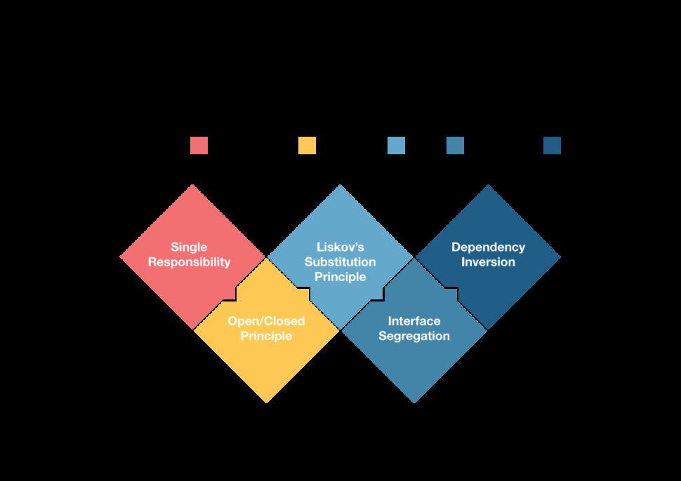

## Página 20 — Princpios basicos de projeto

Princ´ıpios b´asicos de projeto
• Motiva¸c˜ao ´e criar projetos mais f´aceis de modificar.
• Isso inclui reduzir a propaga¸c˜ao de efeitos colaterais na ocorrˆencia de
modifica¸c˜oes.
• Podemos usar tais princ´ıpios como guias, `a medida que cada
componente de software ´e desenvolvido.
15

## Página 21 — Princpios basicos de projeto

Princ´ıpios b´asicos de projeto
A Tabela 1 a seguir mostra as propriedades contempladas ao seguir cada
um desses princ´ıpios.
Princ´ıpio de Projeto
Propriedade de Projeto
(S) Responsabilidade ´Unica
Coes˜ao
(O) Aberto/Fechado
Extensibilidade
(L) Substitui¸c˜ao de Liskov
Extensibilidade
(I) Segrega¸c˜ao de Interfaces
Coes˜ao
(D) Invers˜ao de Dependˆencia
Acoplamento
Tabela 1: Os cinco princ´ıpios de projeto denominados de SOLID.
16

## Página 22 — Projeto de Componentes

Projeto de Componentes
Princ´ıpio da Responsabilidade ´Unica

## Página 23 — Princpio da Responsabilidade Unica

Princ´ıpio da Responsabilidade ´Unica
“Toda classe deve ter uma ´unica responsabilidade!”
• Esse princ´ıpio ´e uma aplica¸c˜ao direta da ideia de coes˜ao.
• Um corol´ario desse princ´ıpio recomenda separar apresenta¸c˜ao de
regras de neg´ocio, pois as classes de apresenta¸c˜ao e as classes de
regras de neg´ocio podem evoluir e sofrer modifica¸c˜oes por raz˜oes
distintas.
• Quem implementa as classes de apresenta¸c˜ao? E quem implementa
as classes de regras de neg´ocio?
17

## Página 24 — Princpio da Responsabilidade Unica

Princ´ıpio da Responsabilidade ´Unica
public class Employee {
private String fullName;
private String dateOfJoining;
private String annualSalaryPackage;
// standard getters and setters methods
public long calculateEmployeeSalary(Employee emp) { ... }
public long calculateEmployeeLeaves(Employee emp) { ... }
public long calculateTaxOnSalary(Employee emp) { ... }
public Employee saveEmployee(Employee emp) { ... }
public Employee updateEmployee(Employee emp) { ... }
}
18

## Página 25 — Princpio da Responsabilidade Unica

Princ´ıpio da Responsabilidade ´Unica
class Animal:
def __init__(self, nome, pernas, quantidade, imagem):
self.nome = nome
self.pernas = pernas
self.quantidade = quantidade
self.imagem = imagem
def calcular_pernas(self):
return f'N´umero de pernas em {self.nome} ´e: ', self.pernas * self.
quantidade
def calcular_olhos(self):
return f'N´umero de olhos em {self.nome} ´e: ', self.quantidade * 2
def alterar_tamanho_imagem(self):
# Este m´etodo altera o tamanho da imagem do animal
pass
def rotacionar_imagem(self):
# Este m´etodo rotaciona a imagem do animal
pass
19

## Página 26 — Princpio da Responsabilidade Unica

Princ´ıpio da Responsabilidade ´Unica
Exerc´ıcio de refatora¸c˜ao:
public String statement() {
double totalAmount = 0;
int frequentRenterPoints = 0;
Enumeration rentals = _rentals.elements();
String result = 'Rental Record for '+ getName() + '\n';
while (rentals.hasMoreElements()) {
double thisAmount = 0;
Rental each = (Rental) rentals.nextElement();
//determine amounts for each line
switch (each.getMovie().getPriceCode()) {
case Movie.REGULAR:
thisAmount += 2;
if (each.getDaysRented() > 2)
thisAmount += (each.getDaysRented() - 2) * 1.5;
break;
...
20

## Página 27 — Projeto de Componentes

Projeto de Componentes
Princ´ıpio da Segrega¸c˜ao de Interfaces
(Interface Segregation Principle -ISP)

## Página 28 — Princpio da Segregacao de Interfaces

Princ´ıpio da Segrega¸c˜ao de Interfaces
• ´E melhor usar v´arias interfaces espec´ıficas do cliente do que uma
´unica interface de prop´osito geral.
• H´a diversas ocasi˜oes em que componentes para v´arios clientes usam
uma opera¸c˜ao fornecida por uma classe-servidora.
• O ISP sugere a cria¸c˜ao de uma interface especializada para atender
cada categoria principal de clientes.
• O objetivo ´e evitar que clientes dependam de interfaces com
m´etodos que eles n˜ao v˜ao usar.
• O ISP ´e um caso particular do princ´ıpio SRP.
21

## Página 29 — Princpio da Segregacao de Interfaces

Princ´ıpio da Segrega¸c˜ao de Interfaces
Exemplo de interface que viola o ISP:
interface Funcionario {
double getSalario();
double getFGTS();
int getSIAPE();
...
}
Por que o ISP ´e violado nesse caso?
22

## Página 30 — Princpio da Segregacao de Interfaces

Princ´ıpio da Segrega¸c˜ao de Interfaces
public interface Vehicle{
void accelerate();
void applyBrakes();
void fly();
}
public class Bus implements Vehicle{
@Override
public void accelerate() {...}
@Override
public void applyBrakes() {...}
@Override
public void fly(){
// dummy implementation
}
}
public class Aeroplane implements
Vehicle{
@Override
public void accelerate() {...}
@Override
public void applyBrakes() {...}
@Override
public void fly(){...}
}
23

## Página 31 — Princpio da Segregacao de Interfaces

Princ´ıpio da Segrega¸c˜ao de Interfaces
Sugest˜oes para resolver o problema e n˜ao violar o princ´ıpio ISP?
24

## Página 32 — Projeto de Componentes

Projeto de Componentes
Princ´ıpio da Invers˜ao da Dependˆencia
(Dependency Inversion Principle - DIP)

## Página 33 — Princpio da Inversao da Dependencia

Princ´ıpio da Invers˜ao da Dependˆencia
• “Dependa de abstra¸c˜oes. N˜ao dependa de concretiza¸c˜oes”.
• Abstra¸c˜oes (interfaces) s˜ao mais est´aveis do que implementa¸c˜oes
concretas (classes).
• Quanto mais um componente depender de outros componentes
concretos (e n˜ao de abstra¸c˜oes), mais dif´ıcil ser´a estendˆe-lo.
25

## Página 34 — Princpio da Inversao da Dependencia

Princ´ıpio da Invers˜ao da Dependˆencia
Exemplo 1:
interface I { ... }
class C1 implements I {
...
}
class C2 implements I {
...
}
class Cliente {
I i;
Cliente (I i) {
this.i = i;
...
} ...
}
26

## Página 35 — Princpio da Inversao da Dependencia

Princ´ıpio da Invers˜ao da Dependˆencia
Exemplo 1:
interface I { ... }
class C1 implements I {
...
}
class C2 implements I {
...
}
class Cliente {
I i;
Cliente (I i) {
this.i = i;
...
} ...
}
class Main {
void main () {
C1 c1 = new C1();
new Cliente(c1);
...
C2 c2 = new C2();
new Cliente(c2);
...
}
}
27

## Página 36 — Princpio da Inversao da Dependencia

Princ´ıpio da Invers˜ao da Dependˆencia
Exemplo 2 - viola o DIP:
class SQLRepository {
public void save() {
...
}
}
class NoSQLRepository {
public void save() {
...
}
}
public class Service {
private SQLRepository repository = new SQLRepository();
public void save() {
repository.save();
}
}
28

## Página 37 — Princpio do AbertoFechado

Princ´ıpio do Aberto-Fechado
• “Um m´odulo [componente] deve ser aberto para a extens˜ao, mas
fechado para modifica¸c˜oes”.
• Essa afirma¸c˜ao pode parecer uma contradi¸c˜ao, mas representa uma
das caracter´ısticas mais importantes de um bom projeto de
componentes.
• Em outras palavras, devemos especificar o componente para permitir
que ele seja estendido (em seu dom´ınio funcional) sem a necessidade
de fazer modifica¸c˜oes internas (em n´ıvel de c´odigo ou l´ogica) no
pr´oprio componente.
• Para tanto, criamos abstra¸c˜oes que servem como um divisor entre a
funcionalidade que provavelmente ser´a estendida e a classe de
projeto em si.
29

## Página 38 — Princpio do AbertoFechado OCP OpenClosed Principle

Princ´ıpio do Aberto-Fechado (OCP, Open-Closed Principle)
Por exemplo, suponhamos que a fun¸c˜ao de seguran¸ca do CasaSegura fa¸ca
uso de uma classe Detector que deve verificar o estado de cada tipo de
sensor de seguran¸ca.
´E prov´avel que, `a medida que o tempo for passando, o n´umero e os tipos
de sensores de seguran¸ca cres¸cam.
Se a l´ogica de processamento interna for implementada como uma
sequˆencia de constru¸c˜oes se-ent˜ao-sen˜ao (ou switch), cada uma delas
tratando de um tipo de sensor diferente, a adi¸c˜ao de um novo tipo de
sensor exigir´a l´ogica de processamento interna adicional.
Isso ´e uma viola¸c˜ao do OCP.
30

## Página 39 — Princpio do AbertoFechado

Princ´ıpio do Aberto-Fechado
A interface sensor apresenta uma vis˜ao consistente dos sensores para o
componente detector. Se for adicionado um novo tipo de sensor,
nenhuma mudan¸ca ser´a necess´aria na classe Detector (componente). O
OCP ´e preservado.
Figura 3: Seguindo o OCP.
31

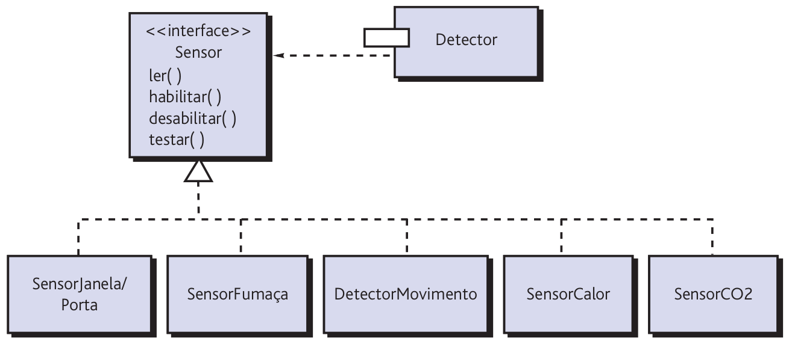

## Página 40 — Princpio do AbertoFechado

Princ´ıpio do Aberto-Fechado
32

## Página 41 — Princpio do AbertoFechado

Princ´ıpio do Aberto-Fechado
A classe Collections de Java segue o Princ´ıpio Aberto/Fechado.
List<String> nomes;
nomes = Arrays.asList('joao', 'maria', 'alexandre', 'ze');
Collections.sort(nomes);
System.out.println(nomes);
// resultado: ['alexandre','joao','maria','ze']
33

## Página 42 — Princpio do AbertoFechado

Princ´ıpio do Aberto-Fechado
Se for necess´ario usar o sorte para ordenar as strings de acordo com o
tamanho em caracteres, s´o preciso implementar um objeto Comparator.
Comparator<String> comparador = new Comparator<String>() {
public int compare(String s1, String s2) {
return s1.length() - s2.length();
}
};
Collections.sort(nomes, comparador);
System.out.println(nomes);
// resultado: [ze, joao, maria, alexandre]
34

## Página 43 — Princpio da Substituicao de Liskov

Princ´ıpio da Substitui¸c˜ao de Liskov
• “As subclasses devem ser substitutas de suas classes-base”.
• Esse princ´ıpio, originalmente proposto por Barbara Liskov, explicita
regras para redefini¸c˜ao de m´etodos de classes base em classes filhas.
• Com isso, um componente que usa uma classe-base deve continuar a
funcionar apropriadamente caso uma classe derivada da classe-base
seja passada para o componente em seu lugar.
35

## Página 44 — Princpio da Substituicao de Liskov

Princ´ıpio da Substitui¸c˜ao de Liskov
O LSP exige que qualquer classe derivada de uma classe-base deve
honrar qualquer contrato impl´ıcito entre a classe-base e os componentes
que a utilizam.
No contexto desta discuss˜ao, um “contrato” ´e uma precondi¸c˜ao que deve
ser verdadeira antes de o componente usar uma classe-base e uma
p´os-condi¸c˜ao que deve ser verdadeira ap´os o componente usar uma
classe-base.
Ao criar classes derivadas, certifique-se de que atendem `as precondi¸c˜oes e
`as p´os-condi¸c˜oes.
36

## Página 45 — Princpio da Substituicao de Liskov

Princ´ıpio da Substitui¸c˜ao de Liskov
Exemplo que viola (fortemente) o LSP:
class A {
int soma(int a, int b) {
return a+b;
}
}
class B extends A {
int soma(int a, int b) {
String r = String.valueOf(a)
+ String.valueOf(b);
return Integer.parseInt(r);
}
}
class Cliente {
void f(A a) {
// pode retornar 3 ou 12
a.soma(1,2);
...
}
}
class Main {
void main() {
A a = new A();
B b = new B();
Cliente cli = new Cliente();
cli.f(a);
cli.f(b);
}
}
37

## Página 46 — Princpio da Inversao da Dependencia

Princ´ıpio da Invers˜ao da Dependˆencia
public class Car {
public void fuel() { ...}
public void wheels() { ... }
public void run() { ... }
}
public class TeslaToyCar extends Car {
@Override
public void fuel() {
throw new IllegalStateException('Not
Supported');
}
@Override
public void run() {...}
@Override
public void wheels() {...}
}
public class TeslaRealCar extends
Car {
@Override
public void fuel() {...}
@Override
public void run() {...}
@Override
public void wheels() {...}
}
38

## Página 47 — Projeto de Componentes

Projeto de Componentes
Princ´ıpios de empacotamento aplic´aveis
ao projeto de componentes

## Página 48 — Princpios de empacotamento aplicaveis ao projeto de compo

Princ´ıpios de empacotamento aplic´aveis ao projeto de compo-
nentes
• Embora os princ´ıpios de projeto de componentes sejam ´uteis em
termos de orienta¸c˜ao, os componentes em si n˜ao vivem de forma
isolada.
• Em muitos casos, componentes ou classes individuais s˜ao
organizados em subsistemas ou pacotes.
• Faz sentido perguntar como deve ocorrer a atividade de
empacotamento.
• Exatamente de que forma os componentes devem ser organizados `a
medida que o projeto prossegue?
39

## Página 49 — Princpio da Equivalencia de Reutilizacao de Versoes REP Re

Princ´ıpio da Equivalˆencia de Reutiliza¸c˜ao de Vers˜oes (REP, Re-
lease Reuse Equivalency Principle)
• “A granularidade da reutiliza¸c˜ao ´e a granularidade da vers˜ao”.
• ´E estabelecido um contrato impl´ıcito entre o desenvolvedor da
entidade reutiliz´avel e quem vai us´a-la.
• O desenvolvedor se compromete a estabelecer um sistema de
controle de vers˜oes que ofere¸ca suporte e manuten¸c˜ao para as
vers˜oes mais antigas da entidade, enquanto os usu´arios v˜ao
atualizando gradualmente para a vers˜ao mais recente.
40

## Página 50 — Princpio do Fechamento Comum CCP Common Closure Prin

Princ´ıpio do Fechamento Comum (CCP, Common Closure Prin-
ciple)
• “Classes que mudam juntas, devem ficar juntas”.
• As classes devem ser empacotadas de forma coesa.
• Ao serem empacotadas como parte de um projeto, devem tratar da
mesma ´area funcional ou comportamental.
• Quando alguma caracter´ıstica dessa ´area tiver de mudar, ´e prov´avel
que apenas as classes contidas no pacote precisem ser modificadas.
•
• Isso leva a um controle de mudan¸cas e gerenciamento de vers˜oes
mais eficiente.
41

## Página 51 — Princpio Comum da Reutilizacao CRP Common Reuse Prin

Princ´ıpio Comum da Reutiliza¸c˜ao (CRP, Common Reuse Prin-
ciple)
• “As classes que n˜ao s˜ao reutilizadas juntas n˜ao devem ser agrupadas
juntas”.
• Quando uma ou mais classes com um pacote muda(m), o n´umero
da vers˜ao do pacote muda.
• Se as classes n˜ao forem agrupadas de forma coesa, ´e poss´ıvel que
uma classe sem nenhuma rela¸c˜ao com as demais contidas em um
pacote seja alterada.
• Por essa raz˜ao, apenas as classes reutilizadas juntas devem ser
inclu´ıdas em um pacote.
42

## Página 52 — Coesao de Componentes o diagrama de tensao

Coes˜ao de Componentes: o diagrama de tens˜ao
• Observe que os trˆes princ´ıpios de coes˜ao lutam entre eles:
• REP e CCP s˜ao princ´ıpios que tendem a gerar componentes maiores
• O CRP ´e um princ´ıpio que tende a gerar componentes menores
• Por isso, ao escolher entre os princ´ıpios, sempre haver´a perdas.
43

## Página 53 — Coesao de Componentes o diagrama de tensao

Coes˜ao de Componentes: o diagrama de tens˜ao
Figura 4: Diagrama de tens˜ao: como os trˆes princ´ıpios de coes˜ao interagem.
As arestas indicam o “custo” de abandonar o princ´ıpio no v´ertice oposto [1].
44

## Página 54 — Conducao de projetos de

Condu¸c˜ao de projetos de
componentes

## Página 55 — Conducao de projetos de componentes

Condu¸c˜ao de projetos de componentes
Temos de transformar informa¸c˜oes de modelos de arquitetura e requisitos
em uma representa¸c˜ao de projeto que nos dˆe detalhes suficientes para
orientar a atividade da constru¸c˜ao (codifica¸c˜ao e testes).
Tais etapas representam um conjunto de tarefas t´ıpicas para um projeto
de componentes – quando ele ´e aplicado a um sistema orientado a
objetos.
45

## Página 56 — Conducao de projetos de componentes

Condu¸c˜ao de projetos de componentes
“Se eu tivesse mais tempo, teria escrito uma carta mais curta.” Blaise
Pascal
“One of my most productive days was throwing away 1000 lines of
code.” (atribu´ıdo a Ken Thompson no livro: The Art of UNIX
Programming, de Eric S. Raymond, p. 24.)
46

## Página 57 — Conducao de projetos de componentes

Condu¸c˜ao de projetos de componentes
• Etapa 1: Identificar todas as classes de projeto correspondentes ao
dom´ınio do problema.
• Etapa 2: Identificar todas as classes de projeto correspondentes ao
dom´ınio de infraestrutura. Exemplos: GUI (muitas vezes dispon´ıveis
na forma de componentes reutiliz´aveis), componentes de
administra¸c˜ao de dados, etc.
• Etapa 3: Elaborar todas as classes de projeto que n˜ao s˜ao obtidas
como componentes reutiliz´aveis.
• Etapa 3a: Especificar detalhes de mensagens quando classes ou
componentes colaboram entre si.
• Etapa 3b: Identificar interfaces adequadas para cada componente.
• Etapa 3c: Elaborar atributos e definir tipos de dados e estruturas de
dados necess´arias para implement´a-los.
• Etapa 3d: Descrever detalhadamente o fluxo de processamento
contido em cada opera¸c˜ao.
47

## Página 58 — Conducao de projetos de componentes

Condu¸c˜ao de projetos de componentes
• Etapa 4: Descrever fontes de dados persistentes (bancos de dados e
arquivos) e identificar as classes necess´arias para gerenci´a-los.
• Etapa 5: Desenvolver e elaborar representa¸c˜oes comportamentais
para uma classe ou componente.
• Etapa 6: Elaborar diagramas de implanta¸c˜ao para fornecer detalhes
de implementa¸c˜ao adicionais.
• Etapa 7: Refatorar toda representa¸c˜ao de projetos de componentes
e sempre considerar alternativas.
48

## Página 59 — Desenvolvimento baseado em

Desenvolvimento baseado em
componentes

## Página 60 — Desenvolvimento baseado em componentes

Desenvolvimento baseado em componentes
No contexto da engenharia de software, a reutiliza¸c˜ao ´e uma ideia ao
mesmo tempo antiga e nova.
Os programadores tˆem reutilizado ideias, abstra¸c˜oes e processos desde os
prim´ordios da computa¸c˜ao, mas a abordagem inicial para a reutiliza¸c˜ao
era improvisada.
Hoje em dia, sistemas computacionais complexos e de alta qualidade
devem ser constru´ıdos em prazos muito curtos e exigem uma abordagem
mais organizada para a reutiliza¸c˜ao.
49

## Página 61 — Desenvolvimento baseado em componentes

Desenvolvimento baseado em componentes
A engenharia de software baseada em componentes (CBSE) ´e um
processo que enfatiza o projeto e a constru¸c˜ao de sistemas baseados em
computadores usando “componentes” de software reutiliz´aveis.
50

## Página 62 — Desenvolvimento baseado em componentes

Desenvolvimento baseado em componentes
Considerando essa descri¸c˜ao, surge uma s´erie de quest˜oes:
• ´E poss´ıvel construir sistemas complexos montando-os por meio de
um cat´alogo de componentes de software reutiliz´aveis?
• Isso pode ser realizado de maneira eficaz em termos de custo e
tempo?
• Podem ser estabelecidos incentivos apropriados para estimular os
engenheiros de software `a reutiliza¸c˜ao em vez de reinventar?
• A gerˆencia est´a disposta a incorrer na despesa adicional associada `a
cria¸c˜ao de componentes de software reutiliz´aveis?
• A biblioteca de componentes necess´arios para a reutiliza¸c˜ao pode ser
criada para torn´a-la acess´ıvel aos que precisam dela?
• Os componentes existentes podem ser encontrados por aqueles que
precisam deles?
Cada vez mais, a resposta a cada uma dessas quest˜oes ´e “sim”.
51

## Página 63 — Desenvolvimento baseado em componentes

Desenvolvimento baseado em componentes
Figura 5: Etapas principais do CBSE. Cada componente possui suas pr´oprias
pr´e e p´os-condi¸c˜oes.
52

## Página 64 — Desenvolvimento baseado em componentes

Desenvolvimento baseado em componentes
A CBSE pode ter as seguintes vantagens:
• Tempo de ciclo reduzido;
• Divis˜ao dos custos do desenvolvimento dos componentes entre
m´ultiplos projetos;
• Maior qualidade, pois os componentes s˜ao reutilizados e testados em
aplicativos diferentes;
• Facilidade de manuten¸c˜ao/substitui¸c˜ao dos componentes.
53

## Página 65 — Desenvolvimento baseado em componentes

Desenvolvimento baseado em componentes
Riscos associados `a CBSE:
• Dificuldade de sele¸c˜ao dos componentes;
• Falta de padr˜ao de interoperabilidade entre componentes;
• Riscos de seguran¸ca (uso inadequado do componente);
• Documenta¸c˜ao inadequada dos componentes.
54

## Página 66 — Referencias

Referˆencias

## Página 67 — 23465

[2][3][4][6][5]
[1] R. C. Martin.
Clean Architecture: A Craftsman’s Guide to Software Structure
and Design.
Pearson, 1 edition, 2017.
[2] R. S. Pressman and B. R. Maxim.
Engenharia de Software uma abordagem profissional, volume 1.
AMGH Editora Ltda, 9. edition, 2021.
[3] S. R. Schach.
Engenharia de Software: Os paradigmas cl´assicos & orientados
a objetos, volume 1.
McGraw-Hill, 7. edition, 2008.
[4] I. Sommerville.
Engenharia de Software, volume 1.
S˜ao Paulo: Addison-Wesley, 10. edition, 2019.
55

## Página 68 — 5 M T Valente

[5] M. T. Valente.
Engenharia de software moderna, volume 1.
Independente, 2020.
[6] R. S. Wazlawick.
Engenharia de Software - Conceitos e Pr´atica, volume 1.
Rio de Janeiro: GEN LTC, 2. edition, 2019.
56

## Página 69 — Perguntas

Perguntas?
Obrigado pela aten¸c˜ao!

---

# 06
_Total de páginas: 33_

## Página 1 — Engenharia de Software II

Engenharia de Software II
Andr´e L. D. Rossi
Universidade Estadual Paulista “J´ulio de Mesquita Filho” (UNESP)
Faculdade de Ciˆencias (FC) / Departamento de Computa¸c˜ao (DCo)
Bauru, SP - Brasil

## Página 2 — Projeto baseado em Padroes

Projeto baseado em Padr˜oes

## Página 3 — Projeto baseado em Padroes

Projeto baseado em Padr˜oes
Todos n´os j´a nos deparamos com um problema de projeto e,
silenciosamente, pensamos: ser´a que algu´em j´a desenvolveu uma solu¸c˜ao
para esse problema?
A resposta ´e quase sempre sim!
1

## Página 4 — Projeto baseado em Padroes

Projeto baseado em Padr˜oes
O problema ´e:
ˆ Encontrar a solu¸c˜ao
ˆ Garantir que, de fato, adapte-se ao problema em quest˜ao
ˆ Entender as restri¸c˜oes que talvez limitem a maneira pela qual a
solu¸c˜ao ´e aplicada
ˆ Traduzir a solu¸c˜ao proposta para seu ambiente de projeto
2

## Página 5 — Projeto baseado em Padroes

Projeto baseado em Padr˜oes
Mas e se a solu¸c˜ao fosse codificada de alguma forma?
E se existisse uma maneira padronizada de descrever um problema (de tal
forma que pud´essemos pesquis´a-lo) e um m´etodo organizado para
representar a solu¸c˜ao para o problema?
Os problemas de software seriam codificados e descritos usando-se um
modelo padronizado e seriam propostas solu¸c˜oes (com restri¸c˜oes) para
eles.
Denominado padr˜oes de projeto, esse m´etodo codificado para descri¸c˜ao
de problemas e suas solu¸c˜oes permite que os profissionais da engenharia
de software adquiram conhecimento de projeto para que ele seja
reutilizado.
3

## Página 6 — Projeto baseado em Padroes

Projeto baseado em Padr˜oes
O in´ıcio da hist´oria dos padr˜oes come¸ca com um arquiteto, Christopher
Alexander.
Alexander encontrou um conjunto de problemas recorrentes toda vez que
um edif´ıcio era projetado. Ele caracterizou esses problemas recorrentes e
suas solu¸c˜oes como padr˜oes, descrevendo-os da seguinte maneira:
Cada padr˜ao descreve um problema que ocorre repetidamente
em nosso ambiente e ent˜ao descreve o cerne de uma solu¸c˜ao para
aquele problema para podermos us´a-la repetidamente um milh˜ao
de vezes sem jamais ter de fazer a mesma coisa duas vezes.
4

## Página 7 — Projeto baseado em Padroes

Projeto baseado em Padr˜oes
As ideias de Alexander foram traduzidas inicialmente para o mundo do
software em livros como os de Gamma [1].
Hoje, existem dezenas de reposit´orios de padr˜oes, e projetos baseados em
padr˜oes podem ser aplicados em diversos dom´ınios de aplica¸c˜ao.
5

## Página 8 — Padroes de Projeto

Padr˜oes de Projeto

## Página 9 — Padroes de Projeto

Padr˜oes de Projeto
Um padr˜ao de projeto pode ser caracterizado como “uma regra de trˆes
partes que expressa uma rela¸c˜ao entre um contexto, um problema e
uma solu¸c˜ao”.
Para projeto de software, o contexto permite ao leitor compreender o
ambiente em que o problema reside e qual solu¸c˜ao poderia ser apropriada
nesse ambiente.
Um conjunto de requisitos, incluindo limita¸c˜oes e restri¸c˜oes, atua como
um sistema de for¸cas1 que influencia a maneira pela qual o problema
pode ser interpretado em seu contexto e como a solu¸c˜ao pode ser
aplicada eficientemente.
1For¸cas s˜ao as caracter´ısticas do problema e os atributos de uma solu¸c˜ao que
restringem a maneira como o projeto pode ser desenvolvido.
6

## Página 10 — Padroes de Projeto

Padr˜oes de Projeto
A maioria dos problemas possui v´arias solu¸c˜oes, por´em uma solu¸c˜ao ´e
eficaz somente se for apropriada no contexto do problema existente.
´E o sistema de for¸cas que faz com que um projetista escolha uma solu¸c˜ao
espec´ıfica. O intuito ´e fornecer uma solu¸c˜ao que melhor atenda ao
sistema de for¸cas, mesmo quando essas for¸cas s˜ao contradit´orias.
Por fim, toda solu¸c˜ao tem consequˆencias que poderiam ter um impacto
sobre outros aspectos do software, e ela pr´opria poderia fazer parte do
sistema de for¸cas para outros problemas a serem resolvidos no sistema
mais amplo.
7

## Página 11 — Padroes de Projeto

Padr˜oes de Projeto
Coplien2 caracteriza um padr˜ao de projeto eficaz da seguinte maneira:
ˆ Ele soluciona um problema: os padr˜oes apreendem solu¸c˜oes, n˜ao
apenas estrat´egias ou princ´ıpios abstratos.
ˆ Ele ´e um conceito comprovado: os padr˜oes apreendem solu¸c˜oes com
um hist´orico, n˜ao teorias ou especula¸c˜ao.
ˆ Uma solu¸c˜ao n˜ao ´e ´obvia: muitas t´ecnicas para resolu¸c˜ao de
problemas (como paradigmas ou m´etodos de projeto de software)
tentam obter solu¸c˜oes com base nos primeiros princ´ıpios. Os
melhores padr˜oes geram uma solu¸c˜ao para um problema
indiretamente – uma abordagem necess´aria para os problemas de
projeto mais dif´ıceis.
2Coplien, J., “Software Patterns”, 2005, dispon´ıvel em
http://hillside.net/patterns/definition.html.
8

## Página 12 — Padroes de Projeto

Padr˜oes de Projeto
ˆ Ele descreve uma rela¸c˜ao: os padr˜oes n˜ao apenas descrevem
m´odulos, como tamb´em estruturas e mecanismos de sistema mais
profundos.
ˆ O padr˜ao possui um componente humano significativo (minimizar a
interven¸c˜ao humana). Todo software visa a atender o conforto
humano ou a qualidade de vida; os melhores padr˜oes apelam
explicitamente `a est´etica e `a utilidade.
9

## Página 13 — Padroes de Projeto

Padr˜oes de Projeto
Um padr˜ao de projeto evita que tenhamos de “reinventar a roda” ou, pior
ainda, inventar uma “nova roda” que n˜ao ser´a perfeitamente redonda;
ser´a muito pequena para o uso pretendido e muito estreita para o terreno
onde ir´a rodar.
Os padr˜oes de projeto, se usados de maneira eficiente, invariavelmente o
tornar˜ao um melhor projetista de software.
10

## Página 14 — Padroes de Projeto

Padr˜oes de Projeto
Tipos de Padr˜oes

## Página 15 — Tipos de Padroes

Tipos de Padr˜oes
Uma das raz˜oes para os engenheiros de software se interessarem (e
ficarem intrigados) por padr˜oes de projeto ´e o fato de os seres humanos
serem inerentemente bons no reconhecimento de padr˜oes.
No mundo real, os padr˜oes que reconhecemos s˜ao aprendidos ao longo de
toda uma vida de experiˆencias.
Reconhecemos instantaneamente e compreendemos inerentemente seus
significados e como eles poderiam ser usados.
Alguns desses padr˜oes nos d˜ao uma melhor vis˜ao do fenˆomeno da
recorrˆencia.
11

## Página 16 — Tipos de Padroes

Tipos de Padr˜oes
RubberNecking: olhar com curiosidade
O padr˜ao RubberNecking produz resultados notavelmente previs´ıveis
(um congestionamento), mas nada mais faz do que descrever um
fenˆomeno.
No jarg˜ao dos padr˜oes, ele poderia ser denominado padr˜ao n˜ao
generativo, pois descreve um contexto e um problema, mas n˜ao fornece
nenhuma solu¸c˜ao expl´ıcita.
12

## Página 17 — Tipos de Padroes

Tipos de Padr˜oes
Quando s˜ao considerados padr˜oes de projeto de software, faz-se um
esfor¸co para identificar e documentar padr˜oes generativos.
Em um ambiente ideal, um conjunto de padr˜oes de projeto generativos
poderia ser usado para “gerar” uma aplica¸c˜ao ou sistema computacional
cuja arquitetura permitisse que se adaptasse `a mudan¸ca.
Algumas vezes chamada generatividade, “a aplica¸c˜ao sucessiva de v´arios
padr˜oes, cada um deles encapsulando seu pr´oprio problema e for¸cas,
desdobra-se em uma solu¸c˜ao mais ampla que emerge indiretamente como
resultado das solu¸c˜oes menores”.
13

## Página 18 — Tipos de Padroes

Tipos de Padr˜oes
Os padr˜oes de projeto abrangem um amplo espectro de abstra¸c˜ao e
aplica¸c˜ao.
14

## Página 19 — Tipos de Padroes

Tipos de Padr˜oes
Os padr˜oes de arquitetura descrevem problemas de projeto de car´ater
amplo e diverso, resolvidos usando-se uma abordagem estrutural.
Os padr˜oes de dados descrevem problemas orientados a dados
recorrentes e as solu¸c˜oes de modelagem de dados que podem ser usadas
para resolvˆe-los.
15

## Página 20 — Tipos de Padroes

Tipos de Padr˜oes
Os padr˜oes de componentes (tamb´em conhecidos como padr˜oes de
projeto) tratam de problemas associados ao desenvolvimento de
subsistemas e componentes, da maneira pela qual eles se comunicam
entre si e de seu posicionamento em uma arquitetura maior.
Os padr˜oes de interfaces descrevem problemas comuns de interfaces do
usu´ario e suas solu¸c˜oes, com um sistema de for¸cas que inclui as
caracter´ısticas espec´ıficas dos usu´arios.
16

## Página 21 — Tipos de Padroes

Tipos de Padr˜oes
Os padr˜oes para WebApp tratam de um conjunto de problemas
encontrados ao se construir WebApps.
Em geral, incorporam muitas das demais categorias de padr˜oes
mencionados.
17

## Página 22 — Tipos de Padroes

Tipos de Padr˜oes
Em seu livro seminal sobre padr˜oes de projeto, Gamma [1] e seus colegas
descrevem trˆes tipos de padr˜oes particularmente relevantes para projetos
orientados a objetos:
ˆ padr˜oes criacionais;
ˆ padr˜oes estruturais; e
ˆ padr˜oes comportamentais.
18

## Página 23 — Relacionamento entre padroes de projeto

Relacionamento entre padr˜oes de projeto
19

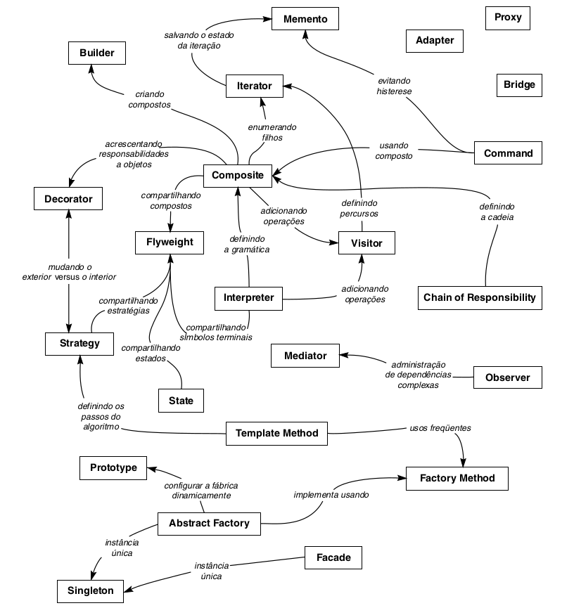

## Página 24 — Padroes de Projeto

Padr˜oes de Projeto
Padr˜oes Criacionais

## Página 25 — Padroes Criacionais

Padr˜oes Criacionais
Os padr˜oes criacionais se concentram na cria¸c˜ao, composi¸c˜ao e
representa¸c˜ao de objetos e disp˜oem de mecanismos que facilitam a
instancia¸c˜ao de objetos.
Os padr˜oes criacionais tamb´em imp˜oem restri¸c˜oes sobre o tipo e
n´umero de objetos que podem ser criados em um sistema.
Exemplos de padr˜oes criacionais:
ˆ Singleton
ˆ M´etodo f´abrica
ˆ F´abrica abstrata
ˆ Construtor
20

## Página 26 — Singleton

Singleton
Suponha uma classe Logger, usada para registrar as opera¸c˜oes realizadas
em um sistema:
void f() {
Logger log = new Logger();
log.println(‘‘Executando f’’);
...
}
void g() {
Logger log = new Logger();
log.println(‘‘Executando g’’);
...
}
void h() {
Logger log = new Logger();
log.println(‘‘Executando h’’);
...
}
21

## Página 27 — Singleton

Singleton
Problema:
Cada m´etodo cria sua pr´opria instˆancia de Logger. Isso pode n˜ao ser
adequado para acesso a algum recurso (banco de dados, arquivos, etc).
Solu¸c˜ao:
Figura 1: Padr˜ao Criacional Singleton
(https://refactoring.guru/pt-br/design-patterns/singleton).
22

## Página 28 — Singleton

Singleton
class Logger {
// proibe clientes de chamar new
Logger()
private Logger() {}
// instancia unica
private static Logger instance;
public static Logger getInstance()
{
if (instance == null)
instance = new Logger();
return instance;
}
public void println(String msg)
{
// Poderia ser em arquivo
System.out.println(msg);
}
}
void f() {
Logger log = Logger.getInstance();
log.println(‘‘Executando f’’);
...
}
void g() {
Logger log = Logger.getInstance();
log.println(‘‘Executando g’’);
...
}
void h() {
Logger log = Logger.getInstance();
log.println(‘‘Executando h’’);
...
}
23

## Página 29 — Fabrica estatico

F´abrica (est´atico)
Suponha um sistema distribu´ıdo baseado em TCP/IP. Nesse sistema, trˆes
fun¸c˜oes f, g e h criam objetos do tipo TCPChannel para comunica¸c˜ao
remota:
void f() {
TCPChannel c = new TCPChannel();
...
}
void g() {
TCPChannel c = new TCPChannel();
...
}
void h() {
TCPChannel c = new TCPChannel();
...
}
24

## Página 30 — Fabrica estatico

F´abrica (est´atico)
E se o sistema precisar usar UDP ao inv´es do TCP para comunica¸c˜ao?
Esse trecho de c´odigo n˜ao atende ao princ´ıpio Aberto/Fechado!
25

## Página 31 — Fabrica estatico

F´abrica (est´atico)
void f() {
TCPChannel c = new
TCPChannel();
...
}
void g() {
TCPChannel c = new
TCPChannel();
...
}
void h() {
TCPChannel c = new
TCPChannel();
...
}
class ChannelFactory {
// metodo fabrica estatico
public static Channel create() {
return new TCPChannel();
}
}
void f() {
Channel c=ChannelFactory.create();
...
}
void g() {
Channel c=ChannelFactory.create();
...
}
void h() {
Channel c=ChannelFactory.create();
...
}
26

## Página 32 — Metodo Fabrica

M´etodo F´abrica
Imagine agora que vocˆe poder sobreescrever o m´etodo f´abrica em uma
subclasse e mudar o produto que est´a sendo criado.
Figura 2: Uma f´abrica ´e criada para cada produto.
27

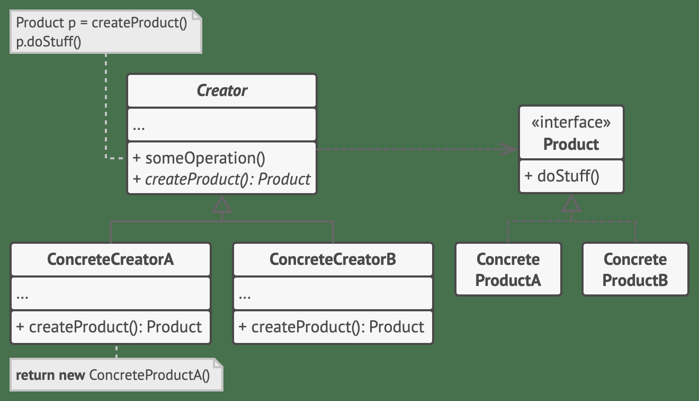

## Página 33 — Metodo Fabrica

M´etodo F´abrica
Para o caso da “f´abrica de canais de comunica¸c˜ao”:
Figura 3: Padr˜ao Criacional M´etodo F´abrica para diferentes produtos (TCP e
UDP).
28

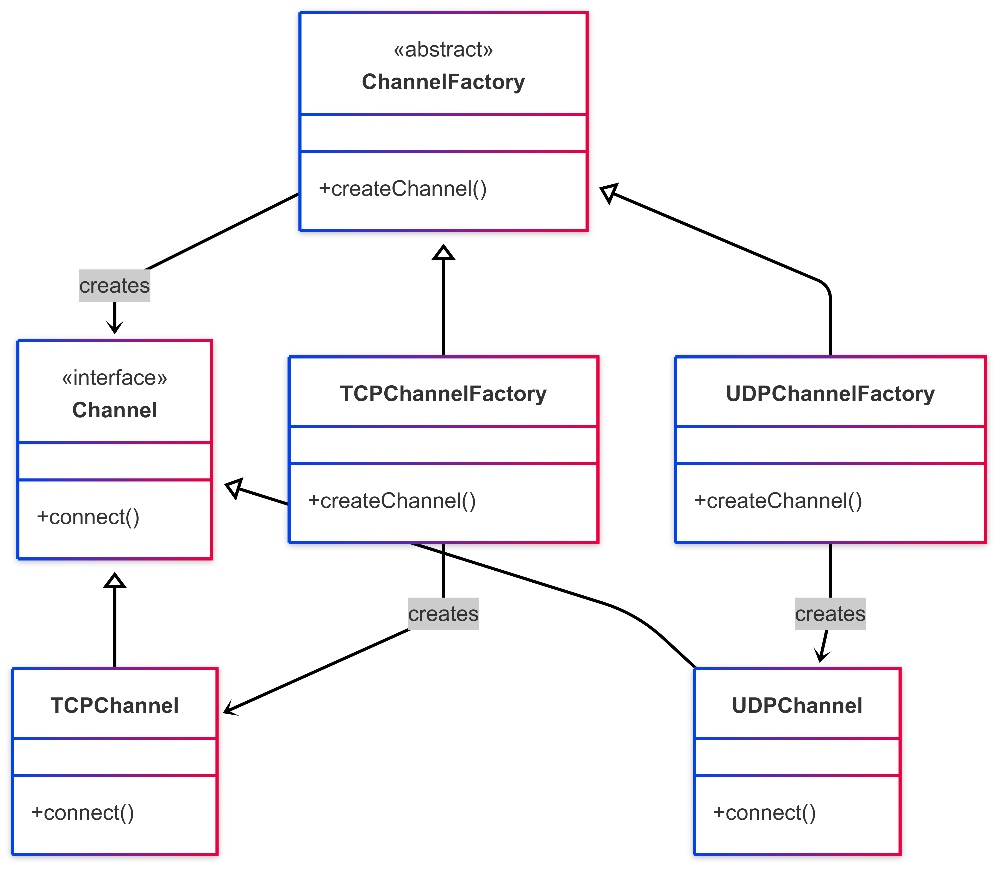

---
